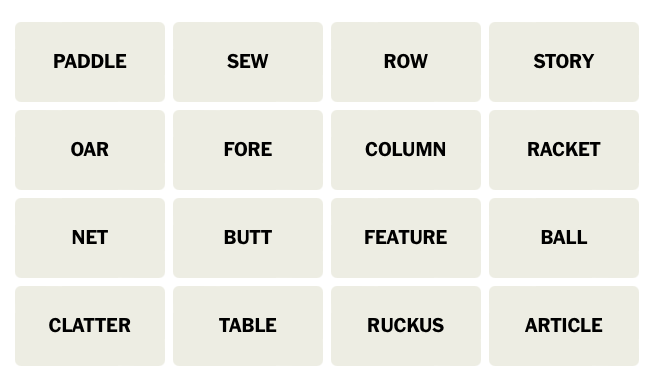
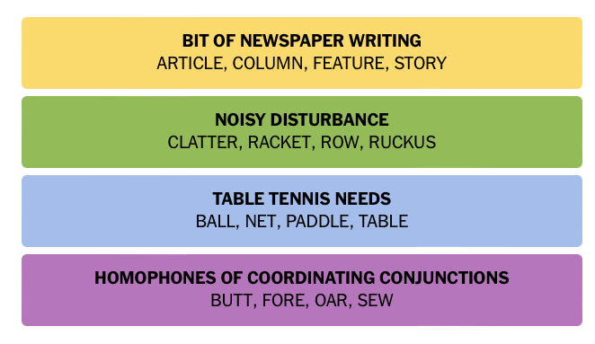

# Connection Solver Virtual Assistant Testbed

Experimental project to solve the [NYT Connection puzzles](https://www.nytimes.com/games/connections) using agentic workflow based on the [`langchain` ecosystem](https://python.langchain.com/v0.2/docs/introduction/).  In particular used:
* [`langchain`'s OpenAI LLM abstraction layer](https://python.langchain.com/v0.2/api_reference/openai/chat_models/langchain_openai.chat_models.base.ChatOpenAI.html#chatopenai) to interact with OpenAI's `gpt-4o` model
* [`langgraph`'s stateful orchestration framework](https://langchain-ai.github.io/langgraph/tutorials/multi_agent/multi-agent-collaboration/#multi-agent-network) to manage the agent's workflow

Historical NYT Connection Puzzles were used in testing the agent.  Past puzzles can be found [here](https://word.tips/todays-nyt-connections-answers/).

## Connection Puzzle Description
Connections is a word game that challenges players to find themes between words. The user is presented with 16 words and must create groups of four items that share something in common. For example: Tropical fruit: banana, mango, pineapple, guava.

## Solution Strategy
The agent uses the `PuzzleState` class to manage the agent's state and controls the agent's workflow. 
```python
class PuzzleState(TypedDict):
    words_remaining: List[str] = []
    invalid_connections: List[List[str]] = []
    recommended_words: List[str] = []
    recommended_connection: str = ""
    recommended_correct: bool = False
    found_yellow: bool = False
    found_greeen: bool = False
    found_blue: bool = False
    found_purple: bool = False
    mistake_count: int = 0
    recommendation_count: int = 0
    llm_temperature: float = 1.0
    input_source_type: str = ""
```
The attributes `words_remaining` and `mistake_count` are used to determine when to terminate the agent.  When a correct group of 4 words are found, these words are removed from `words_remaining`.  If a mistake is made, then `mistake_count` is incremented.  The agent is terminated when either `words_reamaining` becomes empty or  `mistake_count` exceeds a threshold.

Agent's workflow defintion:
```python
    workflow = StateGraph(PuzzleState)

    workflow.add_node("read_words_from_file", read_words_from_file)
    workflow.add_node("get_recommendation", get_recommendation)
    workflow.add_node("regenerate_recommendation", regenerate_recommendation)
    workflow.add_node("apply_recommendation", apply_recommendation)
    workflow.add_node("clear_recommendation", clear_recommendation)

    workflow.add_edge("read_words_from_file", "get_recommendation")
    workflow.add_edge("get_recommendation", "apply_recommendation")
    workflow.add_edge("clear_recommendation", "get_recommendation")
    workflow.add_edge("regenerate_recommendation", "apply_recommendation")
    workflow.add_conditional_edges(
        "apply_recommendation",
        is_end,
        {
            END: END,
            "clear_recommendation": "clear_recommendation",
            "regenerate_recommendation": "regenerate_recommendation",
        },
    )

    workflow.set_entry_point("read_words_from_file")

    app = workflow.compile()
```

Diagram of the agent's workflow:


## Repo Contents
Major contents of the repo:
| File/Folder | Description |
| --- | --- |
| `src/agent/app.py` | Main entry point for the agent.  Define workflow processing steps (aka graph nodes), workflow transitions (aka graph edges) and `PuzzleState` data structure.|
| `src/agent/tools.py` | Tools used by the agent: retrieve puzzle setup, interact with user and interface to OpenAI LLM|
| `src/agent/utils.py` | Utilities to be used by the agent. |
| `src/agent/tests/` | Unit tests for the agent. |
| `src/agent_testbed/` | Directory containing technical proof-of-concept code. |
| `data/` | Directory containing past NYT Connection Puzzles for testing. |
| `prompt_testbed/` | Directory containing sample prompts used in testing with the OpenAI Playground. |

## Lesson Learned
While prompt engineering is a critical component to the agent's success, an equally critical function is setting up the right data structures to be used by the LLM.  Speficially, randomizing the order of the words in `words_remaining` seemed to allow the LLM to get unstuck from invalid groupings. 

## Sample Runs

### Solved Connection Puzzle 1
**Expected Solution**
```text
🟡 MAKE GOOD ON, AS A PROMISE: FULFILL ,HONOR ,KEEP ,UPHOLD

🟢 BEDDING: BLANKET ,SHAM ,SHEET ,THROW

🔵 ACTIONS IN CARD GAMES: DISCARD ,DRAW ,PASS ,PLAY

🟣 CABINET DEPARTMENTS: ENERGY ,JUSTICE ,LABOR ,STATE
```
**Example Run**
```text
/usr/local/bin/python /workspaces/connection_solver/src/agent/app.py
Please enter the file location: data/word_list5.txt

Words read from file: ['uphold', 'discard', 'honor', 'energy', 'state', 'play', 'justice', 'labor', 'pass', 'fulfill', 'draw', 'keep', 'blanket', 'sham', 'sheet', 'throw']

RECOMMENDED WORDS ['blanket', 'sheet', 'sham', 'throw'] with connection bedding items
Is the recommendation accepted? (y/g/b/p/n): g
Recommendation ['blanket', 'sheet', 'sham', 'throw'] is correct

RECOMMENDED WORDS ['play', 'discard', 'draw', 'pass'] with connection Card game actions
Is the recommendation accepted? (y/g/b/p/n): b
Recommendation ['play', 'discard', 'draw', 'pass'] is correct

RECOMMENDED WORDS ['honor', 'uphold', 'keep', 'fulfill'] with connection ways to maintain or adhere to something (e.g., a promise, duty)
Is the recommendation accepted? (y/g/b/p/n): y
Recommendation ['honor', 'uphold', 'keep', 'fulfill'] is correct

RECOMMENDED WORDS ['energy', 'state', 'justice', 'labor'] with connection Departments of the US Government
Is the recommendation accepted? (y/g/b/p/n): p
Recommendation ['energy', 'state', 'justice', 'labor'] is correct
SOLVED THE CONNECTION PUZZLE!!!


FINAL PUZZLE STATE:
{   'found_blue': True,
    'found_purple': True,
    'found_yellow': True,
    'invalid_connections': [],
    'llm_temperature': 0.7,
    'mistake_count': 0,
    'recommendation_count': 4,
    'recommended_connection': 'Departments of the US Government',
    'recommended_correct': True,
    'recommended_words': ['energy', 'state', 'justice', 'labor'],
    'words_remaining': []}
``` 

### Solved Connection Puzzle 2
**Expected Solution**
```text
🟡 BRING ABOUT: GENERATE ,INSPIRE ,PROMPT ,PROVOKE

🟢 THINGS THAT ARE OFTEN SCENTED: CANDLE ,INCENSE ,LOTION ,SOAP

🔵 THINGS THAT MIGHT STING: INSULT ,JELLYFISH ,NETTLE ,WASP

🟣 VIDEO GAME FRANCHISES: CIVILIZATION ,HALO ,MADDEN ,METROID
```
**Example Run**
```text
/usr/local/bin/python /workspaces/connection_solver/src/agent/app.py
Please enter the file location: data/word_list2.txt

Words read from file: ['inspire', 'madden', 'jellyfish', 'metroid', 'insult', 'candle', 'halo', 'provoke', 'soap', 'generate', 'incense', 'civilization', 'lotion', 'wasp', 'prompt', 'nettle']

RECOMMENDED WORDS ['madden', 'provoke', 'insult', 'incense'] with connection To Anger or Annoy
Is the recommendation accepted? (y/g/b/p/n): n
Recommendation ['madden', 'provoke', 'insult', 'incense'] is incorrect

RECOMMENDED WORDS ['soap', 'lotion', 'candle', 'incense'] with connection Items that can produce a pleasant scent or are used in personal care
Is the recommendation accepted? (y/g/b/p/n): g
Recommendation ['soap', 'lotion', 'candle', 'incense'] is correct

RECOMMENDED WORDS ['provoke', 'insult', 'nettle', 'incense'] with connection To Annoy or Irritate
Is the recommendation accepted? (y/g/b/p/n): n
Recommendation ['provoke', 'insult', 'nettle', 'incense'] is incorrect

RECOMMENDED WORDS ['provoke', 'inspire', 'prompt', 'generate'] with connection words related to causing or inducing action or emotion
Is the recommendation accepted? (y/g/b/p/n): y
Recommendation ['provoke', 'inspire', 'prompt', 'generate'] is correct

RECOMMENDED WORDS ['wasp', 'halo', 'metroid', 'jellyfish'] with connection video game titles
Is the recommendation accepted? (y/g/b/p/n): n
Recommendation ['wasp', 'halo', 'metroid', 'jellyfish'] is incorrect

RECOMMENDED WORDS ['madden', 'civilization', 'metroid', 'halo'] with connection Video Game Titles
Is the recommendation accepted? (y/g/b/p/n): p
Recommendation ['madden', 'civilization', 'metroid', 'halo'] is correct

RECOMMENDED WORDS ['jellyfish', 'nettle', 'insult', 'wasp'] with connection things that sting
Is the recommendation accepted? (y/g/b/p/n): b
Recommendation ['jellyfish', 'nettle', 'insult', 'wasp'] is correct
SOLVED THE CONNECTION PUZZLE!!!


FINAL PUZZLE STATE:
{   'found_blue': True,
    'found_purple': True,
    'found_yellow': True,
    'invalid_connections': [   ['madden', 'provoke', 'insult', 'incense'],
                               ['provoke', 'insult', 'nettle', 'incense'],
                               ['wasp', 'halo', 'metroid', 'jellyfish']],
    'llm_temperature': 0.7,
    'mistake_count': 3,
    'recommendation_count': 7,
    'recommended_connection': 'things that sting',
    'recommended_correct': True,
    'recommended_words': ['jellyfish', 'nettle', 'insult', 'wasp'],
    'words_remaining': []}
```

### Solved Connection Puzzle 3
**Expected Solution**
```text
🟡 RUMMAGE: COMB ,DIG ,ROOT ,SIFT

🟢 SOUNDS OF THUNDER: CLAP ,PEAL ,ROLL ,RUMBLE

🔵 WAYS TO WEAR YOUR HAIR UP: BUN ,BRAID ,PONY ,TWIST

🟣 THINGS THAT CAN HAVE LEAVES: BOOK ,SALAD ,TABLE ,TREE
```

**Example Run**
```text
/usr/local/bin/python /workspaces/connection_solver/src/agent/app.py
Please enter the file location: data/word_list4.txt

Words read from file: ['rumble', 'table', 'pony', 'sift', 'roll', 'bun', 'tree', 'twist', 'salad', 'clap', 'comb', 'peal', 'dig', 'braid', 'root', 'book']

RECOMMENDED WORDS ['bun', 'pony', 'braid', 'comb'] with connection Related to hairstyles
Is the recommendation accepted? (y/g/b/p/n): n
Recommendation ['bun', 'pony', 'braid', 'comb'] is incorrect

RECOMMENDED WORDS ['twist', 'braid', 'roll', 'bun'] with connection Hairstyles
Is the recommendation accepted? (y/g/b/p/n): n
Recommendation ['twist', 'braid', 'roll', 'bun'] is incorrect

RECOMMENDED WORDS ['comb', 'dig', 'sift', 'root'] with connection Actions related to gardening or soil preparation
Is the recommendation accepted? (y/g/b/p/n): y
Recommendation ['comb', 'dig', 'sift', 'root'] is correct

RECOMMENDED WORDS ['clap', 'rumble', 'peal', 'roll'] with connection Types of sounds
Is the recommendation accepted? (y/g/b/p/n): g
Recommendation ['clap', 'rumble', 'peal', 'roll'] is correct

RECOMMENDED WORDS ['table', 'book', 'salad', 'tree'] with connection Types of leaves
Is the recommendation accepted? (y/g/b/p/n): p
Recommendation ['table', 'book', 'salad', 'tree'] is correct

RECOMMENDED WORDS ['twist', 'bun', 'pony', 'braid'] with connection types of hairstyles
Is the recommendation accepted? (y/g/b/p/n): b
Recommendation ['twist', 'bun', 'pony', 'braid'] is correct
SOLVED THE CONNECTION PUZZLE!!!


FINAL PUZZLE STATE:
{   'found_blue': True,
    'found_purple': True,
    'found_yellow': True,
    'invalid_connections': [   ['bun', 'pony', 'braid', 'comb'],
                               ['twist', 'braid', 'roll', 'bun']],
    'llm_temperature': 0.7,
    'mistake_count': 2,
    'recommendation_count': 6,
    'recommended_connection': 'types of hairstyles',
    'recommended_correct': True,
    'recommended_words': ['twist', 'bun', 'pony', 'braid'],
    'words_remaining': []}
```

### Solved Connection Puzzle 4
This puzzle is defined by the image from the NYT Connection Puzzle grid for October 20, 2024.  A screenshot of the NYT online Connection Puzzle is saved to disk.  The agent reads the words from the image and solves the puzzle.

**Puzzle Grid**



**Expected Solution**



**Example Run**
```text
/usr/local/bin/python /workspaces/connection_solver/src/agent/app.py
Enter 'file' to read words from a file or 'image' to read words from an image: image
Please enter the image file location: src/agent_testbed/connection_puzzle_image.png

Words read from image: ['paddle', 'sew', 'row', 'story', 'oar', 'fore', 'column', 'racket', 'net', 'butt', 'feature', 'ball', 'clatter', 'table', 'ruckus', 'article']

RECOMMENDED WORDS ['oar', 'paddle', 'fore', 'row'] with connection Rowing-related terms
Is the recommendation accepted? (y/g/b/p/n): n
Recommendation ['oar', 'paddle', 'fore', 'row'] is incorrect

RECOMMENDED WORDS ['oar', 'paddle', 'butt', 'ball'] with connection Parts of a Rowing Boat
Is the recommendation accepted? (y/g/b/p/n): n
Recommendation ['oar', 'paddle', 'butt', 'ball'] is incorrect

RECOMMENDED WORDS ['story', 'feature', 'article', 'column'] with connection Parts of a newspaper or magazine
Is the recommendation accepted? (y/g/b/p/n): y
Recommendation ['story', 'feature', 'article', 'column'] is correct

RECOMMENDED WORDS ['racket', 'ruckus', 'clatter', 'row'] with connection Noise or commotion
Is the recommendation accepted? (y/g/b/p/n): g
Recommendation ['racket', 'ruckus', 'clatter', 'row'] is correct

RECOMMENDED WORDS ['net', 'table', 'ball', 'paddle'] with connection Table Tennis Terms
Is the recommendation accepted? (y/g/b/p/n): b
Recommendation ['net', 'table', 'ball', 'paddle'] is correct

RECOMMENDED WORDS ['fore', 'sew', 'butt', 'oar'] with connection Homophones of numbers (four, so, but, or)
Is the recommendation accepted? (y/g/b/p/n): p
Recommendation ['fore', 'sew', 'butt', 'oar'] is correct
SOLVED THE CONNECTION PUZZLE!!!


FINAL PUZZLE STATE:
{   'found_blue': True,
    'found_purple': True,
    'found_yellow': True,
    'input_source_type': 'image',
    'invalid_connections': [   ['oar', 'paddle', 'fore', 'row'],
                               ['oar', 'paddle', 'butt', 'ball']],
    'llm_temperature': 0.7,
    'mistake_count': 2,
    'recommendation_count': 6,
    'recommended_connection': 'Homophones of numbers (four, so, but, or)',
    'recommended_correct': True,
    'recommended_words': ['fore', 'sew', 'butt', 'oar'],
    'words_remaining': []}
```


### Failed to Solve Connection Puzzle 1
**Expected Solution**
```text
🟡 FOOTBALL POSITIONS: CENTER ,GUARD ,QUARTERBACK ,SAFETY

🟢 CABLE CHANNELS: DISCOVERY ,HISTORY ,NICKELODEON ,OXYGEN

🔵 FICTIONAL CLOWNS: HOMEY ,JOKER ,PENNYWISE ,RONALD

🟣 WHAT “D” MIGHT STAND FOR: DEFENSE ,DEMOCRAT ,DIMENSIONAL ,DRIVE
```

**Example Run**
```text 
/usr/local/bin/python /workspaces/connection_solver/src/agent/app.py
Please enter the file location: data/word_list3.txt

Words read from file: ['center', 'pennywise', 'democrat', 'safety', 'oxygen', 'history', 'guard', 'homey', 'joker', 'quarterback', 'ronald', 'defense', 'discovery', 'drive', 'nickelodeon', 'dimensional']

RECOMMENDED WORDS ['quarterback', 'safety', 'defense', 'guard'] with connection Football positions
Is the recommendation accepted? (y/g/b/p/n): n
Recommendation ['quarterback', 'safety', 'defense', 'guard'] is incorrect

RECOMMENDED WORDS ['nickelodeon', 'joker', 'pennywise', 'ronald'] with connection Famous Clowns
Is the recommendation accepted? (y/g/b/p/n): n
Recommendation ['nickelodeon', 'joker', 'pennywise', 'ronald'] is incorrect

RECOMMENDED WORDS ['quarterback', 'defense', 'guard', 'safety'] with connection Football Positions
Is the recommendation accepted? (y/g/b/p/n): n
Recommendation ['quarterback', 'defense', 'guard', 'safety'] is incorrect

RECOMMENDED WORDS ['quarterback', 'center', 'dimensional', 'drive'] with connection Positions or terms related to football
Is the recommendation accepted? (y/g/b/p/n): n
Recommendation ['quarterback', 'center', 'dimensional', 'drive'] is incorrect
FAILED TO SOLVE THE CONNECTION PUZZLE TOO MANY MISTAKES!!!


FINAL PUZZLE STATE:
{   'found_blue': False,
    'found_purple': False,
    'found_yellow': False,
    'invalid_connections': [   ['quarterback', 'safety', 'defense', 'guard'],
                               ['nickelodeon', 'joker', 'pennywise', 'ronald'],
                               ['quarterback', 'defense', 'guard', 'safety'],
                               [   'quarterback',
                                   'center',
                                   'dimensional',
                                   'drive']],
    'llm_temperature': 0.7,
    'mistake_count': 4,
    'recommendation_count': 4,
    'recommended_connection': 'Positions or terms related to football',
    'recommended_correct': False,
    'recommended_words': ['quarterback', 'center', 'dimensional', 'drive'],
    'words_remaining': [   'drive',
                           'safety',
                           'discovery',
                           'homey',
                           'joker',
                           'defense',
                           'dimensional',
                           'democrat',
                           'history',
                           'center',
                           'quarterback',
                           'pennywise',
                           'ronald',
                           'oxygen',
                           'guard',
                           'nickelodeon']}
```

### Failed to Solve Connection Puzzle 2
**Expected Solution**
```text
🟡 GRASSY AREA: GREEN ,LAWN ,PARK ,YARD

🟢 DEAL WITH: ADDRESS ,ANSWER ,FIELD ,HANDLE

🔵 MOVIES WITH “S” REMOVED: CAR ,GOODFELLA ,JAW ,SWINGER

🟣 ___ LAW: CRIMINAL ,HARVARD ,LEMON ,NATURAL
```

**Example Run**
```text
/usr/local/bin/python /workspaces/connection_solver/src/agent/app.py
Please enter the file location: data/word_list1.txt

Words read from file: ['goodfella', 'jaw', 'answer', 'handle', 'park', 'lemon', 'yard', 'field', 'natural', 'car', 'harvard', 'swinger', 'green', 'criminal', 'address', 'lawn']

RECOMMENDED WORDS ['park', 'lawn', 'field', 'yard'] with connection Outdoor spaces
Is the recommendation accepted? (y/g/b/p/n): n
Recommendation ['park', 'lawn', 'field', 'yard'] is incorrect

RECOMMENDED WORDS ['lawn', 'yard', 'handle', 'jaw'] with connection Parts of a Tool
Is the recommendation accepted? (y/g/b/p/n): n
Recommendation ['lawn', 'yard', 'handle', 'jaw'] is incorrect

RECOMMENDED WORDS ['answer', 'address', 'field', 'park'] with connection Things related to location or response
Is the recommendation accepted? (y/g/b/p/n): n
Recommendation ['answer', 'address', 'field', 'park'] is incorrect

RECOMMENDED WORDS ['lawn', 'green', 'lemon', 'natural'] with connection Things that are green
Is the recommendation accepted? (y/g/b/p/n): n
Recommendation ['lawn', 'green', 'lemon', 'natural'] is incorrect
FAILED TO SOLVE THE CONNECTION PUZZLE TOO MANY MISTAKES!!!


FINAL PUZZLE STATE:
{   'found_blue': False,
    'found_purple': False,
    'found_yellow': False,
    'invalid_connections': [   ['park', 'lawn', 'field', 'yard'],
                               ['lawn', 'yard', 'handle', 'jaw'],
                               ['answer', 'address', 'field', 'park'],
                               ['lawn', 'green', 'lemon', 'natural']],
    'llm_temperature': 0.7,
    'mistake_count': 4,
    'recommendation_count': 4,
    'recommended_connection': 'Things that are green',
    'recommended_correct': False,
    'recommended_words': ['lawn', 'green', 'lemon', 'natural'],
    'words_remaining': [   'lawn',
                           'park',
                           'address',
                           'swinger',
                           'answer',
                           'field',
                           'lemon',
                           'yard',
                           'jaw',
                           'handle',
                           'goodfella',
                           'car',
                           'criminal',
                           'green',
                           'harvard',
                           'natural']}
```