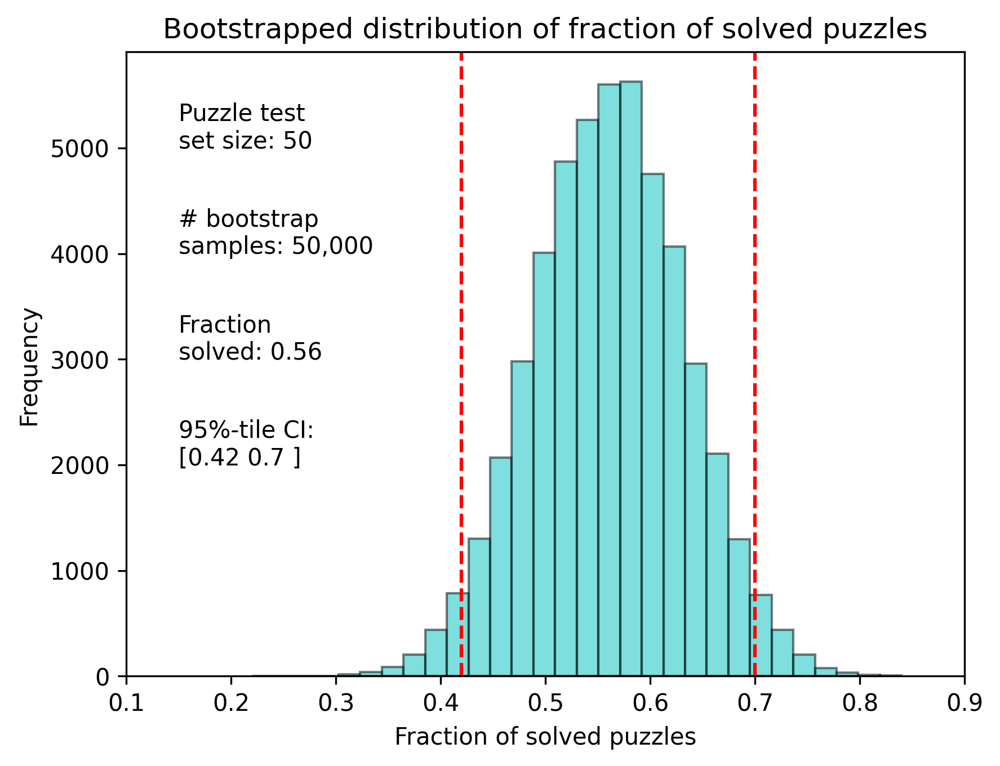
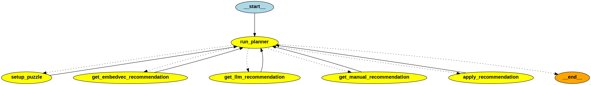
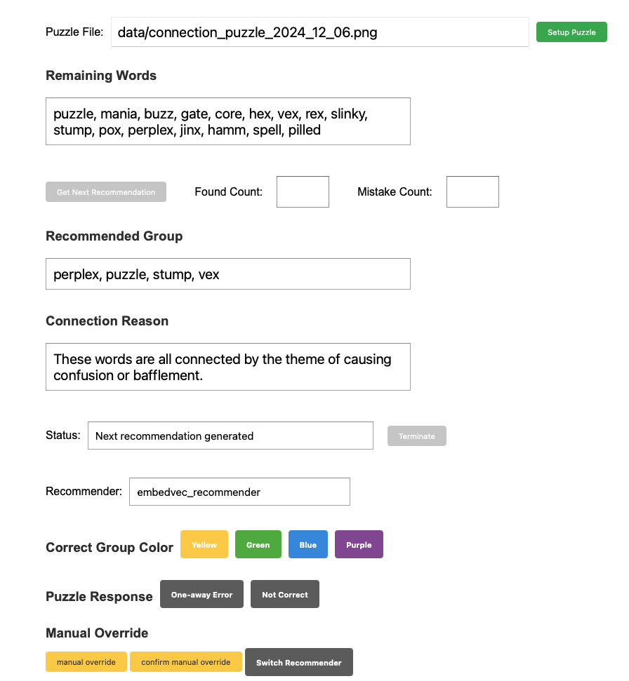

# Connection Solver Virtual Assistant Testbed

Experimental project to solve the [NYT Connection puzzles](https://www.nytimes.com/games/connections) using agentic workflow based on the [`langchain` ecosystem](https://python.langchain.com/v0.2/docs/introduction/).  In particular used:
* [`langchain`'s OpenAI LLM abstraction layer](https://python.langchain.com/v0.2/api_reference/openai/chat_models/langchain_openai.chat_models.base.ChatOpenAI.html#chatopenai) to interact with OpenAI's `gpt-4o` and `gpt-3.5-turbo` models
* [`langgraph`'s stateful orchestration framework](https://langchain-ai.github.io/langgraph/tutorials/multi_agent/multi-agent-collaboration/#multi-agent-network) to manage the agent's workflow
* [`langsmith`'s tracing tool](https://www.langchain.com/langsmith) to trace the agent's workflow

The agentic approach was inspired by these talks:
* [What's next for AI agentic workflows ft. Andrew Ng of AI Fund](https://youtu.be/sal78ACtGTc)
* [How Clearwater Analytics Builds AI Agents with Small Language Models (SLMs)](https://youtu.be/Z-k8Wm2uQmw?t=72)


## Connection Puzzle Description
Connections is a word game that challenges players to find themes between words. The user is presented with 16 words and must create groups of four items that share something in common. For example: **Tropical fruit**: banana, mango, pineapple, guava.

## Features of the Connection Solver Virtual Assistant Agent `app_embedvec.py`
* Extract puzzle words from text file to setup the puzzle
* LLM based tools to:
  * Extract words from an image to setup the puzzle 

    
  * LLM generator to create embedding vectors
  * LLM selector for candidate word groups based created by embedding vectors
  * LLM word group recommendation generator and selector
  * Natural Language Puzzle Planner workflow using markdown in an external file
  * LLM one-away error analyzer
* Two phase solver process
    * Phase 1: Use Embedding Vecotor recommendation generation
    * Phase 2: Use LLM puzzle recommendation generation if Phase 1 encounters a mistake
* Use of multiple LLMs:
    * `gpt-3.5-turbo` for the agent's planner
    * `gpt-4o` for generating puzzle recommendations and extract words from image
* LLM tracing with `langsmith`
* Code-based invalid group detection
* Manual override on agent recommendation
* sqlite3 database to store vocabulary and embedding vectors
* langgraph compliant method for human-in-the-loop interactions for setup and puzzle results
* Refactor code to use `asyncio` to reduce run-time latency
* Web-based puzzle solver interface

## Release History
**Agentic Solver**
| Git Tag | Description |
| --- | --- |
| v0.1.0 | agent with programmatic planner |
| v0.2.0 | Puzzle Planner converted to use LLM |
| v0.3.0 | Puzzle Planner enhanced for NLP instructions |
| v0.4.0 | integrate with langsmith for tracing |
| v0.5.0 | embedding vector recommender |
| v0.6.0 | one-away analyzer & code-based invalid group detection |
| v0.6.1 | fix empty one-away list error |
| v0.6.2 | fix incorrect one-away recommendation |
| v0.6.3 | includes fix #30 repeated one-away invalid group |
| v0.7.0 | Manual override on agent recommendation |
| v0.7.1 | langgraph compliant human-in-the-loop interactions, sqlite3 for vocabulary storage |
| v0.8.0 | asyncio integration to reduce run-time latency |
| v0.9.0 | expand use of asnycio to reduce automated test run-time |
| v0.9.1 | migrated workflow instructions out of PuzzleState |
| v0.9.2 | resolved error when hints are provided in puzzle words |
| v0.9.3 | reduce one-away analyzer time with asyncio |
| v0.9.4 | consolidate on chat_with_llm api for puzzle solver |
| v0.10.0 | Web-based puzzle solver interface |

**Automated Tester**
| Version | Description |
| --- | --- |
| v0.1.0 | Automated tester for Connection Puzzle Solver |
| v0.2.0 | Automated tester expand asycnio to reduce run-time |


## Sample Runs

Historical NYT Connection Puzzles were used in testing the agent.  Past puzzles can be found [here](https://word.tips/todays-nyt-connections-answers/).

Results for the 10 puzzles used for testing can be found [here](./docs/Example_Runs.md).

**First Time Solves**

"First Time Solves" is using the agent to solve the Connection Puzzle for the first time a Connections Puzzle appears in the NYT over a one-week period. This avoids any bias in the agent's performance that may be the result of LLM training on historical puzzle data found in the Internet.

Starting 2024-11-12 the v0.5.x agent is used to solve that day's puzzle.  A log of the agent's run can be found [here](./docs/first_time_solve_log_v0_5_0.md).

Starting 2024-11-20 the v0.6.x agent is used to solve that day's puzzle.  A log of the agent's run can be found [here](./docs/first_time_solve_log_v0_6_0.md).

Starting 2024-11-27 the v0.7.x agent is used to solve that day's puzzle.  A log of the agent's run can be found [here](./docs/first_time_solve_log_v0_7_0.md).

**Summary of First Time Solves**

| Version | Agent Solving Capabilities | Correct Solutions | Percentage Correct |
| --- | --- |:---:|:---:|
| v0.5.x | LLM and Embedding Vector-based recommendation generators | 2/7 | 29% |
| v0.6.x | LLM and Embedding Vector-based recommendation generators with one-away analyzer and revised invalid group detection| 4/7 | 57% |
| v0.7.x | LLM and Embedding Vector-based recommendation generators with one-away analyzer, revised invalid group detection, and manual override | 6/7 | 85% |

**Automated Tester Runs**

This is an automated tester for the Connection Puzzle Solver.  The tester runs the agent on a set of puzzles and records the results.  The results can be found [here](./docs/example_automated_test_run.md).

## Solution Strategy

The agent uses a two-phase solver process.  The first phase uses an Embedding Vector-based recommendation generator.  If the agent encounters a mistake, the second phase uses an LLM-based recommendation generator.  

**Note**: See [here](./docs/README_LLM.md) for a description of the original LLM-based solver.

### Embedding Vector-based Recommendation Generator
After setting up the puzzle with the 16 words, an LLM is used to generate embedding vectors for the words.  This generation is done with this prompt:

```text
You are an expert in language and knowledgeable on how words are used.

Your task is to generate as many diverse definitions as possible for the given word.  Follow these steps:

1. come up with a list of all possible parts of speech that the given word can be,e.g., noun, verb, adjective, etc.
2. for each part of speech, generate one or more examples of the given word for that parts of speech.  preappend the part of speech to the examples, e.g., "noun: example1", "verb: example2", etc.
3. combine all examples into a single list.

Return your response as a JSON object with the word as the key and the connotations as a list of strings.

example:

{
  "word": [
    "noun: example1", 
    "noun: example2", 
    "adjective: example3",]
}
```

The word and their definitions are stored in a `pandas` DataFrame.  The genereted definitions are used to create embedding vectors for the words.  This results in a DataFrame with the word and its embedding vector.


The agent then uses the embedding vectors to generate recommendations for the puzzle with this function `embedvec_tools.get_candidate_words()`.  The agent uses the cosine similarity between the embedding vectors to find the three closest words to the target word.  Since a word could overlap into multiple groupings, the `embedvec_tools.choose_embedvec_item()` function uses an LLM to identitfy the most likely word group from the candidate groupings derived by `get_candidate_words()` with this prompt:

```text
    anaylyze the following set of "candidate group" of 4 words.
    
    For each  "candidate group"  determine if the 4 words are connected by a single theme or concept.

    eliminate "candidate group" where the 4 words are not connected by a single theme or concept.

    return the "candidate group" that is unlike the other word groups

    if there is no  "candidate group" connected by a single theme or concept, return the group with the highest group metric.

    return response in json with the
    * key "candidate_group" for the "candidate group" that is connected by a single theme or concept that is the most unique about the "candidate group".  This is a list of 4 words.
    * key "explanation" with a few word summary for the reason for the response.
```

The agent will continue to use the embedding vector-based recommendation generator until it encounters a mistake.  The agent will then switch to the LLM-based recommendation generator.

### Embedding Vector Visualization with Tensorboard
Using `Tensorbaord` it is possible to analyze the embedding vectors generated by the agent to see how the words are related.  Here is an example of using `T-SNE` plots of the embedding vectors.

#### Initial loading of the embedding vectors
Each word is color-coded to facilitate understanding grouping of words.


#### Focus on a particular word grouping


#### Display metadata captured for the embedding vectors
For each embedding, the "word" and "definition" used to create the embedding are available for analysis.


### Bootstrap Analysis of an Automated Test Run
For a 50 puzzle run of the agent, a bootstrap analysis was performed to determine the confidence interval of the agent's performance.  The results of the analysis are shown in this plot.
.


### One-Away Error Analyzer

The `one_away_analyzer` function in `embedvec_tools.py` analyzes a group of words to identify subgroups that are related to a single topic and recommends a new word to add to the group. It generates all possible combinations of three words from the input group and uses a language model to determine if each three-word combination can be related to a single topic. If multiple single-topic groups are found, one is selected at random; if only one is found, it is selected; otherwise, no group is selected.

If a single-topic group is selected, the function creates a new prompt with the selected group's three-words and the remaining words, and sends it to the language model to get a fourth word recommendation. The recommended fourth word is combined with the original three word group to form a new group of four words, which is then returned as the Connection Puzzle recommendation. If no single-topic groups are found, the function returns `None`.

Here is an example run demonstrating the one-away error analyzer:
```text
python src/agent/app_embedvec.py 
Enter 'file' to read words from a file or 'image' to read words from an image: image
Please enter the image file location: data/connection_puzzle_2024_11_23.png
Puzzle Words: ['ball-in-cup', 'balance sheet', 'latex', 'lollipop', 'account', 'checkers', 'cotton swab', 'licorice', 'gum', 'corn dog', 'story', 'sap', 'chronicle', 'resin', 'roulette', 'description']

Generating vocabulary for the words...this may take about a minute

Generating embeddings for the definitions

ENTERED EMBEDVEC RECOMMENDATION
(94, 94)
(94, 94)
candidate_lists size: 45

EMBEDVEC_RECOMMENDER: RECOMMENDED WORDS ['corn dog', 'gum', 'licorice', 'lollipop'] with connection The group is uniquely connected by the theme of snack or confectionery items.
Is the recommendation accepted? (y/g/b/p/o/n): n
Recommendation ['corn dog', 'gum', 'licorice', 'lollipop'] is incorrect
Changing the recommender from 'embedvec_recommender' to 'llm_recommender'
attempt_count: 1
words_remaining: ['corn dog', 'description', 'account', 'licorice', 'story', 'roulette', 'chronicle', 'ball-in-cup', 'gum', 'checkers', 'cotton swab', 'sap', 'lollipop', 'resin', 'balance sheet', 'latex']

repeat invalid group detected: group_id dc6363b6c4a8b2ea8f142d8b40b227c6, recommendation: ['corn dog', 'licorice', 'gum', 'lollipop']
attempt_count: 2
words_remaining: ['latex', 'cotton swab', 'corn dog', 'story', 'chronicle', 'lollipop', 'balance sheet', 'ball-in-cup', 'description', 'resin', 'roulette', 'checkers', 'licorice', 'sap', 'gum', 'account']

LLM_RECOMMENDER: RECOMMENDED WORDS ['account', 'chronicle', 'description', 'story'] with connection Narrative forms
Is the recommendation accepted? (y/g/b/p/o/n): y
Recommendation ['story', 'chronicle', 'description', 'account'] is correct
attempt_count: 1
words_remaining: ['lollipop', 'gum', 'ball-in-cup', 'roulette', 'corn dog', 'checkers', 'resin', 'licorice', 'cotton swab', 'sap', 'balance sheet', 'latex']

repeat invalid group detected: group_id dc6363b6c4a8b2ea8f142d8b40b227c6, recommendation: ['lollipop', 'gum', 'licorice', 'corn dog']
attempt_count: 2
words_remaining: ['latex', 'balance sheet', 'sap', 'cotton swab', 'licorice', 'resin', 'checkers', 'corn dog', 'roulette', 'ball-in-cup', 'gum', 'lollipop']

LLM_RECOMMENDER: RECOMMENDED WORDS ['cotton swab', 'gum', 'licorice', 'lollipop'] with connection Candy or Confectionery
Is the recommendation accepted? (y/g/b/p/o/n): n
Recommendation ['cotton swab', 'gum', 'licorice', 'lollipop'] is incorrect
attempt_count: 1
words_remaining: ['cotton swab', 'roulette', 'ball-in-cup', 'resin', 'latex', 'corn dog', 'gum', 'checkers', 'lollipop', 'balance sheet', 'licorice', 'sap']

LLM_RECOMMENDER: RECOMMENDED WORDS ['corn dog', 'cotton swab', 'licorice', 'lollipop'] with connection Items commonly associated with sticks
Is the recommendation accepted? (y/g/b/p/o/n): o
Recommendation ['corn dog', 'cotton swab', 'licorice', 'lollipop'] is incorrect, one away from correct

>>>Number of single topic groups: 2
More than one single-topic group recommendations, selecting one at random.

>>>Selected single-topic group:
Recommended Group: ('cotton swab', 'corn dog', 'lollipop')
Connection Description: All three items can be related to the single topic of 'items on a stick.' Cotton swabs often have a stick-like structure for handling, corn dogs are typically served on a stick for easy consumption, and lollipops are known for being candies mounted on sticks. Therefore, they can all be related to the concept of items that are typically attached to or associated with a stick.

>>>One-away group recommendations:
using one_away_group_recommendation

LLM_RECOMMENDER: RECOMMENDED WORDS ['ball-in-cup', 'corn dog', 'cotton swab', 'lollipop'] with connection The common connection among the anchor words 'cotton swab', 'corn dog', and 'lollipop' is that they all involve a stick-like element as a central structural feature. A 'ball-in-cup' toy also includes a stick as part of its design, making it the candidate word most connected to the anchor words. The other candidate words do not share this common structural characteristic.
Is the recommendation accepted? (y/g/b/p/o/n): b
Recommendation ['cotton swab', 'corn dog', 'lollipop', 'ball-in-cup'] is correct
attempt_count: 1
words_remaining: ['sap', 'checkers', 'balance sheet', 'gum', 'latex', 'roulette', 'resin', 'licorice']

LLM_RECOMMENDER: RECOMMENDED WORDS ['gum', 'latex', 'resin', 'sap'] with connection Tree exudates or products
Is the recommendation accepted? (y/g/b/p/o/n): g
Recommendation ['sap', 'gum', 'latex', 'resin'] is correct
attempt_count: 1
words_remaining: ['licorice', 'balance sheet', 'checkers', 'roulette']

LLM_RECOMMENDER: RECOMMENDED WORDS ['balance sheet', 'checkers', 'licorice', 'roulette'] with connection Games
Is the recommendation accepted? (y/g/b/p/o/n): p
Recommendation ['licorice', 'balance sheet', 'checkers', 'roulette'] is correct
SOLVED THE CONNECTION PUZZLE!!!
```

### Heuristics used by the Agent
**Note**: _This section was generated by Github Copilot using the new local repo query feature.  The response was copy and pasted here and slight editing for formatting and corrected two cited code snippets that were close but not the exact code fragment.  Prompt used to generate the first draft of the write-up_:

> @workspace what kind of heuristics are used in #file src/agent/app_embedvec.py and #file src/agent/emvedvec_tool.py


In the files `app_embedvec.py` and `embedvec_tools.py`, several heuristics are used to manage the puzzle-solving process and generate recommendations. Here are some key heuristics:

#### Heuristics in `app_embedvec.py`

1. **Random Shuffling of Words**:
   - In the `get_recommendation` function, the remaining words are randomly shuffled or reversed to ensure robust group selection.
   ```python
   if np.random.uniform() < 0.5:
       random.shuffle(state["words_remaining"])
   else:
       state["words_remaining"].reverse()
   ```

2. **Retry Mechanism**:
   - The `get_recommendation` function includes a retry mechanism to attempt multiple times to get a valid recommendation.
   ```python
   attempt_count = 0
   while True:
       attempt_count += 1
       # ...
       if attempt_count > 10:
           break
   ```

3. **One-Away Error Analysis**:
   - The `apply_recommendation` function uses the `one_away_analyzer` to analyze groups that are one word away from being correct.
   ```python
   one_away_group_recommendation = one_away_analyzer(invalid_group, state["words_remaining"])
   ```

4. **Switching Recommenders**:
   - The `apply_recommendation` function switches from the embedding vector-based recommender to the LLM-based recommender if a mistake is made by the embedding vector-based recommender.  **Note**: _The code snippet was modified to cite the correct code fragment._
   ```python
    case "n":
        print(f"Recommendation {sorted(state['recommended_words'])} is incorrect")
        if state["puzzle_recommender"] == "embedvec_recommender":
            print("Changing the recommender from 'embedvec_recommender' to 'llm_recommender'")
            state["puzzle_recommender"] = "llm_recommender"
   ```

#### Heuristics in `embedvec_tools.py`

1. **Cosine Similarity**:
   - The `get_candidate_words` function uses cosine similarity to find the three closest words to the target word.
   ```python
   cosine_similarities = cosine_similarity(df['embedding'].tolist())
   ```

2. **Group Metric Calculation**:
   - The `get_candidate_words` function calculates a group metric as the average cosine similarity of all combinations of words in the group.
   ```python
   candidate_group.group_metric = np.array([cosine_similarities[r, c] for r, c in combinations]).mean()
   ```

3. **Removing Duplicate Groups**:
   - The `get_candidate_words` function removes duplicate groups by checking the group ID.
   ```python
   found_groups = set()
   unique_candidate_list = []
   for candidate in candidate_list:
       if candidate.group_id not in found_groups:
           unique_candidate_list.append(candidate)
           found_groups.add(candidate.group_id)
   ```

4. **LLM-Based Validation**:
   - The `get_embedvec_recomendation` function uses an LLM to validate the top candidate groups and select the most likely word group `choose_embedvec_item`.  **Note**: _Minor edit of text description and code snippet was modified to cite the correct code fragment._
   ```python
    # validate the top 5 candidate list with LLM
    list_to_validate = "\n".join([str(x) for x in candidate_list[:5]])
    recommended_group = choose_embedvec_item(list_to_validate)
    logger.info(f"Recommended group: {recommended_group}")
   ```

These heuristics help the agent manage the puzzle-solving process, generate recommendations, and handle errors effectively.

### Workflow
The agent uses the `PuzzleState` class to manage the agent's state and controls the agent's workflow. 
```python
# define the state of the puzzle
class PuzzleState(TypedDict):
    puzzle_status: str = ""
    tool_status: str = ""
    current_tool: str = ""
    workflow_instructions: Optional[str] = None
    vocabulary_db_fp: Optional[str] = None
    tool_to_use: str = ""
    words_remaining: List[str] = []
    invalid_connections: List[Tuple[str, List[str]]] = []
    recommended_words: List[str] = []
    recommended_connection: str = ""
    recommended_correct: bool = False
    recommendation_answer_status: Optional[str] = None
    found_yellow: bool = False
    found_greeen: bool = False
    found_blue: bool = False
    found_purple: bool = False
    mistake_count: int = 0
    llm_retry_count: int = 0
    found_count: int = 0
    recommendation_count: int = 0
    llm_temperature: float = 1.0
    puzzle_source_type: Optional[str] = None
    puzzle_source_fp: Optional[str] = None
```

Key workflow attributes:
* `puzzle_status`: indicates if puzzle is initialized
* `tool_status`: indicates the results of the current step and is used to determine next tool to use.
* `current_tool`: indicates current active tool.
* `workflow_instructions`: contains the workflow instructions
* `vocabulary_db_fp`: contains file path to sqlite3 database containing vocabulary and embedding vectors


Overall control is performed by the `run_planner()` function.  The agent's workflow is defined by the `StateGraph` class from `langgraph`.  The agent's workflow is defined by a series of nodes and edges.  The nodes are the agent's processing steps and the edges are the transitions between the processing steps.  This function determines the next step in the agent's workflow based on the attributes described above.

Agent's workflow defintion:
```python
    workflow = StateGraph(PuzzleState)

    workflow.add_node("run_planner", run_planner)
    workflow.add_node("setup_puzzle", setup_puzzle)
    workflow.add_node("get_embedvec_recommendation", get_embedvec_recommendation)
    workflow.add_node("get_llm_recommendation", get_llm_recommendation)
    workflow.add_node("get_manual_recommendation", get_manual_recommendation)
    workflow.add_node("apply_recommendation", apply_recommendation)

    workflow.add_conditional_edges(
        "run_planner",
        determine_next_action,
        {
            "setup_puzzle": "setup_puzzle",
            "get_embedvec_recommendation": "get_embedvec_recommendation",
            "get_llm_recommendation": "get_llm_recommendation",
            "get_manual_recommendation": "get_manual_recommendation",
            "apply_recommendation": "apply_recommendation",
            END: END,
        },
    )

    workflow.add_edge("setup_puzzle", "run_planner")
    workflow.add_edge("get_llm_recommendation", "run_planner")
    workflow.add_edge("get_embedvec_recommendation", "run_planner")
    workflow.add_edge("get_manual_recommendation", "run_planner")
    workflow.add_edge("apply_recommendation", "run_planner")

    workflow.set_entry_point("run_planner")

    app = workflow.compile()
    app.get_graph().draw_png("images/connection_solver_embedvec_graph.png")
```

Diagram of the agent's workflow:


The agent's planner function uses the LLM and current `PuzzleState` to determine the next step in the workflow.  The Planner's prompt consists of three parts.  First is the "system prompt":
```python
PLANNER_SYSTEM_MESSAGE = """
    You are an expert in managing the sequence of a workflow. Your task is to
    determine the next tool to use given the current state of the workflow.

    the eligible tools to use are: ["setup_puzzle", "get_llm_recommendation", "apply_recommendation", "get_embedvec_recommendation", "get_manual_recommendation", "END"]

    The important information for the workflow state is to consider are: "puzzle_status", "tool_status", and "current_tool".

    Using the provided instructions, you will need to determine the next tool to use.

    output response in json format with key word "tool" and the value as the output string.
    
"""
```

The second part is this markdown description of the workflow.

Markdown description of the workflow instructions:
---
**Instructions**

use "setup_puzzle" tool to initialize the puzzle if the "puzzle_status" is not initialized.

if "tool_status" is "puzzle_completed" then use "END" tool.

Use the table to select the appropriate tool.

|current_tool| tool_status | tool |
| --- | --- | --- |
|setup_puzzle| initialized | get_embedvec_recommendation |
|embedvec_recommender| next_recommendation | get_embedvec_recommendation |
|embedvec_recommender| have_recommendation | apply_recommendation |
|llm_recommender| next_recommendation | get_llm_recommendation |
|llm_recommender| have_recommendation | apply_recommendation |
|llm_recommender| manual_recommendation | get_manual_recommendation |
|manual_recommender| have_recommendation | apply_recommendation |
|manual_recommender| next_recommendation | get_llm_recommendation |

If no tool is selected, use "ABORT" tool.

---


The final part is the current state of the game.  The following subset of `PuzzleState` is extracted as a string and passed to the LLM in the prompt to determine the next step in the agent's workflow.  The LLM's response determines the next tool to use.  Here is an example:
```python
'{
    "puzzle_status": "initialized", 
    "tool_status": "next_recommendation",
    "current_tool": "embedvec_recommender",
}'
```

## Web-based Puzzle Solver Interface
The agent's workflow was converted to a web-based interface using `Quart`.  The interface allows the user to interact with the agent to solve a Connection Puzzle.  The interface is a single page application.  Here are some screenshots of the interface:

**Interface on start-up**


**Interface during the solving process**



**Interface after the puzzle is solved**


## Repo Contents
Major contents of the repo:
| File/Folder | Description |
| --- | --- |
| `src/agent/app.py` | Main entry point for the agent.  Define workflow processing steps (aka graph nodes), workflow transitions (aka graph edges) and `PuzzleState` data structure.  The original LLM-based solver|
| `src/agent/app_embedvec.py` | Main entry point for the agent.  Define workflow processing steps (aka graph nodes), workflow transitions (aka graph edges) and `PuzzleState` data structure.  The Embedding Vector-based solver.|
| `src/agent/tools.py` | Tools used by the agent: retrieve puzzle setup, interact with user and interface to OpenAI LLM|
| `src/agent/embedvec_tools.py` | Tools used by the agent: created embedding vectors, retrieve puzzle setup, interact with user and interface to OpenAI LLM|
| `src/agent/utils.py` | Utilities to be used by the agent. |
| `src/agent/tests/` | Unit tests for the agent. |
| `src/agent_testbed/` | Directory containing technical proof-of-concept code. |
| `data/` | Directory containing past NYT Connection Puzzles for testing. |
| `prompt_testbed/` | Directory containing sample prompts used in testing with the OpenAI Playground. |

## Setup
### devcontianer
The project is run in a devcontainer. The `.devcontainer/devcontainer.json` setup is to be used to mount the location where the OPENAI and `langsmith` API Keys can be found.  The environment variable `NCPA_ROOT_DIR` is used to speficify the location on the local host where a json configuration file containing the API Keys.  
```json
	// mount local source folder into container
	"mounts": [
		"source=${localEnv:NCPA_ROOT_DIR}/.openai,target=/openai,type=bind,consistency=cached",
		"source=${localEnv:NCPA_ROOT_DIR},target=/desktop,type=bind,consistency=cached"
	],
```
The above assumes the `.openai` directory contains the `api_key.json` file and `.openai` is a subdirectory of the directory pointed to by the environment variable `$NCPA_ROOT_DIR`.


### Credentials for OpenAI and `langsmith`
The code assumes the existence of this json file in this location: `/openai/api_key.json`.  The file should contain the following:
```json
{
    "org": "<OPENAI-ORG>",
    "key": "<OPENAI-API-KEY>",
    "langsmith_key": "<LANGSMITH-API-KEY>"
}
```

**Note**: The `langsmith_key` is only used if the `--trace` CLI option is specified.  

## Some Lessons Learned
While prompt engineering is a critical component to the agent's success, an equally critical function is setting up the right data structures to be used by the LLM.  Speficially, randomizing the order of the words in `words_remaining` seemed to allow the LLM to get unstuck from invalid groupings. 

Passing only the the required subset of `PuzzleState` for the LLM to make a decision worked out better.  The LLM's response was more accurate when the prompt only included the subset of `PuzzleState` that was relevant to the decision making process.

Automated testing is needed.  Right now the agent is tested manually.  This can be tedious as more test cases are needed.  Automated testing would allow for more rapid development and testing of the agent.

Experiment tracking is needed.  As different designs of the workflow and changes in functionality at different steps in the process, the results from testing should be automatically recorded.  For this body of work, all of this was done either in hand-written notes or tracked via memory.

From a Virtual Coding Assistant perspective, perplexity.ai seemed to generate more useful code for `langchain` and `langgraph`.  Github Copilot generated code for these libraries generated code that was not compatible with the current version of the libraries.  This is probably due to GH Copilot is trained on code in public repos vs perplexity.ai uses a RAG based approach on current content in the web.  perplexity.ai appears to support better at code generation for new and quickly evolving packages.  However, once I have some code in the Visual Studio Code IDE, then GH Copilot reduced the effort to refactor and revise the code.  For long standing packages, e.g, `pandas`, `numpy`, `matplotlib`, GH Copilot generates useful code snippets.


### How to Run the Agent
```bash
# run agent with default logging level
$ python src/agent/app_embedvec.py

# run agent with DEBUG logging level
$ python src/agent/app_embedvec.py --log-level DEBUG
```
Command line options:
```text
usage: app_embedvec.py [-h] [--log-level LOG_LEVEL] [--trace]

Set logging level for the application.

options:
  -h, --help            show this help message and exit
  --log-level LOG_LEVEL
                        Set the logging level (DEBUG, INFO, WARNING, ERROR, CRITICAL)
  --trace               Enable langsmith tracing for the application.
```

Note: Due to the random nature of the LLM, the results vary from run to run.  For example, running the same puzzle multiple times may result in different recommendations from the LLM.  As a result, the puzzle may get solved in one run and not in another.


## `langsmith` tracing

The `langsmith` tracing tool was used to trace the agent's workflow.  Here is an example trace of the agent solving a Connection Puzzle.:

### Overall Trace


### Creating Embeddings


### Workflow Decision Making


## Future Work
See https://github.com/jimthompson5802/connection_solver/issues

## Additional Resources
* Todd, et al, _Missed Connections: Lateral Thinking for Language Models_, 2024, https://arxiv.org/abs/2404.11730 

* Doyle, C., _LLMs as Method Actors: A Model for Prompt Engineering and Architecture_, 2024, https://arxiv.org/abs/2411.05778 

* Merino, et al, _Making New Connections: LLMs as Puzzle Generators for The New York Times' Connections Word Game_, 2024, https://arxiv.org/abs/2407.11240

* Weights and Biases, _GPT - Connections_, demonstration of automating the testing of Connect Puzzle Solver and using WandB to track the results, https://github.com/wandb/connections