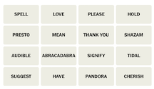

# Connection Solver Virtual Assistant Testbed

Experimental project to solve the [NYT Connection puzzles](https://www.nytimes.com/games/connections) using agentic workflow based on the [`langchain` ecosystem](https://python.langchain.com/v0.2/docs/introduction/).  In particular used:
* [`langchain`'s OpenAI LLM abstraction layer](https://python.langchain.com/v0.2/api_reference/openai/chat_models/langchain_openai.chat_models.base.ChatOpenAI.html#chatopenai) to interact with OpenAI's `gpt-4o` and `gpt-3.5-turbo` models
* [`langgraph`'s stateful orchestration framework](https://langchain-ai.github.io/langgraph/tutorials/multi_agent/multi-agent-collaboration/#multi-agent-network) to manage the agent's workflow
* [`langsmith`'s tracing tool](https://www.langchain.com/langsmith) to trace the agent's workflow

The agentic approach was inspired by these talks:
* [What's next for AI agentic workflows ft. Andrew Ng of AI Fund](https://youtu.be/sal78ACtGTc)
* [How Clearwater Analytics Builds AI Agents with Small Language Models (SLMs)](https://youtu.be/Z-k8Wm2uQmw?t=72)


## Connection Puzzle Description
Connections is a word game that challenges players to find themes between words. The user is presented with 16 words and must create groups of four items that share something in common. For example: **Tropical fruit**: banana, mango, pineapple, guava.

## Features of the Connection Solver Virtual Assistant Agent `app_embedvec.py`
* Extract puzzle words from text file to setup the puzzle
* LLM based tools to:
  * Extract words from an image to seutp the puzzle 

    
  * LLM generator to create embedding vectors
  * Embedding vector based puzzle recommendation generator  
  * LLM puzzle recommendation generator
  * Natural Language Puzzle Planner workflow using markdown in an external file
* Two phase solver process
    * Phase 1: Use Embedding Vecotor recommendation generation
    * Phase 2: Use LLM puzzle recommendation generation if Phase 1 encounters a mistake
* Use of multiple LLMs:
    * `gpt-3.5-turbo` for the agent's planner
    * `gpt-4o` for generating puzzle recommendations and extract words from image
* LLM tracing with `langsmith`


## Solution Strategy

The agent uses a two-phase solver process.  The first phase uses an Embedding Vector-based recommendation generator.  If the agent encounters a mistake, the second phase uses an LLM-based recommendation generator.  

**Note**: See [here](./docs/README_LLM.md) for a description of the original LLM-based solver.

The agent uses the `PuzzleState` class to manage the agent's state and controls the agent's workflow. 
```python
# define the state of the puzzle
class PuzzleState(TypedDict):
    puzzle_status: str = ""
    puzzle_step: str = ""
    puzzle_recommender: str = ""
    workflow_instructions: str = ""
    vocabulary_df: pd.DataFrame = None
    tool_to_use: str = ""
    words_remaining: List[str] = []
    invalid_connections: List[List[str]] = []
    recommended_words: List[str] = []
    recommended_connection: str = ""
    recommended_correct: bool = False
    found_yellow: bool = False
    found_greeen: bool = False
    found_blue: bool = False
    found_purple: bool = False
    mistake_count: int = 0
    found_count: int = 0
    recommendation_count: int = 0
    llm_temperature: float = 1.0
```

Key workflow attributes:
* `puzzle_status`: indicates if puzzle is initialized
* `puzzle_step`: indicates the results of the current step and is used to determine next tool to use
* `puzzle_recommender`: indicates current active recommender tool:  `embedvec_recommender` or `llm_recommender`.
* `workflow_instructions`: contains the workflow instructions
* `vocabulary_df`: contains the vocabulary and embedding vectors for the puzzle words


Overall control is performed by the `run_planner()` function.  The agent's workflow is defined by the `StateGraph` class from `langgraph`.  The agent's workflow is defined by a series of nodes and edges.  The nodes are the agent's processing steps and the edges are the transitions between the processing steps.  This function determines the next step in the agent's workflow based on the attributes described above.

Agent's workflow defintion:
```python
    workflow = StateGraph(PuzzleState)


    workflow.add_node("run_planner", run_planner)
    workflow.add_node("setup_puzzle", setup_puzzle)
    workflow.add_node("get_embedvec_recommendation", get_embedvec_recommendation)
    workflow.add_node("get_recommendation", get_recommendation)
    workflow.add_node("apply_recommendation", apply_recommendation)


    workflow.add_conditional_edges(
        "run_planner",
        determine_next_action,
        {
            "setup_puzzle": "setup_puzzle",
            "get_embedvec_recommendation": "get_embedvec_recommendation",
            "get_recommendation": "get_recommendation",
            "apply_recommendation": "apply_recommendation",
            END: END,
        },
    )


    workflow.add_edge("setup_puzzle", "run_planner")
    workflow.add_edge("get_recommendation", "run_planner")
    workflow.add_edge("get_embedvec_recommendation", "run_planner")
    workflow.add_edge("apply_recommendation", "run_planner")


    workflow.set_entry_point("run_planner")


    app = workflow.compile()
    app.get_graph().draw_png("images/connection_solver_embedvec_graph.png")
```

Diagram of the agent's workflow:


The agent's planner function uses the LLM and current `PuzzleState` to determine the next step in the workflow.  The Planner's prompt consists of three parts.  First is the "system prompt":
```python
PLANNER_SYSTEM_MESSAGE = """
    You are an expert in managing the sequence of a workflow. Your task is to
    determine the next tool to use given the current state of the workflow.


    the eligible tools to use are: ["setup_puzzle", "get_recommendation", "apply_recommendation", "get_embedvec_recommendation", "END"]


    The important information for the workflow state is to consider are: "puzzle_status", "puzzle_step", and "puzzle_recommender".


    Using the provided instructions, you will need to determine the next tool to use.


    output response in json format with key word "tool" and the value as the output string.
    
"""
```

The second part is this markdown description of the workflow.

Markdown description of the workflow instructions:
---
**Instructions**

use "setup_puzzle" tool to initialize the puzzle if the "puzzle_status" is not initialized.

if "puzzle_step" is "puzzle_completed" then use "END" tool.

Use the table to select the appropriate tool.

|puzzle_recommender| puzzle_step | tool |
| --- | --- | --- |
|embedvec_recommender| next_recommendation | get_embedvec_recommendation |
|embedvec_recommender| have_recommendation | apply_recommendation |
|llm_recommender| next_recommendation | get_recommendation |
|llm_recommender| have_recommendation | apply_recommendation |

If no tool is selected, use "ABORT" tool.

---


The final part is the current state of the game.  The following subset of `PuzzleState` is extracted as a string and passed to the LLM in the prompt to determine the next step in the agent's workflow.  The LLM's response determines the next tool to use.
```python
'{
    "puzzle_status": "initialized", 
    "puzzle_step": "next_recommendation",
    "puzzle_recommender": "embedvec_recommender",
}'
```

## Repo Contents
Major contents of the repo:
| File/Folder | Description |
| --- | --- |
| `src/agent/app.py` | Main entry point for the agent.  Define workflow processing steps (aka graph nodes), workflow transitions (aka graph edges) and `PuzzleState` data structure.  The original LLM-based solver|
| `src/agent/app_embedvec.py` | Main entry point for the agent.  Define workflow processing steps (aka graph nodes), workflow transitions (aka graph edges) and `PuzzleState` data structure.  The Embedding Vector-based solver.|
| `src/agent/tools.py` | Tools used by the agent: retrieve puzzle setup, interact with user and interface to OpenAI LLM|
| `src/agent/embedvec_tools.py` | Tools used by the agent: created embedding vectors, retrieve puzzle setup, interact with user and interface to OpenAI LLM|
| `src/agent/utils.py` | Utilities to be used by the agent. |
| `src/agent/tests/` | Unit tests for the agent. |
| `src/agent_testbed/` | Directory containing technical proof-of-concept code. |
| `data/` | Directory containing past NYT Connection Puzzles for testing. |
| `prompt_testbed/` | Directory containing sample prompts used in testing with the OpenAI Playground. |

## Some Lessons Learned
While prompt engineering is a critical component to the agent's success, an equally critical function is setting up the right data structures to be used by the LLM.  Speficially, randomizing the order of the words in `words_remaining` seemed to allow the LLM to get unstuck from invalid groupings. 

Automated testing is needed.  Right now the agent is tested manually.  This can be tedious as more test cases are needed.  Automated testing would allow for more rapid development and testing of the agent.

Experiment tracking is needed.  As different designs of the workflow and changes in functionality at different steps in the process, the results from testing should be automatically recorded.  For this body of work, all of this was done either in hand-written notes or tracked via memory.

From a Virtual Coding Assistant perspective, perplexity.ai seemed to generate more useful code for `langchain` and `langgraph`.  Github Copilot generated code for these libraries generated code that was not compatible with the current version of the libraries.  This is probably due to GH Copilot is trained on code in public repos vs perplexity.ai uses a RAG based approach on current content in the web.  perplexity.ai appears to support better at code generation for new and quickly evolving packages.  However, once I have some code in the Visual Studio Code IDE, then GH Copilot reduced the effort to refactor and revise the code.  For long standing packages, e.g, `pandas`, `numpy`, `matplotlib`, GH Copilot generates useful code snippets.

## Sample Runs

Historical NYT Connection Puzzles were used in testing the agent.  Past puzzles can be found [here](https://word.tips/todays-nyt-connections-answers/).

### How to Run the Agent
```bash
# run agent with default logging level
$ python src/agent/app_embedvec.py

# run agent with DEBUG logging level
$ python src/agent/app_embedvec.py --log-level DEBUG
```
Command line options:
```text
usage: app_embedvec.py [-h] [--log-level LOG_LEVEL] [--trace]

Set logging level for the application.

options:
  -h, --help            show this help message and exit
  --log-level LOG_LEVEL
                        Set the logging level (DEBUG, INFO, WARNING, ERROR, CRITICAL)
  --trace               Enable langsmith tracing for the application.
```

Note: Due to the random nature of the LLM, the results vary from run to run.  For example, running the same puzzle multiple times may result in different recommendations from the LLM.  As a result, the puzzle may get solved in one run and not in another.

### Connections Puzzl 1
**Expected Solution**
```text
🟡 GRASSY AREA: GREEN ,LAWN ,PARK ,YARD

🟢 DEAL WITH: ADDRESS ,ANSWER ,FIELD ,HANDLE

🔵 MOVIES WITH “S” REMOVED: CAR ,GOODFELLA ,JAW ,SWINGER

🟣 ___ LAW: CRIMINAL ,HARVARD ,LEMON ,NATURAL
```

**Example Run**
```text
$ python src/agent/app_embedvec.py 
Enter 'file' to read words from a file or 'image' to read words from an image: file
Please enter the word file location: data/word_list1.txt
Puzzle Words: ['goodfella', 'jaw', 'answer', 'handle', 'park', 'lemon', 'yard', 'field', 'natural', 'car', 'harvard', 'swinger', 'green', 'criminal', 'address', 'lawn']

Generating vocabulary for the words...this may take about a minute

Generating embeddings for the definitions

ENTERED EMBEDVEC RECOMMENDATION
(101, 101)
(101, 101)
candidate_lists size: 61

RECOMMENDED WORDS ['green', 'lawn', 'park', 'yard'] with connection This group is uniquely connected by the theme of grassy or green areas, typically used for recreation or surrounding a building.
Is the recommendation accepted? (y/g/b/p/n): y
Recommendation ['green', 'lawn', 'park', 'yard'] is correct

ENTERED EMBEDVEC RECOMMENDATION
(75, 75)
(75, 75)
candidate_lists size: 41

RECOMMENDED WORDS ['criminal', 'goodfella', 'handle', 'swinger'] with connection This group uniquely combines illegal activities and lifestyle elements, unlike the others.
Is the recommendation accepted? (y/g/b/p/n): n
Recommendation ['criminal', 'goodfella', 'handle', 'swinger'] is incorrect
Changing the recommender from 'embedvec_recommender' to 'llm_recommender'

RECOMMENDED WORDS ['address', 'answer', 'field', 'jaw'] with connection Common words that can follow 'bone'
Is the recommendation accepted? (y/g/b/p/n): n
Recommendation ['address', 'field', 'jaw', 'answer'] is incorrect

RECOMMENDED WORDS ['car', 'criminal', 'lemon', 'natural'] with connection Types of things that can be described as 'bad'
Is the recommendation accepted? (y/g/b/p/n): n
Recommendation ['criminal', 'lemon', 'car', 'natural'] is incorrect

RECOMMENDED WORDS ['car', 'handle', 'jaw', 'lemon'] with connection Parts of a Vehicle
Is the recommendation accepted? (y/g/b/p/n): n
Recommendation ['handle', 'jaw', 'lemon', 'car'] is incorrect
FAILED TO SOLVE THE CONNECTION PUZZLE TOO MANY MISTAKES!!!


FINAL PUZZLE STATE:
{   'found_count': 1,
    'found_yellow': True,
    'invalid_connections': [   ['criminal', 'goodfella', 'handle', 'swinger'],
                               ['address', 'field', 'jaw', 'answer'],
                               ['criminal', 'lemon', 'car', 'natural'],
                               ['handle', 'jaw', 'lemon', 'car']],
    'llm_temperature': 0.7,
    'mistake_count': 4,
    'puzzle_recommender': 'llm_recommender',
    'puzzle_status': 'initialized',
    'puzzle_step': 'puzzle_completed',
    'recommendation_count': 5,
    'recommended_connection': '',
    'recommended_correct': False,
    'recommended_words': [],
    'tool_to_use': 'END',
    'vocabulary_df':          word  ...                                          embedding
0   goodfella  ...  [-0.0018825688166543841, -0.020176813006401062...
1   goodfella  ...  [0.012982374057173729, -0.024880854412913322, ...
2   goodfella  ...  [0.002593545475974679, -0.03611481562256813, -...
3         jaw  ...  [0.009509989060461521, -0.012200391851365566, ...
4         jaw  ...  [0.015597725287079811, 0.040123581886291504, 0...
..        ...  ...                                                ...
93    address  ...  [0.02411642298102379, -0.009190985932946205, -...
94    address  ...  [0.02462298423051834, -0.03992646187543869, 0....
95    address  ...  [0.020654963329434395, 0.002632375340908766, 0...
96    address  ...  [0.06892802566289902, -0.01271691732108593, 0....
97    address  ...  [0.03520861640572548, -0.062401093542575836, -...

[75 rows x 3 columns],
    'words_remaining': [   'address',
                           'handle',
                           'harvard',
                           'goodfella',
                           'field',
                           'jaw',
                           'answer',
                           'lemon',
                           'natural',
                           'swinger',
                           'car',
                           'criminal'],
    'workflow_instructions': '**Instructions**\n'
                             '\n'
                             'use "setup_puzzle" tool to initialize the puzzle '
                             'if the "puzzle_status" is not initialized.\n'
                             '\n'
                             'if "puzzle_step" is "puzzle_completed" then use '
                             '"END" tool.\n'
                             '\n'
                             'Use the table to select the appropriate tool.\n'
                             '\n'
                             '|puzzle_recommender| puzzle_step | tool |\n'
                             '| --- | --- | --- |\n'
                             '|embedvec_recommender| next_recommendation | '
                             'get_embedvec_recommendation |\n'
                             '|embedvec_recommender| have_recommendation | '
                             'apply_recommendation |\n'
                             '|llm_recommender| next_recommendation | '
                             'get_recommendation |\n'
                             '|llm_recommender| have_recommendation | '
                             'apply_recommendation |\n'
                             '\n'
                             'If no tool is selected, use "ABORT" tool.\n'}
```

### Connections Puzzle 2
**Expected Solution**
```text
🟡 BRING ABOUT: GENERATE ,INSPIRE ,PROMPT ,PROVOKE

🟢 THINGS THAT ARE OFTEN SCENTED: CANDLE ,INCENSE ,LOTION ,SOAP

🔵 THINGS THAT MIGHT STING: INSULT ,JELLYFISH ,NETTLE ,WASP

🟣 VIDEO GAME FRANCHISES: CIVILIZATION ,HALO ,MADDEN ,METROID
```
**Example Run**
```text
$ python src/agent/app_embedvec.py 
Enter 'file' to read words from a file or 'image' to read words from an image: file
Please enter the word file location: data/word_list2.txt
Puzzle Words: ['inspire', 'madden', 'jellyfish', 'metroid', 'insult', 'candle', 'halo', 'provoke', 'soap', 'generate', 'incense', 'civilization', 'lotion', 'wasp', 'prompt', 'nettle']

Generating vocabulary for the words...this may take about a minute

Generating embeddings for the definitions

ENTERED EMBEDVEC RECOMMENDATION
(86, 86)
(86, 86)
candidate_lists size: 58

RECOMMENDED WORDS ['incense', 'madden', 'nettle', 'provoke'] with connection All words are connected by the theme of making someone angry or annoyed.
Is the recommendation accepted? (y/g/b/p/n): n
Recommendation ['incense', 'madden', 'nettle', 'provoke'] is incorrect
Changing the recommender from 'embedvec_recommender' to 'llm_recommender'

RECOMMENDED WORDS ['insult', 'jellyfish', 'nettle', 'wasp'] with connection Things that sting or irritate
Is the recommendation accepted? (y/g/b/p/n): b
Recommendation ['nettle', 'wasp', 'jellyfish', 'insult'] is correct

RECOMMENDED WORDS ['civilization', 'halo', 'incense', 'metroid'] with connection Video Game Titles
Is the recommendation accepted? (y/g/b/p/n): n
Recommendation ['metroid', 'halo', 'civilization', 'incense'] is incorrect

RECOMMENDED WORDS ['candle', 'incense', 'lotion', 'soap'] with connection Items used for fragrance or hygiene
Is the recommendation accepted? (y/g/b/p/n): g
Recommendation ['soap', 'candle', 'incense', 'lotion'] is correct

RECOMMENDED WORDS ['generate', 'inspire', 'prompt', 'provoke'] with connection Words related to eliciting a response or action
Is the recommendation accepted? (y/g/b/p/n): y
Recommendation ['inspire', 'provoke', 'generate', 'prompt'] is correct

RECOMMENDED WORDS ['civilization', 'halo', 'madden', 'metroid'] with connection Video Game Titles
Is the recommendation accepted? (y/g/b/p/n): p
Recommendation ['halo', 'metroid', 'civilization', 'madden'] is correct
SOLVED THE CONNECTION PUZZLE!!!


FINAL PUZZLE STATE:
{   'found_blue': True,
    'found_count': 4,
    'found_purple': True,
    'found_yellow': True,
    'invalid_connections': [   ['incense', 'madden', 'nettle', 'provoke'],
                               ['metroid', 'halo', 'civilization', 'incense']],
    'llm_temperature': 0.7,
    'mistake_count': 2,
    'puzzle_recommender': 'llm_recommender',
    'puzzle_status': 'initialized',
    'puzzle_step': 'puzzle_completed',
    'recommendation_count': 6,
    'recommended_connection': '',
    'recommended_correct': False,
    'recommended_words': [],
    'tool_to_use': 'END',
    'vocabulary_df':        word  ...                                          embedding
0   inspire  ...  [0.05667409673333168, -0.02952421084046364, -0...
1   inspire  ...  [0.011845439672470093, 0.008845405653119087, -...
2   inspire  ...  [0.0391249917447567, -0.0660882368683815, -0.1...
3   inspire  ...  [0.0076184929348528385, -0.0359916090965271, -...
4   inspire  ...  [0.04250592365860939, -0.03686268627643585, -0...
..      ...  ...                                                ...
81   prompt  ...  [-0.014272868633270264, 0.023768790066242218, ...
82   nettle  ...  [-0.02215682715177536, -0.00010512269363971427...
83   nettle  ...  [-0.005328505765646696, -0.00879666954278946, ...
84   nettle  ...  [0.01180578675121069, -0.04750848188996315, -0...
85   nettle  ...  [0.02716865763068199, -0.03534795343875885, -0...

[86 rows x 3 columns],
    'words_remaining': [],
    'workflow_instructions': '**Instructions**\n'
                             '\n'
                             'use "setup_puzzle" tool to initialize the puzzle '
                             'if the "puzzle_status" is not initialized.\n'
                             '\n'
                             'if "puzzle_step" is "puzzle_completed" then use '
                             '"END" tool.\n'
                             '\n'
                             'Use the table to select the appropriate tool.\n'
                             '\n'
                             '|puzzle_recommender| puzzle_step | tool |\n'
                             '| --- | --- | --- |\n'
                             '|embedvec_recommender| next_recommendation | '
                             'get_embedvec_recommendation |\n'
                             '|embedvec_recommender| have_recommendation | '
                             'apply_recommendation |\n'
                             '|llm_recommender| next_recommendation | '
                             'get_recommendation |\n'
                             '|llm_recommender| have_recommendation | '
                             'apply_recommendation |\n'
                             '\n'
                             'If no tool is selected, use "ABORT" tool.\n'}
```

### Connections Puzzl 3
**Expected Solution**
```text
🟡 FOOTBALL POSITIONS: CENTER ,GUARD ,QUARTERBACK ,SAFETY

🟢 CABLE CHANNELS: DISCOVERY ,HISTORY ,NICKELODEON ,OXYGEN

🔵 FICTIONAL CLOWNS: HOMEY ,JOKER ,PENNYWISE ,RONALD

🟣 WHAT “D” MIGHT STAND FOR: DEFENSE ,DEMOCRAT ,DIMENSIONAL ,DRIVE
```

**Example Run**
```text 
$ python src/agent/app_embedvec.py 
Enter 'file' to read words from a file or 'image' to read words from an image: file
Please enter the word file location: data/word_list3.txt
Puzzle Words: ['center', 'pennywise', 'democrat', 'safety', 'oxygen', 'history', 'guard', 'homey', 'joker', 'quarterback', 'ronald', 'defense', 'discovery', 'drive', 'nickelodeon', 'dimensional']

Generating vocabulary for the words...this may take about a minute

Generating embeddings for the definitions

ENTERED EMBEDVEC RECOMMENDATION
(97, 97)
(97, 97)
candidate_lists size: 64

RECOMMENDED WORDS ['defense', 'drive', 'guard', 'safety'] with connection This group is unique as it relates to general safety and protection concepts, rather than being strictly tied to sports roles.
Is the recommendation accepted? (y/g/b/p/n): n
Recommendation ['defense', 'drive', 'guard', 'safety'] is incorrect
Changing the recommender from 'embedvec_recommender' to 'llm_recommender'

RECOMMENDED WORDS ['discovery', 'drive', 'history', 'nickelodeon'] with connection TV Channels
Is the recommendation accepted? (y/g/b/p/n): n
Recommendation ['nickelodeon', 'drive', 'discovery', 'history'] is incorrect

RECOMMENDED WORDS ['joker', 'nickelodeon', 'pennywise', 'ronald'] with connection Clowns or clown-related characters
Is the recommendation accepted? (y/g/b/p/n): n
Recommendation ['joker', 'pennywise', 'ronald', 'nickelodeon'] is incorrect

RECOMMENDED WORDS ['center', 'guard', 'quarterback', 'safety'] with connection positions in American football
Is the recommendation accepted? (y/g/b/p/n): y
Recommendation ['quarterback', 'center', 'guard', 'safety'] is correct

RECOMMENDED WORDS ['homey', 'joker', 'pennywise', 'ronald'] with connection Clowns
Is the recommendation accepted? (y/g/b/p/n): b
Recommendation ['joker', 'pennywise', 'ronald', 'homey'] is correct

RECOMMENDED WORDS ['democrat', 'dimensional', 'discovery', 'oxygen'] with connection Words beginning with 'D'
Is the recommendation accepted? (y/g/b/p/n): n
Recommendation ['oxygen', 'democrat', 'dimensional', 'discovery'] is incorrect
FAILED TO SOLVE THE CONNECTION PUZZLE TOO MANY MISTAKES!!!


FINAL PUZZLE STATE:
{   'found_blue': True,
    'found_count': 2,
    'found_yellow': True,
    'invalid_connections': [   ['defense', 'drive', 'guard', 'safety'],
                               ['nickelodeon', 'drive', 'discovery', 'history'],
                               ['joker', 'pennywise', 'ronald', 'nickelodeon'],
                               [   'oxygen',
                                   'democrat',
                                   'dimensional',
                                   'discovery']],
    'llm_temperature': 0.7,
    'mistake_count': 4,
    'puzzle_recommender': 'llm_recommender',
    'puzzle_status': 'initialized',
    'puzzle_step': 'puzzle_completed',
    'recommendation_count': 6,
    'recommended_connection': '',
    'recommended_correct': False,
    'recommended_words': [],
    'tool_to_use': 'END',
    'vocabulary_df':            word  ...                                          embedding
0        center  ...  [0.02066771127283573, -0.031914301216602325, 0...
1        center  ...  [0.005799443461000919, -0.020684584975242615, ...
2        center  ...  [0.005490818060934544, -0.012460795231163502, ...
3        center  ...  [-0.00505771953612566, 1.8607530364533886e-05,...
4        center  ...  [-0.0031464514322578907, 0.01062652189284563, ...
..          ...  ...                                                ...
92  dimensional  ...  [0.011221064254641533, -0.022305285558104515, ...
93  dimensional  ...  [0.022211303934454918, 0.007923364639282227, -...
94  dimensional  ...  [-0.02473333291709423, -0.017410408705472946, ...
95  dimensional  ...  [0.02035861276090145, 0.01731749251484871, -0....
96  dimensional  ...  [-0.005879412870854139, -0.019015125930309296,...

[97 rows x 3 columns],
    'words_remaining': [   'oxygen',
                           'democrat',
                           'dimensional',
                           'drive',
                           'defense',
                           'history',
                           'discovery',
                           'nickelodeon'],
    'workflow_instructions': '**Instructions**\n'
                             '\n'
                             'use "setup_puzzle" tool to initialize the puzzle '
                             'if the "puzzle_status" is not initialized.\n'
                             '\n'
                             'if "puzzle_step" is "puzzle_completed" then use '
                             '"END" tool.\n'
                             '\n'
                             'Use the table to select the appropriate tool.\n'
                             '\n'
                             '|puzzle_recommender| puzzle_step | tool |\n'
                             '| --- | --- | --- |\n'
                             '|embedvec_recommender| next_recommendation | '
                             'get_embedvec_recommendation |\n'
                             '|embedvec_recommender| have_recommendation | '
                             'apply_recommendation |\n'
                             '|llm_recommender| next_recommendation | '
                             'get_recommendation |\n'
                             '|llm_recommender| have_recommendation | '
                             'apply_recommendation |\n'
                             '\n'
                             'If no tool is selected, use "ABORT" tool.\n'}
```

### Connection Puzzle 4
**Expected Solution**
```text
🟡 RUMMAGE: COMB ,DIG ,ROOT ,SIFT

🟢 SOUNDS OF THUNDER: CLAP ,PEAL ,ROLL ,RUMBLE

🔵 WAYS TO WEAR YOUR HAIR UP: BUN ,BRAID ,PONY ,TWIST

🟣 THINGS THAT CAN HAVE LEAVES: BOOK ,SALAD ,TABLE ,TREE
```

**Example Run**
```text
$ python src/agent/app_embedvec.py 
Enter 'file' to read words from a file or 'image' to read words from an image: file
Please enter the word file location: data/word_list4.txt
Puzzle Words: ['rumble', 'table', 'pony', 'sift', 'roll', 'bun', 'tree', 'twist', 'salad', 'clap', 'comb', 'peal', 'dig', 'braid', 'root', 'book']

Generating vocabulary for the words...this may take about a minute

Generating embeddings for the definitions

ENTERED EMBEDVEC RECOMMENDATION
(120, 120)
(120, 120)
candidate_lists size: 74

RECOMMENDED WORDS ['comb', 'dig', 'root', 'sift'] with connection All words are connected by the theme of searching or examining thoroughly.
Is the recommendation accepted? (y/g/b/p/n): y
Recommendation ['comb', 'dig', 'root', 'sift'] is correct

ENTERED EMBEDVEC RECOMMENDATION
(93, 93)
(93, 93)
candidate_lists size: 38

RECOMMENDED WORDS ['braid', 'bun', 'roll', 'twist'] with connection The group is connected by the theme of hairstyles, as all words can describe different hair arrangements or styles.
Is the recommendation accepted? (y/g/b/p/n): n
Recommendation ['braid', 'bun', 'roll', 'twist'] is incorrect
Changing the recommender from 'embedvec_recommender' to 'llm_recommender'

RECOMMENDED WORDS ['clap', 'peal', 'roll', 'rumble'] with connection types of sounds
Is the recommendation accepted? (y/g/b/p/n): y
Recommendation ['peal', 'clap', 'rumble', 'roll'] is correct

RECOMMENDED WORDS ['book', 'salad', 'table', 'tree'] with connection Types of leaves (tree leaf, salad leaf, table leaf, and book leaf)
Is the recommendation accepted? (y/g/b/p/n): p
Recommendation ['tree', 'salad', 'table', 'book'] is correct

RECOMMENDED WORDS ['braid', 'bun', 'pony', 'twist'] with connection types of hairstyles
Is the recommendation accepted? (y/g/b/p/n): b
Recommendation ['pony', 'braid', 'bun', 'twist'] is correct
SOLVED THE CONNECTION PUZZLE!!!


FINAL PUZZLE STATE:
{   'found_blue': True,
    'found_count': 4,
    'found_purple': True,
    'found_yellow': True,
    'invalid_connections': [['braid', 'bun', 'roll', 'twist']],
    'llm_temperature': 0.7,
    'mistake_count': 1,
    'puzzle_recommender': 'llm_recommender',
    'puzzle_status': 'initialized',
    'puzzle_step': 'puzzle_completed',
    'recommendation_count': 5,
    'recommended_connection': '',
    'recommended_correct': False,
    'recommended_words': [],
    'tool_to_use': 'END',
    'vocabulary_df':        word  ...                                          embedding
0    rumble  ...  [0.007194223813712597, -0.03427945449948311, -...
1    rumble  ...  [-0.012329446151852608, -0.012000261805951595,...
2    rumble  ...  [0.0026637613773345947, -0.020794421434402466,...
3    rumble  ...  [0.006952341180294752, -0.049337465316057205, ...
4    rumble  ...  [0.047436319291591644, 0.011532682925462723, -...
..      ...  ...                                                ...
115    book  ...  [-0.023059912025928497, -0.04290644824504852, ...
116    book  ...  [-0.017393656075000763, -0.04099489748477936, ...
117    book  ...  [-0.009654626250267029, -0.027533341199159622,...
118    book  ...  [0.013451640494167805, -0.033327944576740265, ...
119    book  ...  [0.011979937553405762, -0.0443277433514595, -0...

[93 rows x 3 columns],
    'words_remaining': [],
    'workflow_instructions': '**Instructions**\n'
                             '\n'
                             'use "setup_puzzle" tool to initialize the puzzle '
                             'if the "puzzle_status" is not initialized.\n'
                             '\n'
                             'if "puzzle_step" is "puzzle_completed" then use '
                             '"END" tool.\n'
                             '\n'
                             'Use the table to select the appropriate tool.\n'
                             '\n'
                             '|puzzle_recommender| puzzle_step | tool |\n'
                             '| --- | --- | --- |\n'
                             '|embedvec_recommender| next_recommendation | '
                             'get_embedvec_recommendation |\n'
                             '|embedvec_recommender| have_recommendation | '
                             'apply_recommendation |\n'
                             '|llm_recommender| next_recommendation | '
                             'get_recommendation |\n'
                             '|llm_recommender| have_recommendation | '
                             'apply_recommendation |\n'
                             '\n'
                             'If no tool is selected, use "ABORT" tool.\n'}
```


### Connection Puzzle 5
**Expected Solution**
```text
🟡 MAKE GOOD ON, AS A PROMISE: FULFILL ,HONOR ,KEEP ,UPHOLD

🟢 BEDDING: BLANKET ,SHAM ,SHEET ,THROW

🔵 ACTIONS IN CARD GAMES: DISCARD ,DRAW ,PASS ,PLAY

🟣 CABINET DEPARTMENTS: ENERGY ,JUSTICE ,LABOR ,STATE
```
**Example Run**
```text
python src/agent/app_embedvec.py 
Enter 'file' to read words from a file or 'image' to read words from an image: file
Please enter the word file location: data/word_list5.txt
Puzzle Words: ['uphold', 'discard', 'honor', 'energy', 'state', 'play', 'justice', 'labor', 'pass', 'fulfill', 'draw', 'keep', 'blanket', 'sham', 'sheet', 'throw']

Generating vocabulary for the words...this may take about a minute

Generating embeddings for the definitions

ENTERED EMBEDVEC RECOMMENDATION
(133, 133)
(133, 133)
candidate_lists size: 86

RECOMMENDED WORDS ['fulfill', 'honor', 'keep', 'uphold'] with connection These words are all connected by the theme of fulfilling obligations or commitments.
Is the recommendation accepted? (y/g/b/p/n): y
Recommendation ['fulfill', 'honor', 'keep', 'uphold'] is correct

ENTERED EMBEDVEC RECOMMENDATION
(107, 107)
(107, 107)
candidate_lists size: 54

RECOMMENDED WORDS ['blanket', 'sham', 'sheet', 'throw'] with connection All words are related to household fabric items used for covering or decoration.
Is the recommendation accepted? (y/g/b/p/n): g
Recommendation ['blanket', 'sham', 'sheet', 'throw'] is correct

ENTERED EMBEDVEC RECOMMENDATION
(78, 78)
(78, 78)
candidate_lists size: 25

RECOMMENDED WORDS ['discard', 'draw', 'pass', 'play'] with connection This group uniquely centers around actions commonly associated with games or sports.
Is the recommendation accepted? (y/g/b/p/n): b
Recommendation ['discard', 'draw', 'pass', 'play'] is correct

ENTERED EMBEDVEC RECOMMENDATION
(29, 29)
(29, 29)
candidate_lists size: 1

RECOMMENDED WORDS ['energy', 'justice', 'labor', 'state'] with connection The words relate to different societal and functional aspects but do not share a single theme.
Is the recommendation accepted? (y/g/b/p/n): p
Recommendation ['energy', 'justice', 'labor', 'state'] is correct
SOLVED THE CONNECTION PUZZLE!!!


FINAL PUZZLE STATE:
{   'found_blue': True,
    'found_count': 4,
    'found_purple': True,
    'found_yellow': True,
    'invalid_connections': [],
    'llm_temperature': 0.7,
    'mistake_count': 0,
    'puzzle_recommender': 'embedvec_recommender',
    'puzzle_status': 'initialized',
    'puzzle_step': 'puzzle_completed',
    'recommendation_count': 4,
    'recommended_connection': '',
    'recommended_correct': False,
    'recommended_words': [],
    'tool_to_use': 'END',
    'vocabulary_df': Empty DataFrame
Columns: [word, definition, embedding]
Index: [],
    'words_remaining': [],
    'workflow_instructions': '**Instructions**\n'
                             '\n'
                             'use "setup_puzzle" tool to initialize the puzzle '
                             'if the "puzzle_status" is not initialized.\n'
                             '\n'
                             'if "puzzle_step" is "puzzle_completed" then use '
                             '"END" tool.\n'
                             '\n'
                             'Use the table to select the appropriate tool.\n'
                             '\n'
                             '|puzzle_recommender| puzzle_step | tool |\n'
                             '| --- | --- | --- |\n'
                             '|embedvec_recommender| next_recommendation | '
                             'get_embedvec_recommendation |\n'
                             '|embedvec_recommender| have_recommendation | '
                             'apply_recommendation |\n'
                             '|llm_recommender| next_recommendation | '
                             'get_recommendation |\n'
                             '|llm_recommender| have_recommendation | '
                             'apply_recommendation |\n'
                             '\n'
                             'If no tool is selected, use "ABORT" tool.\n'}
``` 


### Solved Connection Puzzle 6

**Puzzle Grid Screenshot**


**Expected Solution**


**Example Run**
```text
$ python src/agent/app_embedvec.py 
Enter 'file' to read words from a file or 'image' to read words from an image: image
Please enter the image file location: data/connection_puzzle_2024_10_23.png
Puzzle Words: ['jeans', 'jacket', 'rain', 'haze', 'goblin', 'jay', 'beret', 'cab', 'moon', 'pages', 'heart', 'thumb', 'prose', 'salad', 'whale', 'journalism']

Generating vocabulary for the words...this may take about a minute

Generating embeddings for the definitions

ENTERED EMBEDVEC RECOMMENDATION
(93, 93)
(93, 93)
candidate_lists size: 75

RECOMMENDED WORDS ['beret', 'jacket', 'jeans', 'pages'] with connection The words 'beret', 'jacket', and 'jeans' all relate to clothing or fashion, whereas 'pages' refers to a section of a website, making this group less cohesive compared to others.
Is the recommendation accepted? (y/g/b/p/n): n
Recommendation ['beret', 'jacket', 'jeans', 'pages'] is incorrect
Changing the recommender from 'embedvec_recommender' to 'llm_recommender'

RECOMMENDED WORDS ['heart', 'moon', 'rain', 'whale'] with connection parts of the song 'Hallelujah'
Is the recommendation accepted? (y/g/b/p/n): n
Recommendation ['heart', 'rain', 'moon', 'whale'] is incorrect

RECOMMENDED WORDS ['beret', 'cab', 'jacket', 'jeans'] with connection Types of Clothing
Is the recommendation accepted? (y/g/b/p/n): n
Recommendation ['cab', 'jacket', 'jeans', 'beret'] is incorrect

RECOMMENDED WORDS ['goblin', 'jay', 'salad', 'thumb'] with connection green
Is the recommendation accepted? (y/g/b/p/n): n
Recommendation ['jay', 'goblin', 'thumb', 'salad'] is incorrect
FAILED TO SOLVE THE CONNECTION PUZZLE TOO MANY MISTAKES!!!


FINAL PUZZLE STATE:
{   'found_count': 0,
    'invalid_connections': [   ['beret', 'jacket', 'jeans', 'pages'],
                               ['heart', 'rain', 'moon', 'whale'],
                               ['cab', 'jacket', 'jeans', 'beret'],
                               ['jay', 'goblin', 'thumb', 'salad']],
    'llm_temperature': 0.7,
    'mistake_count': 4,
    'puzzle_recommender': 'llm_recommender',
    'puzzle_status': 'initialized',
    'puzzle_step': 'puzzle_completed',
    'recommendation_count': 4,
    'recommended_connection': '',
    'recommended_correct': False,
    'recommended_words': [],
    'tool_to_use': 'END',
    'vocabulary_df':           word  ...                                          embedding
0        jeans  ...  [-0.010398581624031067, 0.034614380449056625, ...
1        jeans  ...  [0.07001741975545883, 0.027637239545583725, -0...
2        jeans  ...  [0.002482770476490259, 0.019244685769081116, -...
3        jeans  ...  [0.04950800910592079, 0.028868574649095535, -0...
4        jeans  ...  [0.0724964514374733, 0.01916358433663845, -0.1...
..         ...  ...                                                ...
88       whale  ...  [0.01513548195362091, 0.04323774576187134, -0....
89  journalism  ...  [-0.007067571394145489, -0.012600105255842209,...
90  journalism  ...  [0.0007792948163114488, -0.015096179209649563,...
91  journalism  ...  [0.009174425154924393, -0.01982419565320015, -...
92  journalism  ...  [-0.014559044502675533, -0.003283234778791666,...

[93 rows x 3 columns],
    'words_remaining': [   'pages',
                           'heart',
                           'beret',
                           'jay',
                           'rain',
                           'goblin',
                           'prose',
                           'jeans',
                           'thumb',
                           'jacket',
                           'moon',
                           'whale',
                           'journalism',
                           'haze',
                           'salad',
                           'cab'],
    'workflow_instructions': '**Instructions**\n'
                             '\n'
                             'use "setup_puzzle" tool to initialize the puzzle '
                             'if the "puzzle_status" is not initialized.\n'
                             '\n'
                             'if "puzzle_step" is "puzzle_completed" then use '
                             '"END" tool.\n'
                             '\n'
                             'Use the table to select the appropriate tool.\n'
                             '\n'
                             '|puzzle_recommender| puzzle_step | tool |\n'
                             '| --- | --- | --- |\n'
                             '|embedvec_recommender| next_recommendation | '
                             'get_embedvec_recommendation |\n'
                             '|embedvec_recommender| have_recommendation | '
                             'apply_recommendation |\n'
                             '|llm_recommender| next_recommendation | '
                             'get_recommendation |\n'
                             '|llm_recommender| have_recommendation | '
                             'apply_recommendation |\n'
                             '\n'
                             'If no tool is selected, use "ABORT" tool.\n'}
```

### Solved Connection Puzzle 7

**Puzzle Grid Screenshot**


**Expected Solution**


**Example Run**
```text
$ python src/agent/app_embedvec.py 
Enter 'file' to read words from a file or 'image' to read words from an image: image
Please enter the image file location: data/connection_puzzle_2024_10_26.png
Puzzle Words: ['swing', 'throw', 'rocker', 'roller', 'rattle', 'thread', 'cradle', 'spool', 'can', 'ruffle', 'chat', 'hammock', 'conversation', 'silo', 'chain', 'faze']

Generating vocabulary for the words...this may take about a minute

Generating embeddings for the definitions

ENTERED EMBEDVEC RECOMMENDATION
(118, 118)
(118, 118)
candidate_lists size: 75

RECOMMENDED WORDS ['cradle', 'hammock', 'rocker', 'swing'] with connection The words are connected by the theme of objects or actions related to gentle rocking or swaying motion.
Is the recommendation accepted? (y/g/b/p/n): b
Recommendation ['cradle', 'hammock', 'rocker', 'swing'] is correct

ENTERED EMBEDVEC RECOMMENDATION
(88, 88)
(88, 88)
candidate_lists size: 46

RECOMMENDED WORDS ['faze', 'rattle', 'ruffle', 'throw'] with connection All four words relate to causing disturbance or being unsettled.
Is the recommendation accepted? (y/g/b/p/n): y
Recommendation ['faze', 'rattle', 'ruffle', 'throw'] is correct

ENTERED EMBEDVEC RECOMMENDATION
(61, 61)
(61, 61)
candidate_lists size: 22

RECOMMENDED WORDS ['chain', 'chat', 'conversation', 'thread'] with connection These words are connected by the theme of communication and connectivity, representing linked exchanges or sequences.
Is the recommendation accepted? (y/g/b/p/n): g
Recommendation ['chain', 'chat', 'conversation', 'thread'] is correct

ENTERED EMBEDVEC RECOMMENDATION
(28, 28)
(28, 28)
candidate_lists size: 1

RECOMMENDED WORDS ['can', 'roller', 'silo', 'spool'] with connection All four words refer to cylindrical objects or structures.
Is the recommendation accepted? (y/g/b/p/n): p
Recommendation ['can', 'roller', 'silo', 'spool'] is correct
SOLVED THE CONNECTION PUZZLE!!!


FINAL PUZZLE STATE:
{   'found_blue': True,
    'found_count': 4,
    'found_purple': True,
    'found_yellow': True,
    'invalid_connections': [],
    'llm_temperature': 0.7,
    'mistake_count': 0,
    'puzzle_recommender': 'embedvec_recommender',
    'puzzle_status': 'initialized',
    'puzzle_step': 'puzzle_completed',
    'recommendation_count': 4,
    'recommended_connection': '',
    'recommended_correct': False,
    'recommended_words': [],
    'tool_to_use': 'END',
    'vocabulary_df': Empty DataFrame
Columns: [word, definition, embedding]
Index: [],
    'words_remaining': [],
    'workflow_instructions': '**Instructions**\n'
                             '\n'
                             'use "setup_puzzle" tool to initialize the puzzle '
                             'if the "puzzle_status" is not initialized.\n'
                             '\n'
                             'if "puzzle_step" is "puzzle_completed" then use '
                             '"END" tool.\n'
                             '\n'
                             'Use the table to select the appropriate tool.\n'
                             '\n'
                             '|puzzle_recommender| puzzle_step | tool |\n'
                             '| --- | --- | --- |\n'
                             '|embedvec_recommender| next_recommendation | '
                             'get_embedvec_recommendation |\n'
                             '|embedvec_recommender| have_recommendation | '
                             'apply_recommendation |\n'
                             '|llm_recommender| next_recommendation | '
                             'get_recommendation |\n'
                             '|llm_recommender| have_recommendation | '
                             'apply_recommendation |\n'
                             '\n'
                             'If no tool is selected, use "ABORT" tool.\n'}
```

### Solved Connection Puzzle 8

**Puzzle Grid Screenshot**


**Expected Solution**


**Example Run**
```text
$ python src/agent/app_embedvec.py 
Enter 'file' to read words from a file or 'image' to read words from an image: image
Please enter the image file location: data/connection_puzzle_2024_10_27.png
Puzzle Words: ['fresh', 'prince', 'bel', 'air', 'quality', 'bar', 'cute', 'mermaid', 'lux', 'wise', 'tramp', 'mood', 'feeling', 'smart', 'mole', 'rascals']

Generating vocabulary for the words...this may take about a minute

Generating embeddings for the definitions

ENTERED EMBEDVEC RECOMMENDATION
(107, 107)
(107, 107)
candidate_lists size: 77

RECOMMENDED WORDS ['air', 'feeling', 'mood', 'quality'] with connection This group is connected by the theme of impressions and attributes, focusing on the qualities and impressions given by someone or something.
Is the recommendation accepted? (y/g/b/p/n): g
Recommendation ['air', 'feeling', 'mood', 'quality'] is correct

ENTERED EMBEDVEC RECOMMENDATION
(82, 82)
(82, 82)
candidate_lists size: 49

RECOMMENDED WORDS ['bar', 'bel', 'lux', 'mole'] with connection This group is unique as all words are units of measurement in different scientific fields.
Is the recommendation accepted? (y/g/b/p/n): b
Recommendation ['bar', 'bel', 'lux', 'mole'] is correct

ENTERED EMBEDVEC RECOMMENDATION
(56, 56)
(56, 56)
candidate_lists size: 23

RECOMMENDED WORDS ['fresh', 'mermaid', 'rascals', 'tramp'] with connection The words in this group are associated with playful or cheeky behavior and characteristics.
Is the recommendation accepted? (y/g/b/p/n): n
Recommendation ['fresh', 'mermaid', 'rascals', 'tramp'] is incorrect
Changing the recommender from 'embedvec_recommender' to 'llm_recommender'

RECOMMENDED WORDS ['cute', 'prince', 'smart', 'wise'] with connection Words associated with positive attributes
Is the recommendation accepted? (y/g/b/p/n): n
Recommendation ['smart', 'cute', 'prince', 'wise'] is incorrect

RECOMMENDED WORDS ['cute', 'fresh', 'smart', 'wise'] with connection qualities or attributes
Is the recommendation accepted? (y/g/b/p/n): y
Recommendation ['fresh', 'smart', 'wise', 'cute'] is correct

RECOMMENDED WORDS ['mermaid', 'prince', 'rascals', 'tramp'] with connection Characters in Disney Movies
Is the recommendation accepted? (y/g/b/p/n): p
Recommendation ['mermaid', 'prince', 'rascals', 'tramp'] is correct
SOLVED THE CONNECTION PUZZLE!!!


FINAL PUZZLE STATE:
{   'found_blue': True,
    'found_count': 4,
    'found_purple': True,
    'found_yellow': True,
    'invalid_connections': [   ['fresh', 'mermaid', 'rascals', 'tramp'],
                               ['smart', 'cute', 'prince', 'wise']],
    'llm_temperature': 0.7,
    'mistake_count': 2,
    'puzzle_recommender': 'llm_recommender',
    'puzzle_status': 'initialized',
    'puzzle_step': 'puzzle_completed',
    'recommendation_count': 6,
    'recommended_connection': '',
    'recommended_correct': False,
    'recommended_words': [],
    'tool_to_use': 'END',
    'vocabulary_df':         word  ...                                          embedding
0      fresh  ...  [0.0009076713467948139, -0.006530973128974438,...
1      fresh  ...  [-0.0027019931003451347, -0.01262784842401743,...
2      fresh  ...  [0.005221983417868614, 0.015111403539776802, -...
3      fresh  ...  [-0.0008461514953523874, -0.016223935410380363...
4      fresh  ...  [-4.65069169877097e-05, -0.024564167484641075,...
5      fresh  ...  [0.017499318346381187, -0.009736085310578346, ...
6      fresh  ...  [0.0053479052148759365, 0.00826520286500454, -...
7      fresh  ...  [0.01305740512907505, -0.03257887065410614, -0...
8      fresh  ...  [0.0546686165034771, -0.031419020146131516, -0...
9      fresh  ...  [-0.012106633745133877, -0.0014317771419882774...
10     fresh  ...  [-0.010033145546913147, 0.017830926924943924, ...
11     fresh  ...  [-0.011030287481844425, -0.0023452097084373236...
12    prince  ...  [0.034482698887586594, 0.003929938189685345, -...
13    prince  ...  [-0.022130858153104782, 0.006626558490097523, ...
14    prince  ...  [0.04920336604118347, -0.07953488081693649, -0...
15    prince  ...  [0.03450913727283478, 0.01303296722471714, -0....
16    prince  ...  [0.026695074513554573, 0.006839576177299023, -...
17    prince  ...  [0.03846481442451477, -0.03164497762918472, -0...
48      cute  ...  [0.03985053300857544, -0.07796508073806763, -0...
49      cute  ...  [0.043394844979047775, -0.06474854797124863, -...
50      cute  ...  [0.027842426672577858, -0.055636726319789886, ...
51      cute  ...  [0.025169745087623596, -0.05872528254985809, -...
52   mermaid  ...  [0.04631944000720978, 0.0016517959302291274, 0...
53   mermaid  ...  [0.04340514540672302, 0.0016007332596927881, -...
54   mermaid  ...  [0.05817210674285889, 0.015278618782758713, -0...
55   mermaid  ...  [0.05981506034731865, 0.0003907199716195464, -...
59      wise  ...  [0.037433139979839325, -0.006471284665167332, ...
60      wise  ...  [0.06710575520992279, -0.0024161089677363634, ...
61      wise  ...  [-0.01676831766963005, -0.0011485244613140821,...
62      wise  ...  [-0.023734958842396736, -0.00860238540917635, ...
63      wise  ...  [0.043864622712135315, -0.0050737145356833935,...
64      wise  ...  [0.039760902523994446, -0.025568820536136627, ...
65      wise  ...  [0.039628494530916214, -0.05219362676143646, -...
66     tramp  ...  [0.011311270296573639, 0.014882923103868961, 0...
67     tramp  ...  [-0.004827078431844711, -0.009464307688176632,...
68     tramp  ...  [0.020036863163113594, 0.0091320825740695, -0....
69     tramp  ...  [-0.01161104440689087, 0.03272203356027603, 0....
70     tramp  ...  [0.06757918745279312, 0.0007807775982655585, -...
71     tramp  ...  [0.048762548714876175, 0.02016935870051384, -0...
72     tramp  ...  [0.02171177975833416, 0.005668978672474623, 0....
73     tramp  ...  [0.025681985542178154, 0.003986352123320103, 0...
74     tramp  ...  [0.03595399111509323, -0.0028750444762408733, ...
75     tramp  ...  [0.015498679131269455, 0.004908327478915453, 0...
86     smart  ...  [0.01646694727241993, -0.02550487220287323, -0...
87     smart  ...  [0.03256755694746971, -0.021122826263308525, -...
88     smart  ...  [0.0028826745692640543, 0.0017992807552218437,...
89     smart  ...  [-0.019843222573399544, 0.06030307710170746, -...
90     smart  ...  [0.01644407957792282, -0.006469258107244968, -...
91     smart  ...  [-0.01664695143699646, -0.011670366860926151, ...
92     smart  ...  [0.01592598855495453, -0.014212200418114662, -...
93     smart  ...  [-0.050580061972141266, 0.034565459936857224, ...
102  rascals  ...  [0.04702338948845863, -0.022611195221543312, -...
103  rascals  ...  [0.035631995648145676, -0.023638218641281128, ...
104  rascals  ...  [0.03260764479637146, -0.028950713574886322, -...
105  rascals  ...  [0.040093712508678436, -0.018147410824894905, ...
106  rascals  ...  [0.0366840697824955, 0.03016420267522335, -0.0...

[56 rows x 3 columns],
    'words_remaining': [],
    'workflow_instructions': '**Instructions**\n'
                             '\n'
                             'use "setup_puzzle" tool to initialize the puzzle '
                             'if the "puzzle_status" is not initialized.\n'
                             '\n'
                             'if "puzzle_step" is "puzzle_completed" then use '
                             '"END" tool.\n'
                             '\n'
                             'Use the table to select the appropriate tool.\n'
                             '\n'
                             '|puzzle_recommender| puzzle_step | tool |\n'
                             '| --- | --- | --- |\n'
                             '|embedvec_recommender| next_recommendation | '
                             'get_embedvec_recommendation |\n'
                             '|embedvec_recommender| have_recommendation | '
                             'apply_recommendation |\n'
                             '|llm_recommender| next_recommendation | '
                             'get_recommendation |\n'
                             '|llm_recommender| have_recommendation | '
                             'apply_recommendation |\n'
                             '\n'
                             'If no tool is selected, use "ABORT" tool.\n'}
```

### Solved Connection Puzzle 9

**Puzzle Grid Screenshot**


**Expected Solution**


**Example Run**
```text
$ python src/agent/app_embedvec.py 
Enter 'file' to read words from a file or 'image' to read words from an image: image
Please enter the image file location: data/connection_puzzle_2024_10_28.png
Puzzle Words: ['spell', 'love', 'please', 'hold', 'presto', 'mean', 'thank you', 'shazam', 'audible', 'abracadabra', 'signify', 'tidal', 'suggest', 'have', 'pandora', 'cherish']

Generating vocabulary for the words...this may take about a minute

Generating embeddings for the definitions

ENTERED EMBEDVEC RECOMMENDATION
(88, 88)
(88, 88)
candidate_lists size: 55

RECOMMENDED WORDS ['abracadabra', 'presto', 'shazam', 'spell'] with connection All words are related to magic or magical transformations.
Is the recommendation accepted? (y/g/b/p/n): n
Recommendation ['abracadabra', 'presto', 'shazam', 'spell'] is incorrect
Changing the recommender from 'embedvec_recommender' to 'llm_recommender'

RECOMMENDED WORDS ['cherish', 'love', 'please', 'thank you'] with connection Expressions of Affection or Politeness
Is the recommendation accepted? (y/g/b/p/n): n
Recommendation ['cherish', 'thank you', 'please', 'love'] is incorrect

RECOMMENDED WORDS ['audible', 'pandora', 'suggest', 'tidal'] with connection Music Streaming Services
Is the recommendation accepted? (y/g/b/p/n): n
Recommendation ['audible', 'tidal', 'suggest', 'pandora'] is incorrect

RECOMMENDED WORDS ['cherish', 'have', 'hold', 'love'] with connection Words related to affection or possession
Is the recommendation accepted? (y/g/b/p/n): b
Recommendation ['have', 'hold', 'cherish', 'love'] is correct

RECOMMENDED WORDS ['mean', 'signify', 'spell', 'suggest'] with connection Synonyms for 'indicate'
Is the recommendation accepted? (y/g/b/p/n): g
Recommendation ['mean', 'signify', 'suggest', 'spell'] is correct

RECOMMENDED WORDS ['audible', 'pandora', 'presto', 'tidal'] with connection Music streaming services
Is the recommendation accepted? (y/g/b/p/n): n
Recommendation ['audible', 'tidal', 'pandora', 'presto'] is incorrect
FAILED TO SOLVE THE CONNECTION PUZZLE TOO MANY MISTAKES!!!


FINAL PUZZLE STATE:
{   'found_blue': True,
    'found_count': 2,
    'invalid_connections': [   ['abracadabra', 'presto', 'shazam', 'spell'],
                               ['cherish', 'thank you', 'please', 'love'],
                               ['audible', 'tidal', 'suggest', 'pandora'],
                               ['audible', 'tidal', 'pandora', 'presto']],
    'llm_temperature': 0.7,
    'mistake_count': 4,
    'puzzle_recommender': 'llm_recommender',
    'puzzle_status': 'initialized',
    'puzzle_step': 'puzzle_completed',
    'recommendation_count': 6,
    'recommended_connection': '',
    'recommended_correct': False,
    'recommended_words': [],
    'tool_to_use': 'END',
    'vocabulary_df':        word  ...                                          embedding
0     spell  ...  [0.0124284029006958, -0.009453979320824146, -0...
1     spell  ...  [-0.008444534614682198, -0.016062842682003975,...
2     spell  ...  [0.021861810237169266, -0.04352385550737381, -...
3     spell  ...  [-0.0009696248453110456, 0.0028450379613786936...
4     spell  ...  [0.08166498690843582, -0.01926223188638687, -0...
..      ...  ...                                                ...
83  pandora  ...  [0.017673371359705925, 0.04376263543963432, -0...
84  cherish  ...  [0.042832907289266586, -0.019683465361595154, ...
85  cherish  ...  [0.042156513780355453, -0.00019362549937795848...
86  cherish  ...  [0.030510470271110535, -0.06236092373728752, -...
87  cherish  ...  [0.02435368299484253, -0.030057914555072784, -...

[88 rows x 3 columns],
    'words_remaining': [   'audible',
                           'thank you',
                           'presto',
                           'abracadabra',
                           'please',
                           'pandora',
                           'shazam',
                           'tidal'],
    'workflow_instructions': '**Instructions**\n'
                             '\n'
                             'use "setup_puzzle" tool to initialize the puzzle '
                             'if the "puzzle_status" is not initialized.\n'
                             '\n'
                             'if "puzzle_step" is "puzzle_completed" then use '
                             '"END" tool.\n'
                             '\n'
                             'Use the table to select the appropriate tool.\n'
                             '\n'
                             '|puzzle_recommender| puzzle_step | tool |\n'
                             '| --- | --- | --- |\n'
                             '|embedvec_recommender| next_recommendation | '
                             'get_embedvec_recommendation |\n'
                             '|embedvec_recommender| have_recommendation | '
                             'apply_recommendation |\n'
                             '|llm_recommender| next_recommendation | '
                             'get_recommendation |\n'
                             '|llm_recommender| have_recommendation | '
                             'apply_recommendation |\n'
                             '\n'
                             'If no tool is selected, use "ABORT" tool.\n'}
```

### Solved Connection Puzzle 10

**Puzzle Grid Screenshot**


**Expected Solution**


**Example Run**
```text
$ python src/agent/app_embedvec.py 
Enter 'file' to read words from a file or 'image' to read words from an image: image
Please enter the image file location: data/connection_puzzle_2024_11_02.png
Puzzle Words: ['board', 'drop', 'plank', 'sink', 'range', 'panel', 'stud', 'boat', 'chandelier', 'counter', 'cabinet', 'crunch', 'council', 'mountain climber', 'fridge', 'hoop']

Generating vocabulary for the words...this may take about a minute

Generating embeddings for the definitions

ENTERED EMBEDVEC RECOMMENDATION
(118, 118)
(118, 118)
candidate_lists size: 76

RECOMMENDED WORDS ['board', 'cabinet', 'council', 'panel'] with connection Connected by the theme of groups of people in decision-making roles.
Is the recommendation accepted? (y/g/b/p/n): g
Recommendation ['board', 'cabinet', 'council', 'panel'] is correct

ENTERED EMBEDVEC RECOMMENDATION
(88, 88)
(88, 88)
candidate_lists size: 55

RECOMMENDED WORDS ['counter', 'hoop', 'plank', 'stud'] with connection This group of words all relate to construction or structural elements, with each word representing a component that can be part of a building or structure.
Is the recommendation accepted? (y/g/b/p/n): n
Recommendation ['counter', 'hoop', 'plank', 'stud'] is incorrect
Changing the recommender from 'embedvec_recommender' to 'llm_recommender'

RECOMMENDED WORDS ['chandelier', 'counter', 'fridge', 'sink'] with connection Kitchen or home fixtures
Is the recommendation accepted? (y/g/b/p/n): n
Recommendation ['fridge', 'sink', 'counter', 'chandelier'] is incorrect

RECOMMENDED WORDS ['chandelier', 'fridge', 'range', 'sink'] with connection Household Appliances/Fixtures
Is the recommendation accepted? (y/g/b/p/n): n
Recommendation ['sink', 'fridge', 'chandelier', 'range'] is incorrect

RECOMMENDED WORDS ['boat', 'crunch', 'drop', 'mountain climber'] with connection Exercise or Fitness Terms
Is the recommendation accepted? (y/g/b/p/n): n
Recommendation ['boat', 'mountain climber', 'drop', 'crunch'] is incorrect
FAILED TO SOLVE THE CONNECTION PUZZLE TOO MANY MISTAKES!!!


FINAL PUZZLE STATE:
{   'found_count': 1,
    'invalid_connections': [   ['counter', 'hoop', 'plank', 'stud'],
                               ['fridge', 'sink', 'counter', 'chandelier'],
                               ['sink', 'fridge', 'chandelier', 'range'],
                               ['boat', 'mountain climber', 'drop', 'crunch']],
    'llm_temperature': 0.7,
    'mistake_count': 4,
    'puzzle_recommender': 'llm_recommender',
    'puzzle_status': 'initialized',
    'puzzle_step': 'puzzle_completed',
    'recommendation_count': 5,
    'recommended_connection': '',
    'recommended_correct': False,
    'recommended_words': [],
    'tool_to_use': 'END',
    'vocabulary_df':      word  ...                                          embedding
11   drop  ...  [0.01210901141166687, 0.004545072093605995, -0...
12   drop  ...  [0.0022516821045428514, 0.0007056481554172933,...
13   drop  ...  [0.015226753428578377, 0.005197887774556875, 0...
14   drop  ...  [0.00290021114051342, -0.011369054205715656, -...
15   drop  ...  [-0.01719829812645912, 0.007968463934957981, -...
..    ...  ...                                                ...
113  hoop  ...  [0.007062331773340702, -0.04914180934429169, -...
114  hoop  ...  [0.004792096558958292, 6.375028169713914e-05, ...
115  hoop  ...  [0.01196839939802885, -0.0013090437278151512, ...
116  hoop  ...  [0.030083850026130676, -0.012810706160962582, ...
117  hoop  ...  [0.00035316916182637215, 0.004819720052182674,...

[88 rows x 3 columns],
    'words_remaining': [   'boat',
                           'mountain climber',
                           'fridge',
                           'sink',
                           'counter',
                           'drop',
                           'crunch',
                           'plank',
                           'range',
                           'stud',
                           'hoop',
                           'chandelier'],
    'workflow_instructions': '**Instructions**\n'
                             '\n'
                             'use "setup_puzzle" tool to initialize the puzzle '
                             'if the "puzzle_status" is not initialized.\n'
                             '\n'
                             'if "puzzle_step" is "puzzle_completed" then use '
                             '"END" tool.\n'
                             '\n'
                             'Use the table to select the appropriate tool.\n'
                             '\n'
                             '|puzzle_recommender| puzzle_step | tool |\n'
                             '| --- | --- | --- |\n'
                             '|embedvec_recommender| next_recommendation | '
                             'get_embedvec_recommendation |\n'
                             '|embedvec_recommender| have_recommendation | '
                             'apply_recommendation |\n'
                             '|llm_recommender| next_recommendation | '
                             'get_recommendation |\n'
                             '|llm_recommender| have_recommendation | '
                             'apply_recommendation |\n'
                             '\n'
                             'If no tool is selected, use "ABORT" tool.\n'}
```


## `langsmith` tracing

The `langsmith` tracing tool was used to trace the agent's workflow.  Here is an example trace of the agent solving a Connection Puzzle.:


## Future Work
* Implement automated testing
* Implement experiment tracking
* Experiment...experiment...experiment
  * alternative prompts (color code?), LLM settings, e.g., temperature, top-k, top-p
  * Handle "one away" responses, where 3 of the 4 words are correct
  * RAG-based approach
* Enhance Planner, rationalize workflow design
* Incorporate more `langchain` concepts around "tools"

## Academic References

* Merino, et al, _Making New Connections: LLMs as Puzzle Generators for The New York Times' Connections Word Game_, 2024, https://arxiv.org/abs/2407.11240