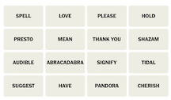
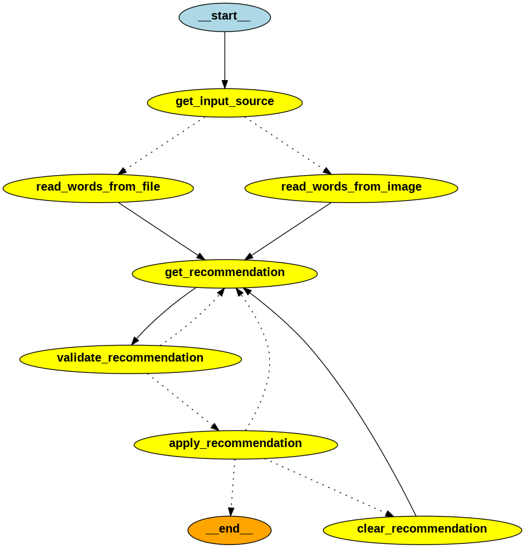

# Original LLM Implementation for Solver

## Features of the Connection Solver Virtual Assistant Agent
* Extract puzzle words from text file to setup the puzzle
* LLM based tools to: 
  * Extract words from an image to seutp the puzzle 

    
  * Generate puzzle recommendations to the user
  * Natural Language Puzzle Planner module
* Use of multiple LLMs:
    * `gpt-3.5-turbo` for the agent's planner
    * `gpt-4o` for generating puzzle recommendations and extract words from image
* LLM tracing with `langsmith`


## Solution Strategy
The agent uses the `PuzzleState` class to manage the agent's state and controls the agent's workflow. 
```python
# define the state of the puzzle
class PuzzleState(TypedDict):
    status: str = ""
    tool_to_use: str = ""
    words_remaining: List[str] = []
    invalid_connections: List[List[str]] = []
    recommended_words: List[str] = []
    recommended_connection: str = ""
    recommended_correct: bool = False
    found_yellow: bool = False
    found_greeen: bool = False
    found_blue: bool = False
    found_purple: bool = False
    mistake_count: int = 0
    found_count: int = 0
    recommendation_count: int = 0
    llm_temperature: float = 1.0
```

The attributes `words_remaining` and `mistake_count` are used to determine when to terminate the agent.  When a correct group of 4 words are found, these words are removed from `words_remaining`.  If a mistake is made, then `mistake_count` is incremented.  The agent is terminated when either `words_reamaining` becomes empty or  `mistake_count` exceeds a threshold.

Overall control is performed by the `run_planner()` function.  The agent's workflow is defined by the `StateGraph` class from `langgraph`.  The agent's workflow is defined by a series of nodes and edges.  The nodes are the agent's processing steps and the edges are the transitions between the processing steps.  This function determines the next step in the agent's workflow based on the `puzzle_phase` of the agent. 

Agent's workflow defintion:
```python
    workflow = StateGraph(PuzzleState)

    workflow.add_node("run_planner", run_planner)
    workflow.add_node("setup_puzzle", setup_puzzle)
    workflow.add_node("get_recommendation", get_recommendation)
    workflow.add_node("regenerate_recommendation", regenerate_recommendation)
    workflow.add_node("apply_recommendation", apply_recommendation)
    workflow.add_node("clear_recommendation", clear_recommendation)

    workflow.add_conditional_edges(
        "run_planner",
        determine_next_action,
        {
            "setup_puzzle": "setup_puzzle",
            "get_recommendation": "get_recommendation",
            END: END,
        },
    )

    workflow.add_edge("setup_puzzle", "run_planner")
    workflow.add_edge("get_recommendation", "apply_recommendation")
    workflow.add_edge("clear_recommendation", "run_planner")
    workflow.add_edge("regenerate_recommendation", "apply_recommendation")

    workflow.add_conditional_edges(
        "apply_recommendation",
        is_end,
        {
            "run_planner": "run_planner",
            "clear_recommendation": "clear_recommendation",
            "regenerate_recommendation": "regenerate_recommendation",
        },
    )

    workflow.set_entry_point("run_planner")

    app = workflow.compile()
    app.get_graph().draw_png("images/connection_solver_graph.png")
```

Diagram of the agent's workflow:


The agent's planner function uses the LLM and current `PuzzleState` to determine the next step in the workflow.  The Planner's prompt consists of three parts.  First is the "system prompt":
```python
PLANNER_SYSTEM_MESSAGE = """
    You are an expert in managing the sequence of a workflow. Your task is to
    determine the next tool to use given the current state of the workflow.

    the eligible tools to use are: ["setup_puzzle", "get_recommendation", "END"]

    The important information for the workflow state is to consider are: "status", "words_remaining", "mistake_count".

    Using the provided instructions, you will need to determine the next tool to use.

    output response in json format with key word "tool" and the value as the output string.
    
"""
```

The second part is game specific instructions:
```python
INSTRUCTIONS_MESSAGE = """
    Instrucitons:
    use "setup_puzzle" tool to initialize the puzzle if the puzzle is not initialized.

    After the puzzle is initialized, use "get_recommendation" tool if "words_remaining" is not an empty list and "mistake_count" is less than 4, else use "END" tool.
"""
```

The final part is the current state of the game.  `PuzzleState` is extracted as a string and passed to the LLM in the prompt to determine the next step in the agent's workflow.  The LLM's response determines the next step.
```python
'{"status": "puzzle is initialized", 
"words_remaining": ["uphold", "justice", "state", "honor", "energy", "keep", "labor", "fulfill"], "invalid_connections": [], 
"recommended_words": [], 
"recommended_connection": "", 
"recommended_correct": false, 
"found_yellow": false, 
"found_blue": true, 
"found_purple": false, 
"mistake_count": 0, 
"recommendation_count": 2, 
"llm_temperature": 0.7, 
"input_source_type": "file"}'
```

## Sample Runs

Historical NYT Connection Puzzles were used in testing the agent.  Past puzzles can be found [here](https://word.tips/todays-nyt-connections-answers/).

### How to Run the Agent
```bash
# run agent with default logging level
$ python src/agent/app.py

# run agent with DEBUG logging level
$ python src/agent/app.py --log-level DEBUG
```
Command line options:
```text
usage: app.py [-h] [--log-level LOG_LEVEL] [--trace]

Set logging level for the application.

options:
  -h, --help            show this help message and exit
  --log-level LOG_LEVEL
                        Set the logging level (DEBUG, INFO, WARNING, ERROR, CRITICAL)
  --trace               Enable langsmith tracing for the application.
```

Note: Due to the random nature of the LLM, the results vary from run to run.  For example, running the same puzzle multiple times may result in different recommendations from the LLM.  As a result, the puzzle may get solved in one run and not in another.

### Solved Connection Puzzle 1
**Expected Solution**
```text
🟡 MAKE GOOD ON, AS A PROMISE: FULFILL ,HONOR ,KEEP ,UPHOLD

🟢 BEDDING: BLANKET ,SHAM ,SHEET ,THROW

🔵 ACTIONS IN CARD GAMES: DISCARD ,DRAW ,PASS ,PLAY

🟣 CABINET DEPARTMENTS: ENERGY ,JUSTICE ,LABOR ,STATE
```
**Example Run**
```text
/usr/local/bin/python /workspaces/connection_solver/src/agent/app.py
Please enter the file location: data/word_list5.txt

Words read from file: ['uphold', 'discard', 'honor', 'energy', 'state', 'play', 'justice', 'labor', 'pass', 'fulfill', 'draw', 'keep', 'blanket', 'sham', 'sheet', 'throw']

RECOMMENDED WORDS ['blanket', 'sheet', 'sham', 'throw'] with connection bedding items
Is the recommendation accepted? (y/g/b/p/n): g
Recommendation ['blanket', 'sheet', 'sham', 'throw'] is correct

RECOMMENDED WORDS ['play', 'discard', 'draw', 'pass'] with connection Card game actions
Is the recommendation accepted? (y/g/b/p/n): b
Recommendation ['play', 'discard', 'draw', 'pass'] is correct

RECOMMENDED WORDS ['honor', 'uphold', 'keep', 'fulfill'] with connection ways to maintain or adhere to something (e.g., a promise, duty)
Is the recommendation accepted? (y/g/b/p/n): y
Recommendation ['honor', 'uphold', 'keep', 'fulfill'] is correct

RECOMMENDED WORDS ['energy', 'state', 'justice', 'labor'] with connection Departments of the US Government
Is the recommendation accepted? (y/g/b/p/n): p
Recommendation ['energy', 'state', 'justice', 'labor'] is correct
SOLVED THE CONNECTION PUZZLE!!!


FINAL PUZZLE STATE:
{   'found_blue': True,
    'found_purple': True,
    'found_yellow': True,
    'invalid_connections': [],
    'llm_temperature': 0.7,
    'mistake_count': 0,
    'recommendation_count': 4,
    'recommended_connection': 'Departments of the US Government',
    'recommended_correct': True,
    'recommended_words': ['energy', 'state', 'justice', 'labor'],
    'words_remaining': []}
``` 

### Solved Connection Puzzle 2
**Expected Solution**
```text
🟡 BRING ABOUT: GENERATE ,INSPIRE ,PROMPT ,PROVOKE

🟢 THINGS THAT ARE OFTEN SCENTED: CANDLE ,INCENSE ,LOTION ,SOAP

🔵 THINGS THAT MIGHT STING: INSULT ,JELLYFISH ,NETTLE ,WASP

🟣 VIDEO GAME FRANCHISES: CIVILIZATION ,HALO ,MADDEN ,METROID
```
**Example Run**
```text
/usr/local/bin/python /workspaces/connection_solver/src/agent/app.py
Please enter the file location: data/word_list2.txt

Words read from file: ['inspire', 'madden', 'jellyfish', 'metroid', 'insult', 'candle', 'halo', 'provoke', 'soap', 'generate', 'incense', 'civilization', 'lotion', 'wasp', 'prompt', 'nettle']

RECOMMENDED WORDS ['madden', 'provoke', 'insult', 'incense'] with connection To Anger or Annoy
Is the recommendation accepted? (y/g/b/p/n): n
Recommendation ['madden', 'provoke', 'insult', 'incense'] is incorrect

RECOMMENDED WORDS ['soap', 'lotion', 'candle', 'incense'] with connection Items that can produce a pleasant scent or are used in personal care
Is the recommendation accepted? (y/g/b/p/n): g
Recommendation ['soap', 'lotion', 'candle', 'incense'] is correct

RECOMMENDED WORDS ['provoke', 'insult', 'nettle', 'incense'] with connection To Annoy or Irritate
Is the recommendation accepted? (y/g/b/p/n): n
Recommendation ['provoke', 'insult', 'nettle', 'incense'] is incorrect

RECOMMENDED WORDS ['provoke', 'inspire', 'prompt', 'generate'] with connection words related to causing or inducing action or emotion
Is the recommendation accepted? (y/g/b/p/n): y
Recommendation ['provoke', 'inspire', 'prompt', 'generate'] is correct

RECOMMENDED WORDS ['wasp', 'halo', 'metroid', 'jellyfish'] with connection video game titles
Is the recommendation accepted? (y/g/b/p/n): n
Recommendation ['wasp', 'halo', 'metroid', 'jellyfish'] is incorrect

RECOMMENDED WORDS ['madden', 'civilization', 'metroid', 'halo'] with connection Video Game Titles
Is the recommendation accepted? (y/g/b/p/n): p
Recommendation ['madden', 'civilization', 'metroid', 'halo'] is correct

RECOMMENDED WORDS ['jellyfish', 'nettle', 'insult', 'wasp'] with connection things that sting
Is the recommendation accepted? (y/g/b/p/n): b
Recommendation ['jellyfish', 'nettle', 'insult', 'wasp'] is correct
SOLVED THE CONNECTION PUZZLE!!!


FINAL PUZZLE STATE:
{   'found_blue': True,
    'found_purple': True,
    'found_yellow': True,
    'invalid_connections': [   ['madden', 'provoke', 'insult', 'incense'],
                               ['provoke', 'insult', 'nettle', 'incense'],
                               ['wasp', 'halo', 'metroid', 'jellyfish']],
    'llm_temperature': 0.7,
    'mistake_count': 3,
    'recommendation_count': 7,
    'recommended_connection': 'things that sting',
    'recommended_correct': True,
    'recommended_words': ['jellyfish', 'nettle', 'insult', 'wasp'],
    'words_remaining': []}
```
