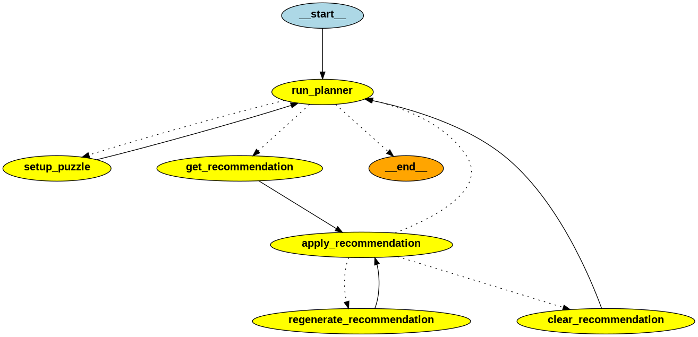

# Original LLM Implementation for Solver

## Features of the Connection Solver Virtual Assistant Agent
* Extract puzzle words from text file to setup the puzzle
* LLM based tools to:
  * Extract words from an image to seutp the puzzle 

    
  * Generate puzzle recommendations to the user
  * Natural Language Puzzle Planner module
* Use of multiple LLMs:
    * `gpt-3.5-turbo` for the agent's planner
    * `gpt-4o` for generating puzzle recommendations and extract words from image
* LLM tracing with `langsmith`


## Solution Strategy
The agent uses the `PuzzleState` class to manage the agent's state and controls the agent's workflow. 
```python
# define the state of the puzzle
class PuzzleState(TypedDict):
    status: str = ""
    tool_to_use: str = ""
    words_remaining: List[str] = []
    invalid_connections: List[List[str]] = []
    recommended_words: List[str] = []
    recommended_connection: str = ""
    recommended_correct: bool = False
    found_yellow: bool = False
    found_greeen: bool = False
    found_blue: bool = False
    found_purple: bool = False
    mistake_count: int = 0
    found_count: int = 0
    recommendation_count: int = 0
    llm_temperature: float = 1.0
```

The attributes `words_remaining` and `mistake_count` are used to determine when to terminate the agent.  When a correct group of 4 words are found, these words are removed from `words_remaining`.  If a mistake is made, then `mistake_count` is incremented.  The agent is terminated when either `words_reamaining` becomes empty or  `mistake_count` exceeds a threshold.

Overall control is performed by the `run_planner()` function.  The agent's workflow is defined by the `StateGraph` class from `langgraph`.  The agent's workflow is defined by a series of nodes and edges.  The nodes are the agent's processing steps and the edges are the transitions between the processing steps.  This function determines the next step in the agent's workflow based on the `puzzle_phase` of the agent. 

Agent's workflow defintion:
```python
    workflow = StateGraph(PuzzleState)

    workflow.add_node("run_planner", run_planner)
    workflow.add_node("setup_puzzle", setup_puzzle)
    workflow.add_node("get_recommendation", get_recommendation)
    workflow.add_node("regenerate_recommendation", regenerate_recommendation)
    workflow.add_node("apply_recommendation", apply_recommendation)
    workflow.add_node("clear_recommendation", clear_recommendation)

    workflow.add_conditional_edges(
        "run_planner",
        determine_next_action,
        {
            "setup_puzzle": "setup_puzzle",
            "get_recommendation": "get_recommendation",
            END: END,
        },
    )

    workflow.add_edge("setup_puzzle", "run_planner")
    workflow.add_edge("get_recommendation", "apply_recommendation")
    workflow.add_edge("clear_recommendation", "run_planner")
    workflow.add_edge("regenerate_recommendation", "apply_recommendation")

    workflow.add_conditional_edges(
        "apply_recommendation",
        is_end,
        {
            "run_planner": "run_planner",
            "clear_recommendation": "clear_recommendation",
            "regenerate_recommendation": "regenerate_recommendation",
        },
    )

    workflow.set_entry_point("run_planner")

    app = workflow.compile()
    app.get_graph().draw_png("images/connection_solver_graph.png")
```

Diagram of the agent's workflow:


The agent's planner function uses the LLM and current `PuzzleState` to determine the next step in the workflow.  The Planner's prompt consists of three parts.  First is the "system prompt":
```python
PLANNER_SYSTEM_MESSAGE = """
    You are an expert in managing the sequence of a workflow. Your task is to
    determine the next tool to use given the current state of the workflow.

    the eligible tools to use are: ["setup_puzzle", "get_recommendation", "END"]

    The important information for the workflow state is to consider are: "status", "words_remaining", "mistake_count".

    Using the provided instructions, you will need to determine the next tool to use.

    output response in json format with key word "tool" and the value as the output string.
    
"""
```

The second part is game specific instructions:
```python
INSTRUCTIONS_MESSAGE = """
    Instrucitons:
    use "setup_puzzle" tool to initialize the puzzle if the puzzle is not initialized.

    After the puzzle is initialized, use "get_recommendation" tool if "words_remaining" is not an empty list and "mistake_count" is less than 4, else use "END" tool.
"""
```

The final part is the current state of the game.  `PuzzleState` is extracted as a string and passed to the LLM in the prompt to determine the next step in the agent's workflow.  The LLM's response determines the next step.
```python
'{"status": "puzzle is initialized", 
"words_remaining": ["uphold", "justice", "state", "honor", "energy", "keep", "labor", "fulfill"], "invalid_connections": [], 
"recommended_words": [], 
"recommended_connection": "", 
"recommended_correct": false, 
"found_yellow": false, 
"found_blue": true, 
"found_purple": false, 
"mistake_count": 0, 
"recommendation_count": 2, 
"llm_temperature": 0.7, 
"input_source_type": "file"}'
```
