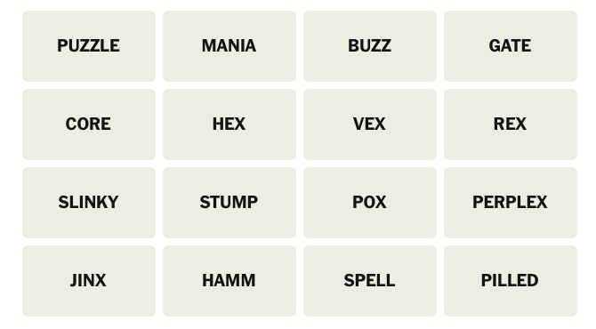

## First run of the Connection Solver Agent with the Bedrock Anthropic LLM Interface
```text
/workspaces/connection_solver/src/agent/app_embedvec_tester.py --puzzle_setup_fp data/automated_test_set_0.jsonl --llm_interface bedrock_anthropic 
Running Connection Solver Agent Tester 0.16.0-dev-bedrock

>>>>SOLVING PUZZLE 1
LLMBedrockAnthropicInterface __init__
Setting up Puzzle Words: ['nets', 'return', 'heat', 'jazz', 'mom', 'shift', 'kayak', 'option', 'rain', 'sleet', 'level', 'racecar', 'bucks', 'tab', 'hail', 'snow']

ENTERED SETUP_PUZZLE

Generating vocabulary and embeddings for the words...this may take several seconds 
Processing word: nets
Processing word: return
Processing word: heat
Processing word: jazz
Processing word: mom
Processing word: shift
Processing word: kayak
Processing word: option
Processing word: rain
Processing word: sleet
Processing word: level
Processing word: racecar
Processing word: bucks
Processing word: tab
Processing word: hail
Processing word: snow
Traceback (most recent call last):
  File "/usr/local/lib/python3.11/runpy.py", line 198, in _run_module_as_main
    return _run_code(code, main_globals, None,
           ^^^^^^^^^^^^^^^^^^^^^^^^^^^^^^^^^^^
  File "/usr/local/lib/python3.11/runpy.py", line 88, in _run_code
    exec(code, run_globals)
  File "/home/vscode/.vscode-server/extensions/ms-python.debugpy-2024.14.0-linux-x64/bundled/libs/debugpy/adapter/../../debugpy/launcher/../../debugpy/__main__.py", line 71, in <module>
    cli.main()
  File "/home/vscode/.vscode-server/extensions/ms-python.debugpy-2024.14.0-linux-x64/bundled/libs/debugpy/adapter/../../debugpy/launcher/../../debugpy/../debugpy/server/cli.py", line 501, in main
    run()
  File "/home/vscode/.vscode-server/extensions/ms-python.debugpy-2024.14.0-linux-x64/bundled/libs/debugpy/adapter/../../debugpy/launcher/../../debugpy/../debugpy/server/cli.py", line 351, in run_file
    runpy.run_path(target, run_name="__main__")
  File "/home/vscode/.vscode-server/extensions/ms-python.debugpy-2024.14.0-linux-x64/bundled/libs/debugpy/_vendored/pydevd/_pydevd_bundle/pydevd_runpy.py", line 310, in run_path
    return _run_module_code(code, init_globals, run_name, pkg_name=pkg_name, script_name=fname)
           ^^^^^^^^^^^^^^^^^^^^^^^^^^^^^^^^^^^^^^^^^^^^^^^^^^^^^^^^^^^^^^^^^^^^^^^^^^^^^^^^^^^^
  File "/home/vscode/.vscode-server/extensions/ms-python.debugpy-2024.14.0-linux-x64/bundled/libs/debugpy/_vendored/pydevd/_pydevd_bundle/pydevd_runpy.py", line 127, in _run_module_code
    _run_code(code, mod_globals, init_globals, mod_name, mod_spec, pkg_name, script_name)
  File "/home/vscode/.vscode-server/extensions/ms-python.debugpy-2024.14.0-linux-x64/bundled/libs/debugpy/_vendored/pydevd/_pydevd_bundle/pydevd_runpy.py", line 118, in _run_code
    exec(code, run_globals)
  File "/workspaces/connection_solver/src/agent/app_embedvec_tester.py", line 184, in <module>
    results = asyncio.run(main(None, check_one_solution))
              ^^^^^^^^^^^^^^^^^^^^^^^^^^^^^^^^^^^^^^^^^^^
  File "/usr/local/lib/python3.11/asyncio/runners.py", line 190, in run
    return runner.run(main)
           ^^^^^^^^^^^^^^^^
  File "/usr/local/lib/python3.11/asyncio/runners.py", line 118, in run
    return self._loop.run_until_complete(task)
           ^^^^^^^^^^^^^^^^^^^^^^^^^^^^^^^^^^^
  File "/usr/local/lib/python3.11/asyncio/base_events.py", line 653, in run_until_complete
    return future.result()
           ^^^^^^^^^^^^^^^
  File "/workspaces/connection_solver/src/agent/app_embedvec_tester.py", line 176, in main
    found_solutions = await asyncio.gather(
                      ^^^^^^^^^^^^^^^^^^^^^
  File "/workspaces/connection_solver/src/agent/app_embedvec_tester.py", line 163, in solve_a_puzzle
    result = await run_workflow(
             ^^^^^^^^^^^^^^^^^^^
  File "/workspaces/connection_solver/src/agent/workflow_manager.py", line 120, in run_workflow
    async for chunk in workflow_graph.astream(None, runtime_config, stream_mode="values"):
  File "/usr/local/lib/python3.11/site-packages/langgraph/pregel/__init__.py", line 1899, in astream
    async for _ in runner.atick(
  File "/usr/local/lib/python3.11/site-packages/langgraph/pregel/runner.py", line 370, in atick
    await arun_with_retry(
  File "/usr/local/lib/python3.11/site-packages/langgraph/pregel/retry.py", line 128, in arun_with_retry
    return await task.proc.ainvoke(task.input, config)
           ^^^^^^^^^^^^^^^^^^^^^^^^^^^^^^^^^^^^^^^^^^^
  File "/usr/local/lib/python3.11/site-packages/langgraph/utils/runnable.py", line 485, in ainvoke
    input = await step.ainvoke(input, config, **kwargs)
            ^^^^^^^^^^^^^^^^^^^^^^^^^^^^^^^^^^^^^^^^^^^
  File "/usr/local/lib/python3.11/site-packages/langgraph/utils/runnable.py", line 275, in ainvoke
    ret = await asyncio.create_task(coro, context=context)
          ^^^^^^^^^^^^^^^^^^^^^^^^^^^^^^^^^^^^^^^^^^^^^^^^
  File "/workspaces/connection_solver/src/agent/puzzle_solver.py", line 136, in setup_puzzle
    vocabulary = await config["configurable"]["llm_interface"].generate_vocabulary(state["words_remaining"])
                 ^^^^^^^^^^^^^^^^^^^^^^^^^^^^^^^^^^^^^^^^^^^^^^^^^^^^^^^^^^^^^^^^^^^^^^^^^^^^^^^^^^^^^^^^^^^
  File "/workspaces/connection_solver/src/agent/bedrock_anthropic_tools.py", line 136, in generate_vocabulary
    await asyncio.gather(*[process_word(word) for word in words])
  File "/workspaces/connection_solver/src/agent/bedrock_anthropic_tools.py", line 133, in process_word
    result = await structured_llm.ainvoke(prompt)
             ^^^^^^^^^^^^^^^^^^^^^^^^^^^^^^^^^^^^
  File "/usr/local/lib/python3.11/site-packages/langchain_core/runnables/base.py", line 3064, in ainvoke
    input = await asyncio.create_task(part(), context=context)  # type: ignore
            ^^^^^^^^^^^^^^^^^^^^^^^^^^^^^^^^^^^^^^^^^^^^^^^^^^
  File "/usr/local/lib/python3.11/site-packages/langchain_core/runnables/base.py", line 5364, in ainvoke
    return await self.bound.ainvoke(
           ^^^^^^^^^^^^^^^^^^^^^^^^^
  File "/usr/local/lib/python3.11/site-packages/langchain_core/language_models/chat_models.py", line 307, in ainvoke
    llm_result = await self.agenerate_prompt(
                 ^^^^^^^^^^^^^^^^^^^^^^^^^^^^
  File "/usr/local/lib/python3.11/site-packages/langchain_core/language_models/chat_models.py", line 796, in agenerate_prompt
    return await self.agenerate(
           ^^^^^^^^^^^^^^^^^^^^^
  File "/usr/local/lib/python3.11/site-packages/langchain_core/language_models/chat_models.py", line 756, in agenerate
    raise exceptions[0]
  File "/usr/local/lib/python3.11/site-packages/langchain_core/language_models/chat_models.py", line 924, in _agenerate_with_cache
    result = await self._agenerate(
             ^^^^^^^^^^^^^^^^^^^^^^
  File "/usr/local/lib/python3.11/site-packages/langchain_core/language_models/chat_models.py", line 964, in _agenerate
    return await run_in_executor(
           ^^^^^^^^^^^^^^^^^^^^^^
  File "/usr/local/lib/python3.11/site-packages/langchain_core/runnables/config.py", line 588, in run_in_executor
    return await asyncio.get_running_loop().run_in_executor(
           ^^^^^^^^^^^^^^^^^^^^^^^^^^^^^^^^^^^^^^^^^^^^^^^^^
  File "/usr/local/lib/python3.11/concurrent/futures/thread.py", line 58, in run
    result = self.fn(*self.args, **self.kwargs)
             ^^^^^^^^^^^^^^^^^^^^^^^^^^^^^^^^^^
  File "/usr/local/lib/python3.11/site-packages/langchain_core/runnables/config.py", line 579, in wrapper
    return func(*args, **kwargs)
           ^^^^^^^^^^^^^^^^^^^^^
  File "/usr/local/lib/python3.11/site-packages/langchain_aws/chat_models/bedrock.py", line 570, in _generate
    completion, tool_calls, llm_output = self._prepare_input_and_invoke(
                                         ^^^^^^^^^^^^^^^^^^^^^^^^^^^^^^^
  File "/usr/local/lib/python3.11/site-packages/langchain_aws/llms/bedrock.py", line 841, in _prepare_input_and_invoke
    raise e
  File "/usr/local/lib/python3.11/site-packages/langchain_aws/llms/bedrock.py", line 827, in _prepare_input_and_invoke
    response = self.client.invoke_model(**request_options)
               ^^^^^^^^^^^^^^^^^^^^^^^^^^^^^^^^^^^^^^^^^^^
  File "/usr/local/lib/python3.11/site-packages/botocore/client.py", line 569, in _api_call
    return self._make_api_call(operation_name, kwargs)
           ^^^^^^^^^^^^^^^^^^^^^^^^^^^^^^^^^^^^^^^^^^^
  File "/usr/local/lib/python3.11/site-packages/botocore/client.py", line 1023, in _make_api_call
    raise error_class(parsed_response, operation_name)
botocore.errorfactory.ThrottlingException: An error occurred (ThrottlingException) when calling the InvokeModel operation (reached max retries: 4): Too many requests, please wait before trying again.
During task with name 'setup_puzzle' and id 'f4ec9627-49f2-1ace-878b-7ca1e573db1d'
``` 

## Successfully solved test puzzle with Anthropic Claude Sonnet v1 LLM
Inserted a bunch of asynio.sleep(8.0) before each call to LLM and converted concurrent processing to sequential processing to avoid the ThrottlingException.

Need to work out a more robust solution for this.

```text
/workspaces/connection_solver/src/agent/app_embedvec_tester.py --puzzle_setup_fp data/automated_test_set_0.jsonl --llm_interface bedrock_anthropic 
Running Connection Solver Agent Tester 0.16.0-dev-bedrock

>>>>SOLVING PUZZLE 1
LLMBedrockAnthropicInterface __init__
Setting up Puzzle Words: ['nets', 'return', 'heat', 'jazz', 'mom', 'shift', 'kayak', 'option', 'rain', 'sleet', 'level', 'racecar', 'bucks', 'tab', 'hail', 'snow']

ENTERED SETUP_PUZZLE

Generating vocabulary and embeddings for the words...this may take several seconds 
Processing word: nets
Processing word: return
Processing word: heat
Processing word: jazz
Processing word: mom
Processing word: shift
Processing word: kayak
Processing word: option
Processing word: rain
Processing word: sleet
Processing word: level
Processing word: racecar
Processing word: bucks
Processing word: tab
Processing word: hail
Processing word: snow

Generating embeddings for the definitions

Storing vocabulary and embeddings in external database

ENTERED EMBEDVEC_RECOMMENDER
found count: 0, mistake_count: 0
words_remaining: ['nets', 'return', 'heat', 'jazz', 'mom', 'shift', 'kayak', 'option', 'rain', 'sleet', 'level', 'racecar', 'bucks', 'tab', 'hail', 'snow']
(146, 146)
(146, 146)
candidate_lists size: 98

EMBEDVEC_RECOMMENDER: RECOMMENDED WORDS ['hail', 'rain', 'sleet', 'snow'] with connection Connected by weather precipitation theme, unique among groups
Connected by weather precipitation theme, unique among groups ~ wet weather: ['hail', 'rain', 'sleet', 'snow'] == ['hail', 'rain', 'sleet', 'snow']
Recommendation ['hail', 'rain', 'sleet', 'snow'] is correct

ENTERED EMBEDVEC_RECOMMENDER
found count: 1, mistake_count: 0
words_remaining: ['nets', 'return', 'heat', 'jazz', 'mom', 'shift', 'kayak', 'option', 'level', 'racecar', 'bucks', 'tab']
(113, 113)
(113, 113)
candidate_lists size: 76

EMBEDVEC_RECOMMENDER: RECOMMENDED WORDS ['level', 'racecar', 'return', 'tab'] with connection Computer keyboard and programming concepts
Recommendation ['level', 'racecar', 'return', 'tab'] is incorrect
Changing the recommender from 'embedvec_recommender' to 'llm_recommender'

ENTERED LLM_RECOMMENDER
found count: 1, mistake_count: 1
attempt_count: 1
words_remaining: ['tab', 'bucks', 'racecar', 'level', 'option', 'kayak', 'shift', 'mom', 'jazz', 'heat', 'return', 'nets']

LLM_RECOMMENDER: RECOMMENDED WORDS ['kayak', 'level', 'mom', 'tab'] with connection palindromes
Recommendation ['kayak', 'level', 'mom', 'tab'] is incorrect, one away from correct

ENTERED ONE-AWAY ANALYZER
found count: 1, mistake_count: 2

>>>Number of single topic groups: 2
More than one single-topic group recommendations, selecting one at random.

>>>Selected single-topic group:
Recommended Group: ('kayak', 'level', 'mom')
Connection Description: The words 'kayak', 'level', and 'mom' can be related to a single topic: palindromes. A palindrome is a word, phrase, number, or other sequence of characters that reads the same forward and backward. All three of these words are palindromes:

1. 'kayak' - reads the same from left to right and right to left
2. 'level' - also reads the same in both directions
3. 'mom' - another word that is identical when reversed

The shared context for these words is their linguistic property of being palindromes. This characteristic is a unique and specific feature that connects all three words, despite their different meanings in everyday usage. Therefore, we can confidently say that these words relate to a single topic within the realm of wordplay and linguistics.

>>>One-away group recommendations:
one_away_group_recommendation is a new recommendation
using one_away_group_recommendation

LLM_RECOMMENDER: RECOMMENDED WORDS ['kayak', 'level', 'mom', 'racecar'] with connection The common connection among the anchor words "kayak", "level", and "mom" is that they are all palindromes - words that read the same forwards and backwards. Among the candidate words, "racecar" is the only palindrome, making it the most highly connected to the anchor words. The other candidate words do not share this unique characteristic.
The common connection among the anchor words "kayak", "level", and "mom" is that they are all palindromes - words that read the same forwards and backwards. Among the candidate words, "racecar" is the only palindrome, making it the most highly connected to the anchor words. The other candidate words do not share this unique characteristic. ~ palindromes: ['kayak', 'level', 'mom', 'racecar'] == ['kayak', 'level', 'mom', 'racecar']
Recommendation ['kayak', 'level', 'mom', 'racecar'] is correct

ENTERED LLM_RECOMMENDER
found count: 2, mistake_count: 2
attempt_count: 1
words_remaining: ['return', 'heat', 'jazz', 'bucks', 'shift', 'tab', 'option', 'nets']

LLM_RECOMMENDER: RECOMMENDED WORDS ['bucks', 'heat', 'jazz', 'nets'] with connection NBA teams
NBA teams ~ nba teams: ['bucks', 'heat', 'jazz', 'nets'] == ['bucks', 'heat', 'jazz', 'nets']
Recommendation ['bucks', 'heat', 'jazz', 'nets'] is correct

ENTERED LLM_RECOMMENDER
found count: 3, mistake_count: 2
attempt_count: 1
words_remaining: ['option', 'tab', 'shift', 'return']

LLM_RECOMMENDER: RECOMMENDED WORDS ['option', 'return', 'shift', 'tab'] with connection Computer keyboard keys
Computer keyboard keys ~ keyboard keys: ['option', 'return', 'shift', 'tab'] == ['option', 'return', 'shift', 'tab']
Recommendation ['option', 'return', 'shift', 'tab'] is correct
SOLVED THE CONNECTION PUZZLE!!!


FINAL PUZZLE STATE:
{'current_tool': 'llm_recommender',
 'found_count': 4,
 'invalid_connections': [['586b2ed66c8dc1d5ef800e4ccbe2820c',
                          ['level', 'racecar', 'return', 'tab']],
                         ['99dc20319614ad73c0105e4afdf264bd',
                          ['kayak', 'level', 'mom', 'tab']]],
 'llm_retry_count': 0,
 'llm_temperature': 0.7,
 'mistake_count': 2,
 'puzzle_status': 'initialized',
 'recommendation_answer_status': 'correct',
 'recommendation_correct_groups': [['hail', 'rain', 'sleet', 'snow'],
                                   ['kayak', 'level', 'mom', 'racecar'],
                                   ['bucks', 'heat', 'jazz', 'nets'],
                                   ['option', 'return', 'shift', 'tab']],
 'recommendation_count': 6,
 'recommended_connection': 'Computer keyboard keys',
 'recommended_correct': True,
 'recommended_words': ['option', 'return', 'shift', 'tab'],
 'tool_status': 'puzzle_completed',
 'tool_to_use': 'END',
 'vocabulary_db_fp': '/tmp/tmpgh2b63hy.db',
 'words_remaining': []}

FOUND SOLUTIONS
[   ['hail', 'rain', 'sleet', 'snow'],
    ['kayak', 'level', 'mom', 'racecar'],
    ['bucks', 'heat', 'jazz', 'nets'],
    ['option', 'return', 'shift', 'tab']]
ALL GROUPS FOUND
[   [   ['hail', 'rain', 'sleet', 'snow'],
        ['kayak', 'level', 'mom', 'racecar'],
        ['bucks', 'heat', 'jazz', 'nets'],
        ['option', 'return', 'shift', 'tab']]]
   solved_puzzle  number_found                                       groups_found
0           True             4  [[hail, rain, sleet, snow], [kayak, level, mom...
```

## Successfully solved test puzzle with Anthropic Claude Sonnet v1 LLM with puzzle image

Puzzle setup from this png image: 



```text
$ python src/agent/app_embedvec.py --llm_interface bedrock_anthropic
Running Connection Solver Agent with EmbedVec Recommender 0.16.0-dev-bedrock
LLMBedrockAnthropicInterface __init__
Enter 'file' to read words from a file or 'image' to read words from an image: image
Please enter the file/image location: data/connection_puzzle_2024_12_06.png
Setting up Puzzle Words: ['puzzle', 'mania', 'buzz', 'gate', 'core', 'hex', 'vex', 'rex', 'slinky', 'stump', 'pox', 'perplex', 'jinx', 'hamm', 'spell', 'pilled']

ENTERED SETUP_PUZZLE

Generating vocabulary and embeddings for the words...this may take several seconds 
Processing word: puzzle
Processing word: mania
Processing word: buzz
Processing word: gate
Processing word: core
Processing word: hex
Processing word: vex
Processing word: rex
Processing word: slinky
Processing word: stump
Processing word: pox
Processing word: perplex
Processing word: jinx
Processing word: hamm
Processing word: spell
Processing word: pilled

Generating embeddings for the definitions

Storing vocabulary and embeddings in external database

ENTERED EMBEDVEC_RECOMMENDER
found count: 0, mistake_count: 0
words_remaining: ['puzzle', 'mania', 'buzz', 'gate', 'core', 'hex', 'vex', 'rex', 'slinky', 'stump', 'pox', 'perplex', 'jinx', 'hamm', 'spell', 'pilled']
(755, 755)
(755, 755)
candidate_lists size: 104

EMBEDVEC_RECOMMENDER: RECOMMENDED WORDS ['hex', 'jinx', 'pox', 'spell'] with connection Supernatural theme, most cohesive group
Is the recommendation accepted? (y/g/b/p/m/s/o/n): g
Recommendation ['hex', 'jinx', 'pox', 'spell'] is correct

ENTERED EMBEDVEC_RECOMMENDER
found count: 1, mistake_count: 0
words_remaining: ['puzzle', 'mania', 'buzz', 'gate', 'core', 'vex', 'rex', 'slinky', 'stump', 'perplex', 'hamm', 'pilled']
(724, 724)
(724, 724)
candidate_lists size: 72

EMBEDVEC_RECOMMENDER: RECOMMENDED WORDS ['perplex', 'puzzle', 'stump', 'vex'] with connection Connected by theme of mental confusion
Is the recommendation accepted? (y/g/b/p/m/s/o/n): y
Recommendation ['perplex', 'puzzle', 'stump', 'vex'] is correct

ENTERED EMBEDVEC_RECOMMENDER
found count: 2, mistake_count: 0
words_remaining: ['mania', 'buzz', 'gate', 'core', 'rex', 'slinky', 'hamm', 'pilled']
(689, 689)
(689, 689)
candidate_lists size: 32

EMBEDVEC_RECOMMENDER: RECOMMENDED WORDS ['buzz', 'hamm', 'mania', 'slinky'] with connection Toy Story characters
Is the recommendation accepted? (y/g/b/p/m/s/o/n): n
Recommendation ['buzz', 'hamm', 'mania', 'slinky'] is incorrect
Changing the recommender from 'embedvec_recommender' to 'llm_recommender'

ENTERED LLM_RECOMMENDER
found count: 2, mistake_count: 1
attempt_count: 1
words_remaining: ['pilled', 'hamm', 'slinky', 'rex', 'core', 'gate', 'buzz', 'mania']

LLM_RECOMMENDER: RECOMMENDED WORDS ['buzz', 'hamm', 'rex', 'slinky'] with connection Toy Story characters
Is the recommendation accepted? (y/g/b/p/m/s/o/n): b
Recommendation ['buzz', 'hamm', 'rex', 'slinky'] is correct

ENTERED LLM_RECOMMENDER
found count: 3, mistake_count: 1
attempt_count: 1
words_remaining: ['gate', 'core', 'mania', 'pilled']

LLM_RECOMMENDER: RECOMMENDED WORDS ['core', 'gate', 'mania', 'pilled'] with connection Suffixes: These words can all be used as suffixes to form compound words or phrases
Is the recommendation accepted? (y/g/b/p/m/s/o/n): p
Recommendation ['core', 'gate', 'mania', 'pilled'] is correct
SOLVED THE CONNECTION PUZZLE!!!


FINAL PUZZLE STATE:
{'current_tool': 'llm_recommender',
 'found_blue': True,
 'found_count': 4,
 'found_purple': True,
 'found_yellow': True,
 'invalid_connections': [['264a47f4f18aa9f46f44e87ea93edaf4',
                          ['buzz', 'hamm', 'mania', 'slinky']]],
 'llm_retry_count': 0,
 'llm_temperature': 0.7,
 'mistake_count': 1,
 'puzzle_status': 'initialized',
 'recommendation_answer_status': 'p',
 'recommendation_correct_groups': [['hex', 'jinx', 'pox', 'spell'],
                                   ['perplex', 'puzzle', 'stump', 'vex'],
                                   ['buzz', 'hamm', 'rex', 'slinky'],
                                   ['core', 'gate', 'mania', 'pilled']],
 'recommendation_count': 5,
 'recommended_connection': 'Suffixes: These words can all be used as suffixes '
                           'to form compound words or phrases',
 'recommended_correct': True,
 'recommended_words': ['core', 'gate', 'mania', 'pilled'],
 'tool_status': 'puzzle_completed',
 'tool_to_use': 'END',
 'vocabulary_db_fp': '/tmp/tmp6ri722l2.db',
 'words_remaining': []}

FOUND SOLUTIONS
[   ['hex', 'jinx', 'pox', 'spell'],
    ['perplex', 'puzzle', 'stump', 'vex'],
    ['buzz', 'hamm', 'rex', 'slinky'],
    ['core', 'gate', 'mania', 'pilled']]
```

## Successfully solved test puzzle with Anthropic Claude Sonnet v1 LLM with retry decorator automated tester

Use of decorator for automatic retry of LLM calls in case of ThrottlingException.

```text
/workspaces/connection_solver/src/agent/app_embedvec_tester.py --puzzle_setup_fp data/automated_test_set_0.jsonl --llm_interface bedrock_anthropic 
Running Connection Solver Agent Tester 0.16.0-dev-bedrock

>>>>SOLVING PUZZLE 1
LLMBedrockAnthropicInterface __init__
Setting up Puzzle Words: ['nets', 'return', 'heat', 'jazz', 'mom', 'shift', 'kayak', 'option', 'rain', 'sleet', 'level', 'racecar', 'bucks', 'tab', 'hail', 'snow']

ENTERED SETUP_PUZZLE

Generating vocabulary and embeddings for the words...this may take several seconds 
Processing word: nets
Processing word: return
Processing word: heat
Processing word: jazz
Processing word: mom
Processing word: shift
Processing word: kayak
Processing word: option
Processing word: rain
Processing word: sleet
Processing word: level
Processing word: racecar
Processing word: bucks
Processing word: tab
Processing word: hail
Processing word: snow
>>> generated vocabulary for jazz
Retrying 1/8 with delay 51.840 after error: An error occurred (ThrottlingException) when calling the InvokeModel operation (reached max retries: 4): Too many requests, please wait before trying again.
>>> generated vocabulary for return
>>> generated vocabulary for heat
Retrying 1/8 with delay 60.064 after error: An error occurred (ThrottlingException) when calling the InvokeModel operation (reached max retries: 4): Too many requests, please wait before trying again.
Retrying 1/8 with delay 32.521 after error: An error occurred (ThrottlingException) when calling the InvokeModel operation (reached max retries: 4): Too many requests, please wait before trying again.
>>> generated vocabulary for nets
Retrying 1/8 with delay 36.994 after error: An error occurred (ThrottlingException) when calling the InvokeModel operation (reached max retries: 4): Too many requests, please wait before trying again.
Retrying 1/8 with delay 32.545 after error: An error occurred (ThrottlingException) when calling the InvokeModel operation (reached max retries: 4): Too many requests, please wait before trying again.
Retrying 1/8 with delay 12.924 after error: An error occurred (ThrottlingException) when calling the InvokeModel operation (reached max retries: 4): Too many requests, please wait before trying again.
Retrying 1/8 with delay 37.139 after error: An error occurred (ThrottlingException) when calling the InvokeModel operation (reached max retries: 4): Too many requests, please wait before trying again.
Retrying 1/8 with delay 30.150 after error: An error occurred (ThrottlingException) when calling the InvokeModel operation (reached max retries: 4): Too many requests, please wait before trying again.
Retrying 1/8 with delay 26.261 after error: An error occurred (ThrottlingException) when calling the InvokeModel operation (reached max retries: 4): Too many requests, please wait before trying again.
Retrying 1/8 with delay 46.731 after error: An error occurred (ThrottlingException) when calling the InvokeModel operation (reached max retries: 4): Too many requests, please wait before trying again.
Retrying 1/8 with delay 23.592 after error: An error occurred (ThrottlingException) when calling the InvokeModel operation (reached max retries: 4): Too many requests, please wait before trying again.
Retrying 1/8 with delay 33.589 after error: An error occurred (ThrottlingException) when calling the InvokeModel operation (reached max retries: 4): Too many requests, please wait before trying again.
>>> generated vocabulary for sleet
>>> generated vocabulary for option
Retrying 2/8 with delay 26.433 after error: An error occurred (ThrottlingException) when calling the InvokeModel operation (reached max retries: 4): Too many requests, please wait before trying again.
>>> generated vocabulary for level
Retrying 2/8 with delay 57.005 after error: An error occurred (ThrottlingException) when calling the InvokeModel operation (reached max retries: 4): Too many requests, please wait before trying again.
Retrying 2/8 with delay 51.079 after error: An error occurred (ThrottlingException) when calling the InvokeModel operation (reached max retries: 4): Too many requests, please wait before trying again.
Retrying 2/8 with delay 33.898 after error: An error occurred (ThrottlingException) when calling the InvokeModel operation (reached max retries: 4): Too many requests, please wait before trying again.
>>> generated vocabulary for shift
Retrying 2/8 with delay 23.907 after error: An error occurred (ThrottlingException) when calling the InvokeModel operation (reached max retries: 4): Too many requests, please wait before trying again.
Retrying 2/8 with delay 31.212 after error: An error occurred (ThrottlingException) when calling the InvokeModel operation (reached max retries: 4): Too many requests, please wait before trying again.
>>> generated vocabulary for bucks
Retrying 3/8 with delay 51.485 after error: An error occurred (ThrottlingException) when calling the InvokeModel operation (reached max retries: 4): Too many requests, please wait before trying again.
>>> generated vocabulary for tab
>>> generated vocabulary for racecar
Retrying 3/8 with delay 21.251 after error: An error occurred (ThrottlingException) when calling the InvokeModel operation (reached max retries: 4): Too many requests, please wait before trying again.
>>> generated vocabulary for snow
Retrying 3/8 with delay 10.271 after error: An error occurred (ThrottlingException) when calling the InvokeModel operation (reached max retries: 4): Too many requests, please wait before trying again.
>>> generated vocabulary for mom
Retrying 4/8 with delay 54.344 after error: An error occurred (ThrottlingException) when calling the InvokeModel operation (reached max retries: 4): Too many requests, please wait before trying again.
>>> generated vocabulary for kayak
>>> generated vocabulary for rain
>>> generated vocabulary for hail

Generating embeddings for the definitions

Storing vocabulary and embeddings in external database

ENTERED EMBEDVEC_RECOMMENDER
found count: 0, mistake_count: 0
words_remaining: ['nets', 'return', 'heat', 'jazz', 'mom', 'shift', 'kayak', 'option', 'rain', 'sleet', 'level', 'racecar', 'bucks', 'tab', 'hail', 'snow']
(148, 148)
(148, 148)
candidate_lists size: 108

EMBEDVEC_RECOMMENDER: RECOMMENDED WORDS ['hail', 'rain', 'sleet', 'snow'] with connection Weather-related precipitation forms
Weather-related precipitation forms ~ wet weather: ['hail', 'rain', 'sleet', 'snow'] == ['hail', 'rain', 'sleet', 'snow']
Recommendation ['hail', 'rain', 'sleet', 'snow'] is correct

ENTERED EMBEDVEC_RECOMMENDER
found count: 1, mistake_count: 0
words_remaining: ['nets', 'return', 'heat', 'jazz', 'mom', 'shift', 'kayak', 'option', 'level', 'racecar', 'bucks', 'tab']
(117, 117)
(117, 117)
candidate_lists size: 84
Retrying 1/8 with delay 33.169 after error: An error occurred (ThrottlingException) when calling the InvokeModel operation (reached max retries: 4): Too many requests, please wait before trying again.

EMBEDVEC_RECOMMENDER: RECOMMENDED WORDS ['level', 'return', 'shift', 'tab'] with connection Keyboard functions
Recommendation ['level', 'return', 'shift', 'tab'] is incorrect, one away from correct

ENTERED ONE-AWAY ANALYZER
found count: 1, mistake_count: 1
Retrying 1/8 with delay 42.001 after error: An error occurred (ThrottlingException) when calling the InvokeModel operation (reached max retries: 4): Too many requests, please wait before trying again.
Retrying 1/8 with delay 35.946 after error: An error occurred (ThrottlingException) when calling the InvokeModel operation (reached max retries: 4): Too many requests, please wait before trying again.

>>>Number of single topic groups: 4
More than one single-topic group recommendations, selecting one at random.

>>>Selected single-topic group:
Recommended Group: ('level', 'return', 'tab')
Connection Description: The words 'level', 'return', and 'tab' can be related to a single topic: computer keyboard or typing. Here's how they are connected:

1. Level: On a keyboard, the 'Caps Lock' key is often referred to as a 'level' shift key, changing the input level from lowercase to uppercase.

2. Return: The 'Return' key, also known as 'Enter', is a standard key on computer keyboards used to start a new line or submit input.

3. Tab: The 'Tab' key is another common key on keyboards, used for indentation or moving between fields in forms.

All three words refer to keys or functions commonly found on computer keyboards, thus they can be related to the single topic of computer input devices or typing interfaces. This connection demonstrates how these seemingly disparate words can be unified under a common theme in the context of modern technology and text input methods.

>>>One-away group recommendations:
one_away_group_recommendation is a new recommendation
using one_away_group_recommendation

EMBEDVEC_RECOMMENDER: RECOMMENDED WORDS ['level', 'level', 'return', 'tab'] with connection The common connection among the anchor words "level", "return", and "tab" is that they are all palindromes - words that read the same forwards and backwards. From the candidate words, "level" is the most highly connected to the anchor words because it is also a palindrome, sharing this unique linguistic property with all the anchor words.
Recommendation ['level', 'level', 'return', 'tab'] is incorrect
Changing the recommender from 'embedvec_recommender' to 'llm_recommender'

ENTERED LLM_RECOMMENDER
found count: 1, mistake_count: 2
attempt_count: 1
words_remaining: ['tab', 'bucks', 'racecar', 'level', 'option', 'kayak', 'shift', 'mom', 'jazz', 'heat', 'return', 'nets']
Retrying 1/8 with delay 56.418 after error: An error occurred (ThrottlingException) when calling the InvokeModel operation (reached max retries: 4): Too many requests, please wait before trying again.

LLM_RECOMMENDER: RECOMMENDED WORDS ['kayak', 'level', 'mom', 'tab'] with connection palindromes
Recommendation ['kayak', 'level', 'mom', 'tab'] is incorrect, one away from correct

ENTERED ONE-AWAY ANALYZER
found count: 1, mistake_count: 3

>>>Number of single topic groups: 2
More than one single-topic group recommendations, selecting one at random.

>>>Selected single-topic group:
Recommended Group: ('kayak', 'level', 'mom')
Connection Description: The three words "kayak", "level", and "mom" can be related to a single topic: palindromes. A palindrome is a word, phrase, number, or other sequence of characters that reads the same forward and backward. All three words given are examples of palindromes:

1. "kayak" - spelled the same forwards and backwards
2. "level" - also spelled the same forwards and backwards
3. "mom" - a shorter palindrome, but still reads the same in both directions

The shared context for these words is their linguistic property of being palindromes, which is a specific characteristic in the English language. This makes them all examples of the same concept in language and word play, thus allowing them to be related to a single topic.

>>>One-away group recommendations:
one_away_group_recommendation is a new recommendation
using one_away_group_recommendation
Retrying 1/8 with delay 34.377 after error: An error occurred (ThrottlingException) when calling the InvokeModel operation (reached max retries: 4): Too many requests, please wait before trying again.

LLM_RECOMMENDER: RECOMMENDED WORDS ['kayak', 'level', 'mom', 'racecar'] with connection The common connection among the anchor words "kayak", "level", and "mom" is that they are all palindromes - words that read the same forwards and backwards. Among the candidate words, "racecar" is the only palindrome, making it the most highly connected to the anchor words. The other candidate words do not share this unique characteristic.
The common connection among the anchor words "kayak", "level", and "mom" is that they are all palindromes - words that read the same forwards and backwards. Among the candidate words, "racecar" is the only palindrome, making it the most highly connected to the anchor words. The other candidate words do not share this unique characteristic. ~ palindromes: ['kayak', 'level', 'mom', 'racecar'] == ['kayak', 'level', 'mom', 'racecar']
Recommendation ['kayak', 'level', 'mom', 'racecar'] is correct

ENTERED LLM_RECOMMENDER
found count: 2, mistake_count: 3
attempt_count: 1
words_remaining: ['nets', 'return', 'heat', 'jazz', 'shift', 'option', 'bucks', 'tab']

LLM_RECOMMENDER: RECOMMENDED WORDS ['bucks', 'heat', 'jazz', 'nets'] with connection NBA basketball teams
NBA basketball teams ~ nba teams: ['bucks', 'heat', 'jazz', 'nets'] == ['bucks', 'heat', 'jazz', 'nets']
Recommendation ['bucks', 'heat', 'jazz', 'nets'] is correct

ENTERED LLM_RECOMMENDER
found count: 3, mistake_count: 3
attempt_count: 1
words_remaining: ['return', 'option', 'tab', 'shift']
Retrying 1/8 with delay 12.775 after error: An error occurred (ThrottlingException) when calling the InvokeModel operation (reached max retries: 4): Too many requests, please wait before trying again.

LLM_RECOMMENDER: RECOMMENDED WORDS ['option', 'return', 'shift', 'tab'] with connection Computer keyboard keys
Computer keyboard keys ~ keyboard keys: ['option', 'return', 'shift', 'tab'] == ['option', 'return', 'shift', 'tab']
Recommendation ['option', 'return', 'shift', 'tab'] is correct
SOLVED THE CONNECTION PUZZLE!!!


FINAL PUZZLE STATE:
{'current_tool': 'llm_recommender',
 'found_count': 4,
 'invalid_connections': [['4a85d42f2baa85dff58bcb9a280d8aaf',
                          ['level', 'return', 'shift', 'tab']],
                         ['7071ca8d9ddd7d5db09bf8cf60087ff3',
                          ['level', 'return', 'tab', 'level']],
                         ['99dc20319614ad73c0105e4afdf264bd',
                          ['kayak', 'level', 'mom', 'tab']]],
 'llm_retry_count': 0,
 'llm_temperature': 0.7,
 'mistake_count': 3,
 'puzzle_status': 'initialized',
 'recommendation_answer_status': 'correct',
 'recommendation_correct_groups': [['hail', 'rain', 'sleet', 'snow'],
                                   ['kayak', 'level', 'mom', 'racecar'],
                                   ['bucks', 'heat', 'jazz', 'nets'],
                                   ['option', 'return', 'shift', 'tab']],
 'recommendation_count': 7,
 'recommended_connection': 'Computer keyboard keys',
 'recommended_correct': True,
 'recommended_words': ['option', 'return', 'shift', 'tab'],
 'tool_status': 'puzzle_completed',
 'tool_to_use': 'END',
 'vocabulary_db_fp': '/tmp/tmp97_7ggfj.db',
 'words_remaining': []}

FOUND SOLUTIONS
[   ['hail', 'rain', 'sleet', 'snow'],
    ['kayak', 'level', 'mom', 'racecar'],
    ['bucks', 'heat', 'jazz', 'nets'],
    ['option', 'return', 'shift', 'tab']]
ALL GROUPS FOUND
[   [   ['hail', 'rain', 'sleet', 'snow'],
        ['kayak', 'level', 'mom', 'racecar'],
        ['bucks', 'heat', 'jazz', 'nets'],
        ['option', 'return', 'shift', 'tab']]]
   solved_puzzle  number_found                                       groups_found
0           True             4  [[hail, rain, sleet, snow], [kayak, level, mom...
```

## Successfully solved test puzzle with Anthropic Claude Sonnet v1 LLM with puzzle image with retry decorator manual testing

```text
$ python src/agent/app_embedvec.py --llm_interface bedrock_anthropic
Running Connection Solver Agent with EmbedVec Recommender 0.16.0-dev-bedrock
LLMBedrockAnthropicInterface __init__
Enter 'file' to read words from a file or 'image' to read words from an image: image
Please enter the file/image location: data/connection_puzzle_2024_12_06.png
Setting up Puzzle Words: ['puzzle', 'mania', 'buzz', 'gate', 'core', 'hex', 'vex', 'rex', 'slinky', 'stump', 'pox', 'perplex', 'jinx', 'hamm', 'spell', 'pilled']

ENTERED SETUP_PUZZLE

Generating vocabulary and embeddings for the words...this may take several seconds 
Processing word: puzzle
Processing word: mania
Processing word: buzz
Processing word: gate
Processing word: core
Processing word: hex
Processing word: vex
Processing word: rex
Processing word: slinky
Processing word: stump
Processing word: pox
Processing word: perplex
Processing word: jinx
Processing word: hamm
Processing word: spell
Processing word: pilled
>>> generated vocabulary for puzzle
>>> generated vocabulary for buzz
Retrying 1/8 with delay 60.462 after error: An error occurred (ThrottlingException) when calling the InvokeModel operation (reached max retries: 4): Too many requests, please wait before trying again.
Retrying 1/8 with delay 39.095 after error: An error occurred (ThrottlingException) when calling the InvokeModel operation (reached max retries: 4): Too many requests, please wait before trying again.
>>> generated vocabulary for mania
Retrying 1/8 with delay 4.144 after error: An error occurred (ThrottlingException) when calling the InvokeModel operation (reached max retries: 4): Too many requests, please wait before trying again.
>>> generated vocabulary for gate
Retrying 1/8 with delay 29.088 after error: An error occurred (ThrottlingException) when calling the InvokeModel operation (reached max retries: 4): Too many requests, please wait before trying again.
Retrying 1/8 with delay 40.029 after error: An error occurred (ThrottlingException) when calling the InvokeModel operation (reached max retries: 4): Too many requests, please wait before trying again.
Retrying 1/8 with delay 36.713 after error: An error occurred (ThrottlingException) when calling the InvokeModel operation (reached max retries: 4): Too many requests, please wait before trying again.
Retrying 1/8 with delay 56.421 after error: An error occurred (ThrottlingException) when calling the InvokeModel operation (reached max retries: 4): Too many requests, please wait before trying again.
Retrying 1/8 with delay 53.162 after error: An error occurred (ThrottlingException) when calling the InvokeModel operation (reached max retries: 4): Too many requests, please wait before trying again.
Retrying 1/8 with delay 24.286 after error: An error occurred (ThrottlingException) when calling the InvokeModel operation (reached max retries: 4): Too many requests, please wait before trying again.
Retrying 1/8 with delay 39.069 after error: An error occurred (ThrottlingException) when calling the InvokeModel operation (reached max retries: 4): Too many requests, please wait before trying again.
Retrying 1/8 with delay 22.479 after error: An error occurred (ThrottlingException) when calling the InvokeModel operation (reached max retries: 4): Too many requests, please wait before trying again.
>>> generated vocabulary for vex
Retrying 2/8 with delay 5.531 after error: An error occurred (ThrottlingException) when calling the InvokeModel operation (reached max retries: 4): Too many requests, please wait before trying again.
>>> generated vocabulary for hamm
>>> generated vocabulary for core
Retrying 2/8 with delay 6.202 after error: An error occurred (ThrottlingException) when calling the InvokeModel operation (reached max retries: 4): Too many requests, please wait before trying again.
Retrying 2/8 with delay 22.302 after error: An error occurred (ThrottlingException) when calling the InvokeModel operation (reached max retries: 4): Too many requests, please wait before trying again.
Retrying 2/8 with delay 44.938 after error: An error occurred (ThrottlingException) when calling the InvokeModel operation (reached max retries: 4): Too many requests, please wait before trying again.
>>> generated vocabulary for spell
Retrying 2/8 with delay 31.741 after error: An error occurred (ThrottlingException) when calling the InvokeModel operation (reached max retries: 4): Too many requests, please wait before trying again.
Retrying 3/8 with delay 62.045 after error: An error occurred (ThrottlingException) when calling the InvokeModel operation (reached max retries: 4): Too many requests, please wait before trying again.
>>> generated vocabulary for slinky
Retrying 2/8 with delay 40.502 after error: An error occurred (ThrottlingException) when calling the InvokeModel operation (reached max retries: 4): Too many requests, please wait before trying again.
Retrying 2/8 with delay 53.291 after error: An error occurred (ThrottlingException) when calling the InvokeModel operation (reached max retries: 4): Too many requests, please wait before trying again.
>>> generated vocabulary for pilled
Retrying 2/8 with delay 7.210 after error: An error occurred (ThrottlingException) when calling the InvokeModel operation (reached max retries: 4): Too many requests, please wait before trying again.
>>> generated vocabulary for hex
Retrying 3/8 with delay 23.559 after error: An error occurred (ThrottlingException) when calling the InvokeModel operation (reached max retries: 4): Too many requests, please wait before trying again.
>>> generated vocabulary for jinx
>>> generated vocabulary for rex
>>> generated vocabulary for pox
Retrying 4/8 with delay 49.965 after error: An error occurred (ThrottlingException) when calling the InvokeModel operation (reached max retries: 4): Too many requests, please wait before trying again.
>>> generated vocabulary for perplex
>>> generated vocabulary for stump

Generating embeddings for the definitions

Storing vocabulary and embeddings in external database

ENTERED EMBEDVEC_RECOMMENDER
found count: 0, mistake_count: 0
words_remaining: ['puzzle', 'mania', 'buzz', 'gate', 'core', 'hex', 'vex', 'rex', 'slinky', 'stump', 'pox', 'perplex', 'jinx', 'hamm', 'spell', 'pilled']
(137, 137)
(137, 137)
candidate_lists size: 92

EMBEDVEC_RECOMMENDER: RECOMMENDED WORDS ['perplex', 'puzzle', 'stump', 'vex'] with connection Connected by theme of causing confusion
Is the recommendation accepted? (y/g/b/p/m/s/o/n): y
Recommendation ['perplex', 'puzzle', 'stump', 'vex'] is correct

ENTERED EMBEDVEC_RECOMMENDER
found count: 1, mistake_count: 0
words_remaining: ['mania', 'buzz', 'gate', 'core', 'hex', 'rex', 'slinky', 'pox', 'jinx', 'hamm', 'spell', 'pilled']
(104, 104)
(104, 104)
candidate_lists size: 66

EMBEDVEC_RECOMMENDER: RECOMMENDED WORDS ['hex', 'jinx', 'pox', 'spell'] with connection Connected by theme of curses/magic, most cohesive group
Is the recommendation accepted? (y/g/b/p/m/s/o/n): g
Recommendation ['hex', 'jinx', 'pox', 'spell'] is correct

ENTERED EMBEDVEC_RECOMMENDER
found count: 2, mistake_count: 0
words_remaining: ['mania', 'buzz', 'gate', 'core', 'rex', 'slinky', 'hamm', 'pilled']
(73, 73)
(73, 73)
candidate_lists size: 36

EMBEDVEC_RECOMMENDER: RECOMMENDED WORDS ['buzz', 'hamm', 'mania', 'pilled'] with connection Most unique theme: Internet slang and modern concepts
Is the recommendation accepted? (y/g/b/p/m/s/o/n): n
Recommendation ['buzz', 'hamm', 'mania', 'pilled'] is incorrect
Changing the recommender from 'embedvec_recommender' to 'llm_recommender'

ENTERED LLM_RECOMMENDER
found count: 2, mistake_count: 1
attempt_count: 1
words_remaining: ['hamm', 'slinky', 'pilled', 'buzz', 'gate', 'rex', 'core', 'mania']
Retrying 1/8 with delay 37.398 after error: An error occurred (ThrottlingException) when calling the InvokeModel operation (reached max retries: 4): Too many requests, please wait before trying again.

LLM_RECOMMENDER: RECOMMENDED WORDS ['buzz', 'hamm', 'rex', 'slinky'] with connection Toy Story characters
Is the recommendation accepted? (y/g/b/p/m/s/o/n): b
Recommendation ['buzz', 'hamm', 'rex', 'slinky'] is correct

ENTERED LLM_RECOMMENDER
found count: 3, mistake_count: 1
attempt_count: 1
words_remaining: ['mania', 'core', 'gate', 'pilled']

LLM_RECOMMENDER: RECOMMENDED WORDS ['core', 'gate', 'mania', 'pilled'] with connection Suffixes or word endings
Is the recommendation accepted? (y/g/b/p/m/s/o/n): p
Recommendation ['core', 'gate', 'mania', 'pilled'] is correct
SOLVED THE CONNECTION PUZZLE!!!


FINAL PUZZLE STATE:
{'current_tool': 'llm_recommender',
 'found_blue': True,
 'found_count': 4,
 'found_purple': True,
 'found_yellow': True,
 'invalid_connections': [['ea1193be662a08a0ca3f91f6705fd2c8',
                          ['buzz', 'hamm', 'mania', 'pilled']]],
 'llm_retry_count': 0,
 'llm_temperature': 0.7,
 'mistake_count': 1,
 'puzzle_status': 'initialized',
 'recommendation_answer_status': 'p',
 'recommendation_correct_groups': [['perplex', 'puzzle', 'stump', 'vex'],
                                   ['hex', 'jinx', 'pox', 'spell'],
                                   ['buzz', 'hamm', 'rex', 'slinky'],
                                   ['core', 'gate', 'mania', 'pilled']],
 'recommendation_count': 5,
 'recommended_connection': 'Suffixes or word endings',
 'recommended_correct': True,
 'recommended_words': ['core', 'gate', 'mania', 'pilled'],
 'tool_status': 'puzzle_completed',
 'tool_to_use': 'END',
 'vocabulary_db_fp': '/tmp/tmpm53rv9y6.db',
 'words_remaining': []}

FOUND SOLUTIONS
[   ['perplex', 'puzzle', 'stump', 'vex'],
    ['hex', 'jinx', 'pox', 'spell'],
    ['buzz', 'hamm', 'rex', 'slinky'],
    ['core', 'gate', 'mania', 'pilled']]
```

## Successfully solved test puzzle with Anthropic Claude Sonnet v1 LLM with puzzle image with retry decorator automated testing

```python
# define limit on number of concurrent aysnc concurrent calls
MAX_CONCURRENT_CALLS = asyncio.Semaphore(4)
```

and used in code to limit concurrency
```python
    async with MAX_CONCURRENT_CALLS:
        return await llm_model.ainvoke(prompt)
```

Run log

```text
/workspaces/connection_solver/src/agent/app_embedvec_tester.py --puzzle_setup_fp data/automated_test_set_0.jsonl --llm_interface bedrock_anthropic 
Running Connection Solver Agent Tester 0.16.0-dev-bedrock

>>>>SOLVING PUZZLE 1
LLMBedrockAnthropicInterface __init__
Setting up Puzzle Words: ['nets', 'return', 'heat', 'jazz', 'mom', 'shift', 'kayak', 'option', 'rain', 'sleet', 'level', 'racecar', 'bucks', 'tab', 'hail', 'snow']

ENTERED SETUP_PUZZLE

Generating vocabulary and embeddings for the words...this may take several seconds 
Processing word: nets
Processing word: return
Processing word: heat
Processing word: jazz
Processing word: mom
Processing word: shift
Processing word: kayak
Processing word: option
Processing word: rain
Processing word: sleet
Processing word: level
Processing word: racecar
Processing word: bucks
Processing word: tab
Processing word: hail
Processing word: snow
>>> generated vocabulary for jazz
>>> generated vocabulary for heat
>>> generated vocabulary for nets
>>> generated vocabulary for return
Retrying 1/8 with delay 18.799 after error: An error occurred (ThrottlingException) when calling the InvokeModel operation (reached max retries: 4): Too many requests, please wait before trying again.
Retrying 1/8 with delay 52.569 after error: An error occurred (ThrottlingException) when calling the InvokeModel operation (reached max retries: 4): Too many requests, please wait before trying again.
>>> generated vocabulary for sleet
Retrying 1/8 with delay 54.627 after error: An error occurred (ThrottlingException) when calling the InvokeModel operation (reached max retries: 4): Too many requests, please wait before trying again.
Retrying 1/8 with delay 43.093 after error: An error occurred (ThrottlingException) when calling the InvokeModel operation (reached max retries: 4): Too many requests, please wait before trying again.
Retrying 1/8 with delay 9.579 after error: An error occurred (ThrottlingException) when calling the InvokeModel operation (reached max retries: 4): Too many requests, please wait before trying again.
Retrying 1/8 with delay 38.147 after error: An error occurred (ThrottlingException) when calling the InvokeModel operation (reached max retries: 4): Too many requests, please wait before trying again.
Retrying 1/8 with delay 27.977 after error: An error occurred (ThrottlingException) when calling the InvokeModel operation (reached max retries: 4): Too many requests, please wait before trying again.
Retrying 1/8 with delay 54.908 after error: An error occurred (ThrottlingException) when calling the InvokeModel operation (reached max retries: 4): Too many requests, please wait before trying again.
Retrying 1/8 with delay 35.625 after error: An error occurred (ThrottlingException) when calling the InvokeModel operation (reached max retries: 4): Too many requests, please wait before trying again.
>>> generated vocabulary for hail
Retrying 1/8 with delay 9.737 after error: An error occurred (ThrottlingException) when calling the InvokeModel operation (reached max retries: 4): Too many requests, please wait before trying again.
Retrying 2/8 with delay 18.094 after error: An error occurred (ThrottlingException) when calling the InvokeModel operation (reached max retries: 4): Too many requests, please wait before trying again.
>>> generated vocabulary for rain
Retrying 2/8 with delay 33.649 after error: An error occurred (ThrottlingException) when calling the InvokeModel operation (reached max retries: 4): Too many requests, please wait before trying again.
>>> generated vocabulary for tab
Retrying 3/8 with delay 48.697 after error: An error occurred (ThrottlingException) when calling the InvokeModel operation (reached max retries: 4): Too many requests, please wait before trying again.
Retrying 2/8 with delay 16.270 after error: An error occurred (ThrottlingException) when calling the InvokeModel operation (reached max retries: 4): Too many requests, please wait before trying again.
>>> generated vocabulary for option
Retrying 2/8 with delay 42.182 after error: An error occurred (ThrottlingException) when calling the InvokeModel operation (reached max retries: 4): Too many requests, please wait before trying again.
Retrying 2/8 with delay 16.840 after error: An error occurred (ThrottlingException) when calling the InvokeModel operation (reached max retries: 4): Too many requests, please wait before trying again.
>>> generated vocabulary for mom
Retrying 3/8 with delay 27.439 after error: An error occurred (ThrottlingException) when calling the InvokeModel operation (reached max retries: 4): Too many requests, please wait before trying again.
Retrying 3/8 with delay 43.068 after error: An error occurred (ThrottlingException) when calling the InvokeModel operation (reached max retries: 4): Too many requests, please wait before trying again.
>>> generated vocabulary for bucks
>>> generated vocabulary for kayak
>>> generated vocabulary for shift
>>> generated vocabulary for level
Retrying 3/8 with delay 52.557 after error: An error occurred (ThrottlingException) when calling the InvokeModel operation (reached max retries: 4): Too many requests, please wait before trying again.
>>> generated vocabulary for snow
>>> generated vocabulary for racecar

Generating embeddings for the definitions

Storing vocabulary and embeddings in external database

ENTERED EMBEDVEC_RECOMMENDER
found count: 0, mistake_count: 0
words_remaining: ['nets', 'return', 'heat', 'jazz', 'mom', 'shift', 'kayak', 'option', 'rain', 'sleet', 'level', 'racecar', 'bucks', 'tab', 'hail', 'snow']
(134, 134)
(134, 134)
candidate_lists size: 90

EMBEDVEC_RECOMMENDER: RECOMMENDED WORDS ['hail', 'rain', 'sleet', 'snow'] with connection Connected by weather theme; most coherent group
Connected by weather theme; most coherent group ~ wet weather: ['hail', 'rain', 'sleet', 'snow'] == ['hail', 'rain', 'sleet', 'snow']
Recommendation ['hail', 'rain', 'sleet', 'snow'] is correct

ENTERED EMBEDVEC_RECOMMENDER
found count: 1, mistake_count: 0
words_remaining: ['nets', 'return', 'heat', 'jazz', 'mom', 'shift', 'kayak', 'option', 'level', 'racecar', 'bucks', 'tab']
(102, 102)
(102, 102)
candidate_lists size: 67
Retrying 1/8 with delay 28.590 after error: An error occurred (ThrottlingException) when calling the InvokeModel operation (reached max retries: 4): Too many requests, please wait before trying again.

EMBEDVEC_RECOMMENDER: RECOMMENDED WORDS ['heat', 'jazz', 'racecar', 'shift'] with connection Unique theme: Movement and energy
Recommendation ['heat', 'jazz', 'racecar', 'shift'] is incorrect
Changing the recommender from 'embedvec_recommender' to 'llm_recommender'

ENTERED LLM_RECOMMENDER
found count: 1, mistake_count: 1
attempt_count: 1
words_remaining: ['tab', 'bucks', 'racecar', 'level', 'option', 'kayak', 'shift', 'mom', 'jazz', 'heat', 'return', 'nets']
Retrying 1/8 with delay 5.085 after error: An error occurred (ThrottlingException) when calling the InvokeModel operation (reached max retries: 4): Too many requests, please wait before trying again.

LLM_RECOMMENDER: RECOMMENDED WORDS ['kayak', 'level', 'mom', 'tab'] with connection palindromes
Recommendation ['kayak', 'level', 'mom', 'tab'] is incorrect, one away from correct

ENTERED ONE-AWAY ANALYZER
found count: 1, mistake_count: 2
Retrying 1/8 with delay 8.221 after error: An error occurred (ThrottlingException) when calling the InvokeModel operation (reached max retries: 4): Too many requests, please wait before trying again.
Retrying 1/8 with delay 36.130 after error: An error occurred (ThrottlingException) when calling the InvokeModel operation (reached max retries: 4): Too many requests, please wait before trying again.
Retrying 1/8 with delay 18.815 after error: An error occurred (ThrottlingException) when calling the InvokeModel operation (reached max retries: 4): Too many requests, please wait before trying again.
Retrying 2/8 with delay 61.597 after error: An error occurred (ThrottlingException) when calling the InvokeModel operation (reached max retries: 4): Too many requests, please wait before trying again.

>>>Number of single topic groups: 3
More than one single-topic group recommendations, selecting one at random.

>>>Selected single-topic group:
Recommended Group: ('kayak', 'level', 'tab')
Connection Description: The words 'kayak', 'level', and 'tab' can be related to a single topic: palindromes. A palindrome is a word, phrase, number, or other sequence of characters that reads the same forward and backward. 

1. 'Kayak' is a palindrome word, spelled the same forwards and backwards.
2. 'Level' is also a palindrome word.
3. While 'tab' itself is not a palindrome, it can become one when reversed: 'tab' becomes 'bat'.

All three words have a strong connection to the concept of palindromes in language and wordplay. 'Kayak' and 'level' are classic examples of palindromes, while 'tab' demonstrates how some words can be transformed into palindromes by reversal. This shared characteristic of symmetry and reversibility in language unites these three words under the single topic of palindromes.

>>>One-away group recommendations:
one_away_group_recommendation is a new recommendation
using one_away_group_recommendation

LLM_RECOMMENDER: RECOMMENDED WORDS ['kayak', 'level', 'racecar', 'tab'] with connection The common connection among the anchor words (kayak, level, tab) is that they are all palindromes - words that read the same forwards and backwards. Among the candidate words, 'racecar' is the only palindrome, making it the most highly connected to the anchor words. The other candidate words do not share this distinctive characteristic with the anchor words.
Recommendation ['kayak', 'level', 'racecar', 'tab'] is incorrect, one away from correct

ENTERED ONE-AWAY ANALYZER
found count: 1, mistake_count: 3
Retrying 1/8 with delay 12.094 after error: An error occurred (ThrottlingException) when calling the InvokeModel operation (reached max retries: 4): Too many requests, please wait before trying again.
Retrying 1/8 with delay 33.616 after error: An error occurred (ThrottlingException) when calling the InvokeModel operation (reached max retries: 4): Too many requests, please wait before trying again.

>>>Number of single topic groups: 4
More than one single-topic group recommendations, selecting one at random.

>>>Selected single-topic group:
Recommended Group: ('kayak', 'level', 'tab')
Connection Description: The words 'kayak', 'level', and 'tab' can be related to a single topic: palindromes. A palindrome is a word, phrase, number, or other sequence of characters that reads the same forward and backward. 

1. 'Kayak' is a palindrome word, spelled the same forwards and backwards.
2. 'Level' is also a palindrome word.
3. While 'tab' itself is not a palindrome, it can become one when reversed: 'tab' becomes 'bat'. This property is called a semordnilap (palindromes spelled backwards).

All three words have a strong connection to the concept of palindromes or reversible words, which is a specific linguistic feature. Therefore, they can be related to the single topic of palindromes or word play in the English language.

>>>One-away group recommendations:
one_away_group_recommendation is a prior mistake
no one_away_group_recommendation, let llm_recommender try again

ENTERED LLM_RECOMMENDER
found count: 1, mistake_count: 3
attempt_count: 1
words_remaining: ['nets', 'return', 'heat', 'jazz', 'mom', 'shift', 'kayak', 'option', 'level', 'racecar', 'bucks', 'tab']
Retrying 1/8 with delay 10.828 after error: An error occurred (ThrottlingException) when calling the InvokeModel operation (reached max retries: 4): Too many requests, please wait before trying again.

LLM_RECOMMENDER: RECOMMENDED WORDS ['kayak', 'level', 'mom', 'racecar'] with connection Palindromes - words that read the same forwards and backwards
Palindromes - words that read the same forwards and backwards ~ palindromes: ['kayak', 'level', 'mom', 'racecar'] == ['kayak', 'level', 'mom', 'racecar']
Recommendation ['kayak', 'level', 'mom', 'racecar'] is correct
Retrying 1/8 with delay 6.586 after error: An error occurred (ThrottlingException) when calling the InvokeModel operation (reached max retries: 4): Too many requests, please wait before trying again.

ENTERED LLM_RECOMMENDER
found count: 2, mistake_count: 3
attempt_count: 1
words_remaining: ['tab', 'bucks', 'option', 'shift', 'jazz', 'heat', 'return', 'nets']

LLM_RECOMMENDER: RECOMMENDED WORDS ['bucks', 'heat', 'jazz', 'nets'] with connection NBA teams
NBA teams ~ nba teams: ['bucks', 'heat', 'jazz', 'nets'] == ['bucks', 'heat', 'jazz', 'nets']
Recommendation ['bucks', 'heat', 'jazz', 'nets'] is correct
Retrying 1/8 with delay 2.170 after error: An error occurred (ThrottlingException) when calling the InvokeModel operation (reached max retries: 4): Too many requests, please wait before trying again.

ENTERED LLM_RECOMMENDER
found count: 3, mistake_count: 3
attempt_count: 1
words_remaining: ['tab', 'option', 'return', 'shift']
Retrying 1/8 with delay 35.930 after error: An error occurred (ThrottlingException) when calling the InvokeModel operation (reached max retries: 4): Too many requests, please wait before trying again.

LLM_RECOMMENDER: RECOMMENDED WORDS ['option', 'return', 'shift', 'tab'] with connection Keyboard keys
Keyboard keys ~ keyboard keys: ['option', 'return', 'shift', 'tab'] == ['option', 'return', 'shift', 'tab']
Recommendation ['option', 'return', 'shift', 'tab'] is correct
SOLVED THE CONNECTION PUZZLE!!!


FINAL PUZZLE STATE:
{'current_tool': 'llm_recommender',
 'found_count': 4,
 'invalid_connections': [['d1e4c7930366fb0159481b6fc1c4e361',
                          ['heat', 'jazz', 'racecar', 'shift']],
                         ['99dc20319614ad73c0105e4afdf264bd',
                          ['kayak', 'level', 'mom', 'tab']],
                         ['459abd3f2dfa25447f0be379c82a71ca',
                          ['kayak', 'level', 'tab', 'racecar']]],
 'llm_retry_count': 0,
 'llm_temperature': 0.7,
 'mistake_count': 3,
 'puzzle_status': 'initialized',
 'recommendation_answer_status': 'correct',
 'recommendation_correct_groups': [['hail', 'rain', 'sleet', 'snow'],
                                   ['kayak', 'level', 'mom', 'racecar'],
                                   ['bucks', 'heat', 'jazz', 'nets'],
                                   ['option', 'return', 'shift', 'tab']],
 'recommendation_count': 7,
 'recommended_connection': 'Keyboard keys',
 'recommended_correct': True,
 'recommended_words': ['option', 'return', 'shift', 'tab'],
 'tool_status': 'puzzle_completed',
 'tool_to_use': 'END',
 'vocabulary_db_fp': '/tmp/tmpqjod7mgl.db',
 'words_remaining': []}

FOUND SOLUTIONS
[   ['hail', 'rain', 'sleet', 'snow'],
    ['kayak', 'level', 'mom', 'racecar'],
    ['bucks', 'heat', 'jazz', 'nets'],
    ['option', 'return', 'shift', 'tab']]
ALL GROUPS FOUND
[   [   ['hail', 'rain', 'sleet', 'snow'],
        ['kayak', 'level', 'mom', 'racecar'],
        ['bucks', 'heat', 'jazz', 'nets'],
        ['option', 'return', 'shift', 'tab']]]
   solved_puzzle  number_found                                       groups_found
0           True             4  [[hail, rain, sleet, snow], [kayak, level, mom...
```

## Successful 10-puzzle test run with Anthropic Claude Sonnet v1 LLM with puzzle image with retry decorator automated testing

Solved 5 out of the 10-puzzle test set

```text
/workspaces/connection_solver/src/agent/app_embedvec_tester.py --puzzle_setup_fp data/automated_test_set_1.jsonl --llm_interface bedrock_anthropic --concurrent true 
/workspaces/connection_solver/src/agent/bedrock_anthropic_tools.py:89: LangChainBetaWarning: Introduced in 0.2.24. API subject to change.
  RATE_LIMITER = InMemoryRateLimiter(
Running Connection Solver Agent Tester 0.16.0-dev-bedrock

>>>>SOLVING PUZZLE 1
LLMBedrockAnthropicInterface __init__

>>>>SOLVING PUZZLE 2
LLMBedrockAnthropicInterface __init__

>>>>SOLVING PUZZLE 3
LLMBedrockAnthropicInterface __init__

>>>>SOLVING PUZZLE 4
LLMBedrockAnthropicInterface __init__

>>>>SOLVING PUZZLE 5
LLMBedrockAnthropicInterface __init__

>>>>SOLVING PUZZLE 6
LLMBedrockAnthropicInterface __init__

>>>>SOLVING PUZZLE 7
LLMBedrockAnthropicInterface __init__

>>>>SOLVING PUZZLE 8
LLMBedrockAnthropicInterface __init__

>>>>SOLVING PUZZLE 9
LLMBedrockAnthropicInterface __init__

>>>>SOLVING PUZZLE 10
LLMBedrockAnthropicInterface __init__
Setting up Puzzle Words: ['charm', 'cape', 'bay', 'pawn', 'tights', 'hex', 'instrument', 'puppet', 'scott', 'woo', 'underwear', 'carpenter', 'mask', 'tool', 'spell', 'magic']

ENTERED SETUP_PUZZLE

Generating vocabulary and embeddings for the words...this may take several seconds 
Processing word: charm
Processing word: cape
Processing word: bay
Processing word: pawn
Processing word: tights
Processing word: hex
Processing word: instrument
Processing word: puppet
Processing word: scott
Processing word: woo
Processing word: underwear
Processing word: carpenter
Processing word: mask
Processing word: tool
Processing word: spell
Processing word: magic
Setting up Puzzle Words: ['buy', 'pinch', 'face', 'bit', 'ball', 'steal', 'match', 'touch', 'dash', 'mac', 'chalk', 'value', 'pocket', 'cue', 'rack', 'deal']

ENTERED SETUP_PUZZLE

Generating vocabulary and embeddings for the words...this may take several seconds 
Processing word: buy
Processing word: pinch
Processing word: face
Processing word: bit
Processing word: ball
Processing word: steal
Processing word: match
Processing word: touch
Processing word: dash
Processing word: mac
Processing word: chalk
Processing word: value
Processing word: pocket
Processing word: cue
Processing word: rack
Processing word: deal
>>> generated vocabulary for buy
>>> generated vocabulary for pinch
>>> generated vocabulary for face
>>> generated vocabulary for bit
>>> generated vocabulary for ball
>>> generated vocabulary for steal
>>> generated vocabulary for match
>>> generated vocabulary for touch
>>> generated vocabulary for dash
>>> generated vocabulary for mac
>>> generated vocabulary for chalk
>>> generated vocabulary for value
>>> generated vocabulary for pocket
>>> generated vocabulary for cue
>>> generated vocabulary for rack
>>> generated vocabulary for deal

Generating embeddings for the definitions

Storing vocabulary and embeddings in external database
>>> generated vocabulary for charm
>>> generated vocabulary for cape
>>> generated vocabulary for bay
>>> generated vocabulary for pawn
>>> generated vocabulary for tights
>>> generated vocabulary for hex
>>> generated vocabulary for instrument
>>> generated vocabulary for puppet
>>> generated vocabulary for scott
>>> generated vocabulary for magic
>>> generated vocabulary for woo
>>> generated vocabulary for underwear
>>> generated vocabulary for carpenter
>>> generated vocabulary for mask
>>> generated vocabulary for tool
>>> generated vocabulary for spell

Generating embeddings for the definitions

Storing vocabulary and embeddings in external database
Setting up Puzzle Words: ['ride', 'auto', 'shells', 'wheels', 'bees', 'toes', 'pares', 'shucks', 'head', 'whip', 'gossip', 'knees', 'peels', 'shoulders', 'intercoms', 'caffeine']

ENTERED SETUP_PUZZLE

Generating vocabulary and embeddings for the words...this may take several seconds 
Processing word: ride
Processing word: auto
Processing word: shells
Processing word: wheels
Processing word: bees
Processing word: toes
Processing word: pares
Processing word: shucks
Processing word: head
Processing word: whip
Processing word: gossip
Processing word: knees
Processing word: peels
Processing word: shoulders
Processing word: intercoms
Processing word: caffeine
Setting up Puzzle Words: ['done', 'supper', 'leverage', 'heyday', 'milk', 'culture', 'copy', 'up', 'use', 'through', 'city', 'sports', 'exploit', 'yogurt', 'over', 'hijinks']

ENTERED SETUP_PUZZLE

Generating vocabulary and embeddings for the words...this may take several seconds 
Processing word: done
Processing word: supper
Processing word: leverage
Processing word: heyday
Processing word: milk
Processing word: culture
Processing word: copy
Processing word: up
Processing word: use
Processing word: through
Processing word: city
Processing word: sports
Processing word: exploit
Processing word: yogurt
Processing word: over
Processing word: hijinks
>>> generated vocabulary for done
>>> generated vocabulary for supper
>>> generated vocabulary for leverage
>>> generated vocabulary for heyday
>>> generated vocabulary for milk
>>> generated vocabulary for culture
>>> generated vocabulary for copy
>>> generated vocabulary for up
>>> generated vocabulary for use
>>> generated vocabulary for through
>>> generated vocabulary for city
>>> generated vocabulary for sports
>>> generated vocabulary for exploit
>>> generated vocabulary for yogurt
>>> generated vocabulary for over
>>> generated vocabulary for hijinks

Generating embeddings for the definitions

Storing vocabulary and embeddings in external database
>>> generated vocabulary for ride
>>> generated vocabulary for auto
>>> generated vocabulary for shells
>>> generated vocabulary for wheels
>>> generated vocabulary for bees
>>> generated vocabulary for toes
>>> generated vocabulary for pares
>>> generated vocabulary for shucks
>>> generated vocabulary for head
>>> generated vocabulary for whip
>>> generated vocabulary for gossip
>>> generated vocabulary for knees
>>> generated vocabulary for peels
>>> generated vocabulary for shoulders
>>> generated vocabulary for intercoms
>>> generated vocabulary for caffeine

Generating embeddings for the definitions

Storing vocabulary and embeddings in external database

ENTERED EMBEDVEC_RECOMMENDER
found count: 0, mistake_count: 0
words_remaining: ['charm', 'cape', 'bay', 'pawn', 'tights', 'hex', 'instrument', 'puppet', 'scott', 'woo', 'underwear', 'carpenter', 'mask', 'tool', 'spell', 'magic']
(133, 133)
(133, 133)
candidate_lists size: 75

EMBEDVEC_RECOMMENDER: RECOMMENDED WORDS ['charm', 'hex', 'magic', 'spell'] with connection Unique theme of magical enchantments
Unique theme of magical enchantments ~ sorcerer’s output: ['charm', 'hex', 'magic', 'spell'] == ['charm', 'hex', 'magic', 'spell']
Recommendation ['charm', 'hex', 'magic', 'spell'] is correct

ENTERED EMBEDVEC_RECOMMENDER
found count: 0, mistake_count: 0
words_remaining: ['ride', 'auto', 'shells', 'wheels', 'bees', 'toes', 'pares', 'shucks', 'head', 'whip', 'gossip', 'knees', 'peels', 'shoulders', 'intercoms', 'caffeine']
(143, 143)
(143, 143)
candidate_lists size: 88

EMBEDVEC_RECOMMENDER: RECOMMENDED WORDS ['pares', 'peels', 'shells', 'shucks'] with connection Connected by theme of removing outer layers
Connected by theme of removing outer layers ~ removes the covering of: ['pares', 'peels', 'shells', 'shucks'] == ['pares', 'peels', 'shells', 'shucks']
Recommendation ['pares', 'peels', 'shells', 'shucks'] is correct

ENTERED EMBEDVEC_RECOMMENDER
found count: 1, mistake_count: 0
words_remaining: ['ride', 'auto', 'wheels', 'bees', 'toes', 'head', 'whip', 'gossip', 'knees', 'shoulders', 'intercoms', 'caffeine']
(109, 109)
(109, 109)
candidate_lists size: 57

EMBEDVEC_RECOMMENDER: RECOMMENDED WORDS ['head', 'ride', 'toes', 'wheels'] with connection Most unique group related to body parts and movement
Recommendation ['head', 'ride', 'toes', 'wheels'] is incorrect
Changing the recommender from 'embedvec_recommender' to 'llm_recommender'

ENTERED EMBEDVEC_RECOMMENDER
found count: 1, mistake_count: 0
words_remaining: ['cape', 'bay', 'pawn', 'tights', 'instrument', 'puppet', 'scott', 'woo', 'underwear', 'carpenter', 'mask', 'tool']
(97, 97)
(97, 97)
candidate_lists size: 51

ENTERED LLM_RECOMMENDER
found count: 1, mistake_count: 1
attempt_count: 1
words_remaining: ['auto', 'knees', 'intercoms', 'whip', 'gossip', 'toes', 'shoulders', 'bees', 'wheels', 'head', 'ride', 'caffeine']
Setting up Puzzle Words: ['corn', 'climate', 'loose', 'smile', 'drain', 'window', 'pipe', 'sap', 'sea', 'knuckles', 'cheese', 'duct', 'sewer', 'chump', 'schmaltz', 'egg']

ENTERED SETUP_PUZZLE

Generating vocabulary and embeddings for the words...this may take several seconds 
Processing word: corn
Processing word: climate
Processing word: loose
Processing word: smile
Processing word: drain
Processing word: window
Processing word: pipe
Processing word: sap
Processing word: sea
Processing word: knuckles
Processing word: cheese
Processing word: duct
Processing word: sewer
Processing word: chump
Processing word: schmaltz
Processing word: egg
>>> generated vocabulary for corn
>>> generated vocabulary for sewer
>>> generated vocabulary for climate

ENTERED EMBEDVEC_RECOMMENDER
found count: 0, mistake_count: 0
words_remaining: ['buy', 'pinch', 'face', 'bit', 'ball', 'steal', 'match', 'touch', 'dash', 'mac', 'chalk', 'value', 'pocket', 'cue', 'rack', 'deal']
(166, 166)
(166, 166)
candidate_lists size: 112
>>> generated vocabulary for duct
>>> generated vocabulary for chump
>>> generated vocabulary for schmaltz
>>> generated vocabulary for egg
Setting up Puzzle Words: ['wee', 'back', 'champion', 'poster', 'first', 'here', 'premier', 'billboard', 'theme', 'use', 'initial', 'support', 'sign', 'endorse', 'maiden', 'banner']

ENTERED SETUP_PUZZLE

Generating vocabulary and embeddings for the words...this may take several seconds 
Processing word: wee
Processing word: back
Processing word: champion
Processing word: poster
Processing word: first
Processing word: here
Processing word: premier
Processing word: billboard
Processing word: theme
Processing word: use
Processing word: initial
Processing word: support
Processing word: sign
Processing word: endorse
Processing word: maiden
Processing word: banner
>>> generated vocabulary for wee
>>> generated vocabulary for back
>>> generated vocabulary for champion
>>> generated vocabulary for poster
>>> generated vocabulary for first
>>> generated vocabulary for here
>>> generated vocabulary for premier
>>> generated vocabulary for billboard
>>> generated vocabulary for theme
>>> generated vocabulary for use
>>> generated vocabulary for initial
>>> generated vocabulary for support
>>> generated vocabulary for sign
>>> generated vocabulary for endorse
>>> generated vocabulary for maiden
>>> generated vocabulary for banner

Generating embeddings for the definitions

Storing vocabulary and embeddings in external database
Setting up Puzzle Words: ['griddle', 'fringe', 'tease', 'geez', 'seize', 'pan', 'kettle', 'trim', 'lay', 'wise', 'pot', 'ruffle', 'put', 'frill', 'place', 'set']

ENTERED SETUP_PUZZLE

Generating vocabulary and embeddings for the words...this may take several seconds 
Processing word: griddle
Processing word: fringe
Processing word: tease
Processing word: geez
Processing word: seize
Processing word: pan
Processing word: kettle
Processing word: trim
Processing word: lay
Processing word: wise
Processing word: pot
Processing word: ruffle
Processing word: put
Processing word: frill
Processing word: place
Processing word: set
Setting up Puzzle Words: ['quarter', 'down', 'flat', 'choice', 'natural', 'heel', 'tire', 'speak', 'vote', 'say', 'voice', 'steam', 'shake', 'waffle', 'pump', 'whole']

ENTERED SETUP_PUZZLE

Generating vocabulary and embeddings for the words...this may take several seconds 
Processing word: quarter
Processing word: down
Processing word: flat
Processing word: choice
Processing word: natural
Processing word: heel
Processing word: tire
Processing word: speak
Processing word: vote
Processing word: say
Processing word: voice
Processing word: steam
Processing word: shake
Processing word: waffle
Processing word: pump
Processing word: whole
>>> generated vocabulary for quarter
>>> generated vocabulary for down
>>> generated vocabulary for flat
>>> generated vocabulary for pipe
>>> generated vocabulary for sap
>>> generated vocabulary for sea
>>> generated vocabulary for knuckles
>>> generated vocabulary for cheese

EMBEDVEC_RECOMMENDER: RECOMMENDED WORDS ['buy', 'pinch', 'pocket', 'steal'] with connection Connected by theme of acquiring/taking
Recommendation ['buy', 'pinch', 'pocket', 'steal'] is incorrect
Changing the recommender from 'embedvec_recommender' to 'llm_recommender'
>>> generated vocabulary for choice
>>> generated vocabulary for natural
>>> generated vocabulary for heel
>>> generated vocabulary for tire
>>> generated vocabulary for speak
>>> generated vocabulary for vote
>>> generated vocabulary for say
>>> generated vocabulary for voice
>>> generated vocabulary for steam
>>> generated vocabulary for shake
>>> generated vocabulary for waffle
>>> generated vocabulary for pump
>>> generated vocabulary for whole

Generating embeddings for the definitions

Storing vocabulary and embeddings in external database
>>> generated vocabulary for griddle
>>> generated vocabulary for fringe
>>> generated vocabulary for tease
>>> generated vocabulary for geez
>>> generated vocabulary for seize
>>> generated vocabulary for pan
>>> generated vocabulary for kettle
>>> generated vocabulary for trim
>>> generated vocabulary for lay
>>> generated vocabulary for wise
>>> generated vocabulary for pot
>>> generated vocabulary for ruffle
>>> generated vocabulary for put
>>> generated vocabulary for frill
>>> generated vocabulary for place
>>> generated vocabulary for set

Generating embeddings for the definitions

Storing vocabulary and embeddings in external database
Setting up Puzzle Words: ['evil', 'scented', 'receptive', 'flexible', 'vile', 'waxy', 'live', 'veil', 'open', 'easy', 'wicked', 'solid', 'beginner', 'amazing', 'lit', 'genius']

ENTERED SETUP_PUZZLE

Generating vocabulary and embeddings for the words...this may take several seconds 
Processing word: evil
Processing word: scented
Processing word: receptive
Processing word: flexible
Processing word: vile
Processing word: waxy
Processing word: live
Processing word: veil
Processing word: open
Processing word: easy
Processing word: wicked
Processing word: solid
Processing word: beginner
Processing word: amazing
Processing word: lit
Processing word: genius

ENTERED EMBEDVEC_RECOMMENDER
found count: 0, mistake_count: 0
words_remaining: ['wee', 'back', 'champion', 'poster', 'first', 'here', 'premier', 'billboard', 'theme', 'use', 'initial', 'support', 'sign', 'endorse', 'maiden', 'banner']
(158, 158)
(158, 158)
candidate_lists size: 91
Setting up Puzzle Words: ['daunt', 'bully', 'steer', 'stock', 'rattle', 'flea', 'bull', 'lead', 'chow', 'cow', 'meat', 'guide', 'grub', 'direct', 'eats', 'fare']

ENTERED SETUP_PUZZLE

Generating vocabulary and embeddings for the words...this may take several seconds 
Processing word: daunt
Processing word: bully
Processing word: steer
Processing word: stock
Processing word: rattle
Processing word: flea
Processing word: bull
Processing word: lead
Processing word: chow
Processing word: cow
Processing word: meat
Processing word: guide
Processing word: grub
Processing word: direct
Processing word: eats
Processing word: fare
>>> generated vocabulary for daunt
>>> generated vocabulary for bully
>>> generated vocabulary for steer
>>> generated vocabulary for stock
>>> generated vocabulary for rattle
>>> generated vocabulary for flea
>>> generated vocabulary for direct
>>> generated vocabulary for eats
>>> generated vocabulary for fare

ENTERED EMBEDVEC_RECOMMENDER
found count: 0, mistake_count: 0
words_remaining: ['done', 'supper', 'leverage', 'heyday', 'milk', 'culture', 'copy', 'up', 'use', 'through', 'city', 'sports', 'exploit', 'yogurt', 'over', 'hijinks']
(150, 150)
(150, 150)
candidate_lists size: 94

EMBEDVEC_RECOMMENDER: RECOMMENDED WORDS ['cape', 'mask', 'tights', 'underwear'] with connection Unique superhero costume elements
Unique superhero costume elements ~ classic superhero wear: ['cape', 'mask', 'tights', 'underwear'] == ['cape', 'mask', 'tights', 'underwear']
Recommendation ['cape', 'mask', 'tights', 'underwear'] is correct
>>> generated vocabulary for loose
>>> generated vocabulary for smile
>>> generated vocabulary for drain
>>> generated vocabulary for window

Generating embeddings for the definitions

Storing vocabulary and embeddings in external database

ENTERED EMBEDVEC_RECOMMENDER
found count: 0, mistake_count: 0
words_remaining: ['quarter', 'down', 'flat', 'choice', 'natural', 'heel', 'tire', 'speak', 'vote', 'say', 'voice', 'steam', 'shake', 'waffle', 'pump', 'whole']
(161, 161)
(161, 161)
candidate_lists size: 103

ENTERED LLM_RECOMMENDER
found count: 0, mistake_count: 1
attempt_count: 1
words_remaining: ['deal', 'rack', 'cue', 'pocket', 'value', 'chalk', 'mac', 'dash', 'touch', 'match', 'steal', 'ball', 'bit', 'face', 'pinch', 'buy']
>>> generated vocabulary for evil
>>> generated vocabulary for scented
>>> generated vocabulary for receptive
>>> generated vocabulary for flexible
>>> generated vocabulary for vile
>>> generated vocabulary for waxy
>>> generated vocabulary for live
>>> generated vocabulary for veil
>>> generated vocabulary for open
>>> generated vocabulary for easy
>>> generated vocabulary for wicked
>>> generated vocabulary for solid
>>> generated vocabulary for beginner
>>> generated vocabulary for amazing
>>> generated vocabulary for lit
>>> generated vocabulary for genius

Generating embeddings for the definitions

Storing vocabulary and embeddings in external database

ENTERED EMBEDVEC_RECOMMENDER
found count: 0, mistake_count: 0
words_remaining: ['griddle', 'fringe', 'tease', 'geez', 'seize', 'pan', 'kettle', 'trim', 'lay', 'wise', 'pot', 'ruffle', 'put', 'frill', 'place', 'set']
(155, 155)
(155, 155)
candidate_lists size: 91

EMBEDVEC_RECOMMENDER: RECOMMENDED WORDS ['griddle', 'kettle', 'pan', 'pot'] with connection Most unique theme: cooking utensils
Most unique theme: cooking utensils ~ found on a stove top: ['griddle', 'kettle', 'pan', 'pot'] == ['griddle', 'kettle', 'pan', 'pot']
Recommendation ['griddle', 'kettle', 'pan', 'pot'] is correct

EMBEDVEC_RECOMMENDER: RECOMMENDED WORDS ['banner', 'billboard', 'poster', 'sign'] with connection Advertising display mediums
Advertising display mediums ~ advertising format: ['banner', 'billboard', 'poster', 'sign'] == ['banner', 'billboard', 'poster', 'sign']
Recommendation ['banner', 'billboard', 'poster', 'sign'] is correct

ENTERED EMBEDVEC_RECOMMENDER
found count: 1, mistake_count: 0
words_remaining: ['wee', 'back', 'champion', 'first', 'here', 'premier', 'theme', 'use', 'initial', 'support', 'endorse', 'maiden']
(124, 124)
(124, 124)
candidate_lists size: 59
>>> generated vocabulary for bull

EMBEDVEC_RECOMMENDER: RECOMMENDED WORDS ['back', 'champion', 'endorse', 'support'] with connection Most cohesive group, connected by theme of support
Most cohesive group, connected by theme of support ~ advocate for: ['back', 'champion', 'endorse', 'support'] == ['back', 'champion', 'endorse', 'support']
Recommendation ['back', 'champion', 'endorse', 'support'] is correct
>>> generated vocabulary for lead
>>> generated vocabulary for chow
>>> generated vocabulary for cow
>>> generated vocabulary for meat
>>> generated vocabulary for guide
>>> generated vocabulary for grub

Generating embeddings for the definitions

Storing vocabulary and embeddings in external database

EMBEDVEC_RECOMMENDER: RECOMMENDED WORDS ['exploit', 'leverage', 'milk', 'use'] with connection Most coherent group with common theme of utilizing or taking advantage
Most coherent group with common theme of utilizing or taking advantage ~ take advantage of: ['exploit', 'leverage', 'milk', 'use'] == ['exploit', 'leverage', 'milk', 'use']
Recommendation ['exploit', 'leverage', 'milk', 'use'] is correct

ENTERED EMBEDVEC_RECOMMENDER
found count: 1, mistake_count: 0
words_remaining: ['done', 'supper', 'heyday', 'culture', 'copy', 'up', 'through', 'city', 'sports', 'yogurt', 'over', 'hijinks']
(113, 113)
(113, 113)
candidate_lists size: 68

EMBEDVEC_RECOMMENDER: RECOMMENDED WORDS ['done', 'over', 'through', 'up'] with connection Completion or finality theme
Completion or finality theme ~ finished, as time: ['done', 'over', 'through', 'up'] == ['done', 'over', 'through', 'up']
Recommendation ['done', 'over', 'through', 'up'] is correct

ENTERED EMBEDVEC_RECOMMENDER
found count: 2, mistake_count: 0
words_remaining: ['bay', 'pawn', 'instrument', 'puppet', 'scott', 'woo', 'carpenter', 'tool']
(63, 63)
(63, 63)
candidate_lists size: 23

LLM_RECOMMENDER: RECOMMENDED WORDS ['head', 'knees', 'shoulders', 'toes'] with connection Parts of the body mentioned in the children's song "Head, Shoulders, Knees and Toes"
Parts of the body mentioned in the children's song "Head, Shoulders, Knees and Toes" ~ body parts in “head, shoulders, knees and toes”: ['head', 'knees', 'shoulders', 'toes'] == ['head', 'knees', 'shoulders', 'toes']
Recommendation ['head', 'knees', 'shoulders', 'toes'] is correct

ENTERED EMBEDVEC_RECOMMENDER
found count: 0, mistake_count: 0
words_remaining: ['corn', 'climate', 'loose', 'smile', 'drain', 'window', 'pipe', 'sap', 'sea', 'knuckles', 'cheese', 'duct', 'sewer', 'chump', 'schmaltz', 'egg']
(160, 160)
(160, 160)
candidate_lists size: 94

EMBEDVEC_RECOMMENDER: RECOMMENDED WORDS ['heel', 'pump', 'shake', 'waffle'] with connection Unique group with movement-related words
Recommendation ['heel', 'pump', 'shake', 'waffle'] is incorrect
Changing the recommender from 'embedvec_recommender' to 'llm_recommender'

ENTERED EMBEDVEC_RECOMMENDER
found count: 0, mistake_count: 0
words_remaining: ['evil', 'scented', 'receptive', 'flexible', 'vile', 'waxy', 'live', 'veil', 'open', 'easy', 'wicked', 'solid', 'beginner', 'amazing', 'lit', 'genius']
(146, 146)
(146, 146)
candidate_lists size: 82

ENTERED EMBEDVEC_RECOMMENDER
found count: 1, mistake_count: 0
words_remaining: ['fringe', 'tease', 'geez', 'seize', 'trim', 'lay', 'wise', 'ruffle', 'put', 'frill', 'place', 'set']
(119, 119)
(119, 119)
candidate_lists size: 60

EMBEDVEC_RECOMMENDER: RECOMMENDED WORDS ['frill', 'fringe', 'ruffle', 'trim'] with connection Unique theme: decorative elements on clothing
Unique theme: decorative elements on clothing ~ ornamental border: ['frill', 'fringe', 'ruffle', 'trim'] == ['frill', 'fringe', 'ruffle', 'trim']
Recommendation ['frill', 'fringe', 'ruffle', 'trim'] is correct

ENTERED EMBEDVEC_RECOMMENDER
found count: 2, mistake_count: 0
words_remaining: ['tease', 'geez', 'seize', 'lay', 'wise', 'put', 'place', 'set']
(80, 80)
(80, 80)
candidate_lists size: 27

EMBEDVEC_RECOMMENDER: RECOMMENDED WORDS ['lay', 'place', 'put', 'set'] with connection Unique theme: positioning objects
Unique theme: positioning objects ~ deposit, with “down”: ['lay', 'place', 'put', 'set'] == ['lay', 'place', 'put', 'set']
Recommendation ['lay', 'place', 'put', 'set'] is correct

ENTERED EMBEDVEC_RECOMMENDER
found count: 3, mistake_count: 0
words_remaining: ['tease', 'geez', 'seize', 'wise']
(30, 30)
(30, 30)
candidate_lists size: 1

EMBEDVEC_RECOMMENDER: RECOMMENDED WORDS ['geez', 'seize', 'tease', 'wise'] with connection Rhyming words, not thematically connected
Rhyming words, not thematically connected ~ words that sound like plural letters: ['geez', 'seize', 'tease', 'wise'] == ['geez', 'seize', 'tease', 'wise']
Recommendation ['geez', 'seize', 'tease', 'wise'] is correct
SOLVED THE CONNECTION PUZZLE!!!

ENTERED EMBEDVEC_RECOMMENDER
found count: 2, mistake_count: 0
words_remaining: ['wee', 'first', 'here', 'premier', 'theme', 'use', 'initial', 'maiden']
(88, 88)
(88, 88)
candidate_lists size: 30


FINAL PUZZLE STATE:
{'current_tool': 'embedvec_recommender',
 'found_count': 4,
 'invalid_connections': [],
 'llm_retry_count': 0,
 'llm_temperature': 0.7,
 'mistake_count': 0,
 'puzzle_status': 'initialized',
 'recommendation_answer_status': 'correct',
 'recommendation_correct_groups': [['griddle', 'kettle', 'pan', 'pot'],
                                   ['frill', 'fringe', 'ruffle', 'trim'],
                                   ['lay', 'place', 'put', 'set'],
                                   ['geez', 'seize', 'tease', 'wise']],
 'recommendation_count': 4,
 'recommended_connection': 'Rhyming words, not thematically connected',
 'recommended_correct': True,
 'recommended_words': ['geez', 'seize', 'tease', 'wise'],
 'tool_status': 'puzzle_completed',
 'tool_to_use': 'END',
 'vocabulary_db_fp': '/tmp/tmpl8rhdhgr.db',
 'words_remaining': []}

FOUND SOLUTIONS
[   ['griddle', 'kettle', 'pan', 'pot'],
    ['frill', 'fringe', 'ruffle', 'trim'],
    ['lay', 'place', 'put', 'set'],
    ['geez', 'seize', 'tease', 'wise']]

ENTERED EMBEDVEC_RECOMMENDER
found count: 0, mistake_count: 0
words_remaining: ['daunt', 'bully', 'steer', 'stock', 'rattle', 'flea', 'bull', 'lead', 'chow', 'cow', 'meat', 'guide', 'grub', 'direct', 'eats', 'fare']
(144, 144)
(144, 144)
candidate_lists size: 72

ENTERED EMBEDVEC_RECOMMENDER
found count: 2, mistake_count: 0
words_remaining: ['supper', 'heyday', 'culture', 'copy', 'city', 'sports', 'yogurt', 'hijinks']
(68, 68)
(68, 68)
candidate_lists size: 35

EMBEDVEC_RECOMMENDER: RECOMMENDED WORDS ['direct', 'guide', 'lead', 'steer'] with connection Most cohesive group, all related to guiding or directing
Most cohesive group, all related to guiding or directing ~ pilot: ['direct', 'guide', 'lead', 'steer'] == ['direct', 'guide', 'lead', 'steer']
Recommendation ['direct', 'guide', 'lead', 'steer'] is correct

ENTERED EMBEDVEC_RECOMMENDER
found count: 1, mistake_count: 0
words_remaining: ['daunt', 'bully', 'stock', 'rattle', 'flea', 'bull', 'chow', 'cow', 'meat', 'grub', 'eats', 'fare']
(100, 100)
(100, 100)
candidate_lists size: 50

EMBEDVEC_RECOMMENDER: RECOMMENDED WORDS ['instrument', 'pawn', 'puppet', 'tool'] with connection Most cohesive group representing manipulation
Most cohesive group representing manipulation ~ one being manipulated: ['instrument', 'pawn', 'puppet', 'tool'] == ['instrument', 'pawn', 'puppet', 'tool']
Recommendation ['instrument', 'pawn', 'puppet', 'tool'] is correct

ENTERED LLM_RECOMMENDER
found count: 2, mistake_count: 1
attempt_count: 1
words_remaining: ['gossip', 'intercoms', 'caffeine', 'auto', 'bees', 'whip', 'ride', 'wheels']

ENTERED LLM_RECOMMENDER
found count: 0, mistake_count: 1
attempt_count: 1
words_remaining: ['quarter', 'say', 'tire', 'natural', 'speak', 'down', 'heel', 'voice', 'whole', 'choice', 'flat', 'shake', 'pump', 'steam', 'waffle', 'vote']

EMBEDVEC_RECOMMENDER: RECOMMENDED WORDS ['cheese', 'corn', 'schmaltz', 'smile'] with connection Most unique group, connected by sentiment/corniness
Recommendation ['cheese', 'corn', 'schmaltz', 'smile'] is incorrect, one away from correct

ENTERED ONE-AWAY ANALYZER
found count: 0, mistake_count: 1

ENTERED EMBEDVEC_RECOMMENDER
found count: 3, mistake_count: 0
words_remaining: ['bay', 'scott', 'woo', 'carpenter']
(32, 32)
(32, 32)
candidate_lists size: 1

LLM_RECOMMENDER: RECOMMENDED WORDS ['chalk', 'cue', 'pocket', 'rack'] with connection Billiards/Pool equipment and terms
Recommendation ['chalk', 'cue', 'pocket', 'rack'] is incorrect, one away from correct

ENTERED ONE-AWAY ANALYZER
found count: 0, mistake_count: 2

EMBEDVEC_RECOMMENDER: RECOMMENDED WORDS ['beginner', 'flexible', 'open', 'receptive'] with connection Most unique theme: openness to new ideas
Recommendation ['beginner', 'flexible', 'open', 'receptive'] is incorrect, one away from correct

ENTERED ONE-AWAY ANALYZER
found count: 0, mistake_count: 1

>>>Number of single topic groups: 4
More than one single-topic group recommendations, selecting one at random.

>>>Selected single-topic group:
Recommended Group: ('beginner', 'open', 'receptive')
Connection Description: The words 'beginner', 'open', and 'receptive' can be related to a single topic: Learning or New Experiences. Here's how they connect:

1. Beginner: This word directly relates to someone who is new to a skill, subject, or experience.

2. Open: In the context of learning or new experiences, being 'open' suggests a willingness to try new things or accept new ideas.

3. Receptive: This term implies being ready and willing to receive new information or experiences.

All three words share a common context of approaching new knowledge or experiences with a positive, accepting attitude. They describe qualities that are beneficial for someone embarking on a learning journey or facing new situations. 

The single topic that encompasses all three words could be described as "The Ideal Learner's Mindset" or "Attributes for Embracing New Experiences." Each word represents a key aspect of this mindset: being new to something (beginner), willing to engage with it (open), and ready to take in new information or experiences (receptive).

EMBEDVEC_RECOMMENDER: RECOMMENDED WORDS ['first', 'initial', 'maiden', 'premier'] with connection Connected by theme of 'beginnings', highest group metric
Connected by theme of 'beginnings', highest group metric ~ inaugural: ['first', 'initial', 'maiden', 'premier'] == ['first', 'initial', 'maiden', 'premier']
Recommendation ['first', 'initial', 'maiden', 'premier'] is correct

ENTERED EMBEDVEC_RECOMMENDER
found count: 3, mistake_count: 0
words_remaining: ['wee', 'here', 'theme', 'use']
(50, 50)
(50, 50)
candidate_lists size: 1

EMBEDVEC_RECOMMENDER: RECOMMENDED WORDS ['here', 'theme', 'use', 'wee'] with connection No clear thematic connection
No clear thematic connection ~ pronoun plus “e”: ['here', 'theme', 'use', 'wee'] == ['here', 'theme', 'use', 'wee']
Recommendation ['here', 'theme', 'use', 'wee'] is correct
SOLVED THE CONNECTION PUZZLE!!!

EMBEDVEC_RECOMMENDER: RECOMMENDED WORDS ['copy', 'culture', 'sports', 'yogurt'] with connection Most diverse group, lacking common theme
Recommendation ['copy', 'culture', 'sports', 'yogurt'] is incorrect, one away from correct

ENTERED ONE-AWAY ANALYZER
found count: 2, mistake_count: 1

EMBEDVEC_RECOMMENDER: RECOMMENDED WORDS ['bully', 'cow', 'daunt', 'rattle'] with connection Unique theme of intimidation
Unique theme of intimidation ~ intimidate: ['bully', 'cow', 'daunt', 'rattle'] == ['bully', 'cow', 'daunt', 'rattle']
Recommendation ['bully', 'cow', 'daunt', 'rattle'] is correct

ENTERED EMBEDVEC_RECOMMENDER
found count: 2, mistake_count: 0
words_remaining: ['stock', 'flea', 'bull', 'chow', 'meat', 'grub', 'eats', 'fare']
(69, 69)
(69, 69)
candidate_lists size: 27

EMBEDVEC_RECOMMENDER: RECOMMENDED WORDS ['chow', 'eats', 'fare', 'grub'] with connection Most unique group connected by food theme
Most unique group connected by food theme ~ food: ['chow', 'eats', 'fare', 'grub'] == ['chow', 'eats', 'fare', 'grub']
Recommendation ['chow', 'eats', 'fare', 'grub'] is correct

ENTERED EMBEDVEC_RECOMMENDER
found count: 3, mistake_count: 0
words_remaining: ['stock', 'flea', 'bull', 'meat']
(35, 35)
(35, 35)
candidate_lists size: 1

EMBEDVEC_RECOMMENDER: RECOMMENDED WORDS ['bull', 'flea', 'meat', 'stock'] with connection Diverse animal-related terms
Diverse animal-related terms ~ ___ market: ['bull', 'flea', 'meat', 'stock'] == ['bull', 'flea', 'meat', 'stock']
Recommendation ['bull', 'flea', 'meat', 'stock'] is correct
SOLVED THE CONNECTION PUZZLE!!!

>>>Number of single topic groups: 2
More than one single-topic group recommendations, selecting one at random.

>>>Selected single-topic group:
Recommended Group: ('culture', 'sports', 'yogurt')
Connection Description: The words 'culture', 'sports', and 'yogurt' can be related to a single topic: health and wellness. Here's how they connect:

1. Culture: This can refer to the growing interest in health-conscious lifestyles and the cultural shift towards prioritizing wellness.

2. Sports: Obviously related to physical activity and fitness, which are key components of a healthy lifestyle.

3. Yogurt: A food often associated with health benefits, particularly gut health and probiotics.

The overarching theme that connects these three words is the modern emphasis on holistic health and wellness. This encompasses physical fitness (sports), dietary choices (yogurt), and lifestyle trends (culture). The growing wellness culture globally integrates aspects of physical activity, nutrition, and overall lifestyle choices, making it a single topic that effectively relates all three words.


FINAL PUZZLE STATE:
{'current_tool': 'embedvec_recommender',
 'found_count': 4,
 'invalid_connections': [],
 'llm_retry_count': 0,
 'llm_temperature': 0.7,
 'mistake_count': 0,
 'puzzle_status': 'initialized',
 'recommendation_answer_status': 'correct',
 'recommendation_correct_groups': [['banner', 'billboard', 'poster', 'sign'],
                                   ['back', 'champion', 'endorse', 'support'],
                                   ['first', 'initial', 'maiden', 'premier'],
                                   ['here', 'theme', 'use', 'wee']],
 'recommendation_count': 4,
 'recommended_connection': 'No clear thematic connection',
 'recommended_correct': True,
 'recommended_words': ['here', 'theme', 'use', 'wee'],
 'tool_status': 'puzzle_completed',
 'tool_to_use': 'END',
 'vocabulary_db_fp': '/tmp/tmp5w1dxk5w.db',
 'words_remaining': []}

FOUND SOLUTIONS
[   ['banner', 'billboard', 'poster', 'sign'],
    ['back', 'champion', 'endorse', 'support'],
    ['first', 'initial', 'maiden', 'premier'],
    ['here', 'theme', 'use', 'wee']]

>>>Number of single topic groups: 0
No single-topic group recommendations found.
no one_away_group_recommendation, let llm_recommender try again

EMBEDVEC_RECOMMENDER: RECOMMENDED WORDS ['bay', 'carpenter', 'scott', 'woo'] with connection No common theme, highest group metric
No common theme, highest group metric ~ action movie directors: ['bay', 'carpenter', 'scott', 'woo'] == ['bay', 'carpenter', 'scott', 'woo']
Recommendation ['bay', 'carpenter', 'scott', 'woo'] is correct
SOLVED THE CONNECTION PUZZLE!!!

>>>Number of single topic groups: 4
More than one single-topic group recommendations, selecting one at random.

>>>Selected single-topic group:
Recommended Group: ('chalk', 'pocket', 'rack')
Connection Description: The words 'chalk', 'pocket', and 'rack' can be related to a single topic: billiards or pool. In the context of this game:

1. Chalk is used to apply to the tip of the cue stick to increase friction and prevent miscues.
2. Pockets are the holes on the table where balls are sunk.
3. Rack is both a noun (the triangular frame used to arrange the balls at the start of the game) and a verb (the act of setting up the balls).

All three words are essential elements or actions in the game of billiards/pool, thus they can be connected under this single topic.

>>>One-away group recommendations:
one_away_group_recommendation is a new recommendation
using one_away_group_recommendation


FINAL PUZZLE STATE:
{'current_tool': 'embedvec_recommender',
 'found_count': 4,
 'invalid_connections': [],
 'llm_retry_count': 0,
 'llm_temperature': 0.7,
 'mistake_count': 0,
 'puzzle_status': 'initialized',
 'recommendation_answer_status': 'correct',
 'recommendation_correct_groups': [['direct', 'guide', 'lead', 'steer'],
                                   ['bully', 'cow', 'daunt', 'rattle'],
                                   ['chow', 'eats', 'fare', 'grub'],
                                   ['bull', 'flea', 'meat', 'stock']],
 'recommendation_count': 4,
 'recommended_connection': 'Diverse animal-related terms',
 'recommended_correct': True,
 'recommended_words': ['bull', 'flea', 'meat', 'stock'],
 'tool_status': 'puzzle_completed',
 'tool_to_use': 'END',
 'vocabulary_db_fp': '/tmp/tmp081lf_1r.db',
 'words_remaining': []}

FOUND SOLUTIONS
[   ['direct', 'guide', 'lead', 'steer'],
    ['bully', 'cow', 'daunt', 'rattle'],
    ['chow', 'eats', 'fare', 'grub'],
    ['bull', 'flea', 'meat', 'stock']]

>>>One-away group recommendations:
one_away_group_recommendation is a new recommendation
using one_away_group_recommendation

LLM_RECOMMENDER: RECOMMENDED WORDS ['flat', 'pump', 'tire', 'whole'] with connection Types of wheels or related to wheels
Recommendation ['flat', 'pump', 'tire', 'whole'] is incorrect

ENTERED LLM_RECOMMENDER
found count: 0, mistake_count: 2
attempt_count: 1
words_remaining: ['vote', 'waffle', 'steam', 'pump', 'shake', 'flat', 'choice', 'whole', 'voice', 'heel', 'down', 'speak', 'natural', 'tire', 'say', 'quarter']

>>>One-away group recommendations:
one_away_group_recommendation is a prior mistake
no one_away_group_recommendation, let llm_recommender try again

ENTERED LLM_RECOMMENDER
found count: 0, mistake_count: 2
attempt_count: 1
words_remaining: ['buy', 'pinch', 'face', 'bit', 'ball', 'steal', 'match', 'touch', 'dash', 'mac', 'chalk', 'value', 'pocket', 'cue', 'rack', 'deal']

LLM_RECOMMENDER: RECOMMENDED WORDS ['say', 'speak', 'voice', 'vote'] with connection Ways of expressing oneself verbally
Recommendation ['say', 'speak', 'voice', 'vote'] is incorrect, one away from correct

ENTERED ONE-AWAY ANALYZER
found count: 0, mistake_count: 3

>>>Number of single topic groups: 4
More than one single-topic group recommendations, selecting one at random.

>>>Selected single-topic group:
Recommended Group: ('speak', 'voice', 'vote')
Connection Description: The words 'speak', 'voice', and 'vote' can all be related to a single topic: expression of opinion or participation in democracy.

Common contexts for each word:
1. Speak: to utter words, to express oneself, to address an audience
2. Voice: the sound produced by vocal cords, to express an opinion, to articulate thoughts
3. Vote: to express a choice in an election, to make a decision as part of a group

Shared context:
All three words relate to the concept of expressing oneself or participating in a democratic process. 

- 'Speak' can refer to voicing one's thoughts or opinions.
- 'Voice' can be used both literally (as in speaking) and figuratively (as in expressing one's views).
- 'Vote' is a way of expressing one's choice or opinion in a formal decision-making process.

These words converge on the theme of civic engagement and the expression of individual or collective will in a democratic society. They all involve the act of making one's thoughts, opinions, or choices known, whether through verbal communication or formal political processes.

Therefore, these three words can be related to the single topic of "expression in democracy" or "civic participation."

EMBEDVEC_RECOMMENDER: RECOMMENDED WORDS ['culture', 'culture', 'sports', 'yogurt'] with connection Among the candidate words, "culture" has the strongest connection to the anchor words (culture, sports, yogurt). The common thread among the anchor words is that they all relate to different aspects of human activities and practices. 

1. Culture: This word itself is one of the anchor words and represents the broadest concept, encompassing customs, arts, social institutions, and achievements of a particular nation, people, or social group.

2. Sports: A significant part of many cultures, representing physical activities, competitions, and pastimes that are often deeply ingrained in societal traditions.

3. Yogurt: A food product that is closely associated with certain cultures, particularly in Eastern Europe and the Middle East, and has become popular worldwide as part of health-conscious diets.

The word "culture" best captures the essence of all these concepts. It's directly related to sports as cultural activities and to yogurt as a cultural food item. None of the other candidate words (supper, heyday, city, hijinks) have such a strong and direct connection to all three anchor words simultaneously.
Recommendation ['culture', 'culture', 'sports', 'yogurt'] is incorrect
Changing the recommender from 'embedvec_recommender' to 'llm_recommender'


FINAL PUZZLE STATE:
{'current_tool': 'embedvec_recommender',
 'found_count': 4,
 'invalid_connections': [],
 'llm_retry_count': 0,
 'llm_temperature': 0.7,
 'mistake_count': 0,
 'puzzle_status': 'initialized',
 'recommendation_answer_status': 'correct',
 'recommendation_correct_groups': [['charm', 'hex', 'magic', 'spell'],
                                   ['cape', 'mask', 'tights', 'underwear'],
                                   ['instrument', 'pawn', 'puppet', 'tool'],
                                   ['bay', 'carpenter', 'scott', 'woo']],
 'recommendation_count': 4,
 'recommended_connection': 'No common theme, highest group metric',
 'recommended_correct': True,
 'recommended_words': ['bay', 'carpenter', 'scott', 'woo'],
 'tool_status': 'puzzle_completed',
 'tool_to_use': 'END',
 'vocabulary_db_fp': '/tmp/tmpnp0k8xtj.db',
 'words_remaining': []}

FOUND SOLUTIONS
[   ['charm', 'hex', 'magic', 'spell'],
    ['cape', 'mask', 'tights', 'underwear'],
    ['instrument', 'pawn', 'puppet', 'tool'],
    ['bay', 'carpenter', 'scott', 'woo']]

LLM_RECOMMENDER: RECOMMENDED WORDS ['ball', 'cue', 'pocket', 'rack'] with connection Billiards/Pool equipment and terms
Recommendation ['ball', 'cue', 'pocket', 'rack'] is incorrect, one away from correct

ENTERED ONE-AWAY ANALYZER
found count: 0, mistake_count: 3

>>>Number of single topic groups: 4
More than one single-topic group recommendations, selecting one at random.

>>>Selected single-topic group:
Recommended Group: ('ball', 'cue', 'rack')
Connection Description: The words 'ball', 'cue', and 'rack' can be related to a single topic: the game of billiards or pool. In this context, 'ball' refers to the billiard balls used in the game, 'cue' is short for 'cue stick' which is the long stick used to strike the balls, and 'rack' is both a noun (the triangular frame used to arrange the balls at the start of the game) and a verb (the act of setting up the balls). All three words are essential components or actions in the game of billiards/pool, thus they share a common context and can be related to a single topic.

>>>One-away group recommendations:
one_away_group_recommendation is a new recommendation
using one_away_group_recommendation

ENTERED EMBEDVEC_RECOMMENDER
found count: 0, mistake_count: 1
words_remaining: ['corn', 'climate', 'loose', 'smile', 'drain', 'window', 'pipe', 'sap', 'sea', 'knuckles', 'cheese', 'duct', 'sewer', 'chump', 'schmaltz', 'egg']
(160, 160)
(160, 160)
candidate_lists size: 94

>>>One-away group recommendations:
one_away_group_recommendation is a new recommendation
using one_away_group_recommendation

LLM_RECOMMENDER: RECOMMENDED WORDS ['auto', 'ride', 'wheels', 'whip'] with connection vehicles or transportation
vehicles or transportation ~ car, informally: ['auto', 'ride', 'wheels', 'whip'] == ['auto', 'ride', 'wheels', 'whip']
Recommendation ['auto', 'ride', 'wheels', 'whip'] is correct

EMBEDVEC_RECOMMENDER: RECOMMENDED WORDS ['beginner', 'open', 'open', 'receptive'] with connection The common connection present in all the "anchor_words" (beginner, open, receptive) is the concept of being approachable, willing to learn, and without preconceived notions. The word that best fits this connection from the candidate list is "open". Here's why:

1. "Open" is directly one of the anchor words, which makes it the strongest connection.
2. It perfectly embodies the shared concept of being receptive, approachable, and willing to learn or experience new things.
3. "Open" can describe a beginner's mindset (open to learning), and it's synonymous with being receptive.
4. None of the other candidate words capture this shared meaning as accurately or comprehensively as "open" does.

While "easy" might be somewhat related (as things might be made easy for beginners), and "live" could potentially relate to being open to experiences, "open" is by far the most directly connected and relevant choice from the candidate list.
Recommendation ['beginner', 'open', 'open', 'receptive'] is incorrect
Changing the recommender from 'embedvec_recommender' to 'llm_recommender'

LLM_RECOMMENDER: RECOMMENDED WORDS ['choice', 'speak', 'voice', 'vote'] with connection The common connection among the anchor words 'speak', 'voice', and 'vote' is the concept of expressing one's opinion or preference. 'Choice' is the most highly connected word to this theme among the candidate words. It directly relates to the act of selecting or deciding, which is inherent in voting. When we speak or voice our opinions, we are often making or expressing choices. The word 'choice' embodies the fundamental concept of decision-making and self-expression that underlies all the anchor words.
FAILED TO SOLVE THE CONNECTION PUZZLE TOO MANY MISTAKES!!!

ENTERED LLM_RECOMMENDER
found count: 2, mistake_count: 2
attempt_count: 1
words_remaining: ['hijinks', 'yogurt', 'sports', 'city', 'copy', 'culture', 'heyday', 'supper']


FINAL PUZZLE STATE:
{'current_tool': 'llm_recommender',
 'found_count': 0,
 'invalid_connections': [['8d8be9b744ca99ac7620b1de40ccda8f',
                          ['heel', 'pump', 'shake', 'waffle']],
                         ['15dfdf1ac0d4ce08a10cb68f2ccc56de',
                          ['flat', 'pump', 'tire', 'whole']],
                         ['0363e36498db608f9a247e5da043e560',
                          ['say', 'speak', 'voice', 'vote']],
                         ('8783d1015be8f6cc8267eeda564ed20d',
                          ['speak', 'voice', 'vote', 'choice'])],
 'llm_retry_count': 0,
 'llm_temperature': 0.7,
 'mistake_count': 4,
 'puzzle_status': 'initialized',
 'recommendation_answer_status': 'o',
 'recommendation_correct_groups': [],
 'recommendation_count': 4,
 'recommended_connection': '',
 'recommended_correct': False,
 'recommended_words': [],
 'tool_status': 'puzzle_completed',
 'tool_to_use': 'END',
 'vocabulary_db_fp': '/tmp/tmp7cevxhzj.db',
 'words_remaining': ['vote',
                     'waffle',
                     'steam',
                     'pump',
                     'shake',
                     'flat',
                     'choice',
                     'whole',
                     'voice',
                     'heel',
                     'down',
                     'speak',
                     'natural',
                     'tire',
                     'say',
                     'quarter']}

FOUND SOLUTIONS
[]

ENTERED LLM_RECOMMENDER
found count: 0, mistake_count: 2
attempt_count: 1
words_remaining: ['easy', 'waxy', 'lit', 'amazing', 'receptive', 'live', 'genius', 'vile', 'solid', 'flexible', 'evil', 'beginner', 'open', 'veil', 'scented', 'wicked']

ENTERED LLM_RECOMMENDER
found count: 3, mistake_count: 1
attempt_count: 1
words_remaining: ['bees', 'caffeine', 'intercoms', 'gossip']

LLM_RECOMMENDER: RECOMMENDED WORDS ['city', 'culture', 'sports', 'yogurt'] with connection Things that can be described as "urban"
Recommendation ['city', 'culture', 'sports', 'yogurt'] is incorrect, one away from correct

ENTERED ONE-AWAY ANALYZER
found count: 2, mistake_count: 3

LLM_RECOMMENDER: RECOMMENDED WORDS ['amazing', 'genius', 'lit', 'solid'] with connection Synonyms for "excellent" or "very good"
Recommendation ['amazing', 'genius', 'lit', 'solid'] is incorrect, one away from correct

ENTERED ONE-AWAY ANALYZER
found count: 0, mistake_count: 3

>>>Number of single topic groups: 4
More than one single-topic group recommendations, selecting one at random.

>>>Selected single-topic group:
Recommended Group: ('amazing', 'lit', 'solid')
Connection Description: The words "amazing," "lit," and "solid" can be related to a single topic: slang or informal language used to express approval or positive qualities.

Common contexts for each word:
1. Amazing: wonderful, impressive, astonishing
2. Lit: exciting, excellent, cool (in modern slang)
3. Solid: reliable, strong, good

The shared context for all three words is their use in informal or slang language to describe something positively. In contemporary vernacular, especially among younger generations:

- "Amazing" is commonly used to express strong approval or admiration.
- "Lit" has evolved to mean something exciting, awesome, or excellent.
- "Solid" is often used to describe something as good, reliable, or praiseworthy.

All three words can be used interchangeably in certain contexts to express that something is very good or impressive. For example, one might say "That party was amazing/lit/solid" to convey the same general meaning of a highly enjoyable event.

Therefore, these words can be related to the single topic of positive slang expressions or informal language used for approval.

>>>One-away group recommendations:
one_away_group_recommendation is a new recommendation
using one_away_group_recommendation

LLM_RECOMMENDER: RECOMMENDED WORDS ['amazing', 'lit', 'solid', 'wicked'] with connection The common connection among the anchor words "amazing", "lit", and "solid" is that they are all slang terms or informal expressions used to describe something positively or impressively. 

1. "Amazing" means extremely impressive or excellent.
2. "Lit" is slang for exciting, enjoyable, or excellent.
3. "Solid" in this context means reliable, excellent, or impressive.

Among the candidate words, "wicked" is the most highly connected to the anchor words because:

1. "Wicked" has evolved in slang usage to mean extremely good, excellent, or impressive, which aligns closely with the positive connotations of the anchor words.
2. Like "lit" and "solid", "wicked" has undergone a semantic shift in informal language from a negative meaning to a positive one.
3. "Wicked" is often used in similar contexts as the anchor words, particularly in youth culture and informal speech, to express enthusiasm or admiration.

The other candidate words either lack the strong positive connotation (e.g., "easy", "flexible", "open") or have negative or neutral meanings (e.g., "vile", "evil") that don't align with the anchor words' positive slang usage.
FAILED TO SOLVE THE CONNECTION PUZZLE TOO MANY MISTAKES!!!


FINAL PUZZLE STATE:
{'current_tool': 'llm_recommender',
 'found_count': 0,
 'invalid_connections': [['a92f265a330bad0123476bbaaaf2a690',
                          ['beginner', 'flexible', 'open', 'receptive']],
                         ['721bbc23fa6031960edeb3a80961e645',
                          ['beginner', 'open', 'receptive', 'open']],
                         ['7c9cfaca2f9d10b29bc60c6dc2eda5c0',
                          ['amazing', 'genius', 'lit', 'solid']],
                         ('9361bbacf52c3d70c23a0099a84b3ff4',
                          ['amazing', 'lit', 'solid', 'wicked'])],
 'llm_retry_count': 0,
 'llm_temperature': 0.7,
 'mistake_count': 4,
 'puzzle_status': 'initialized',
 'recommendation_answer_status': 'n',
 'recommendation_correct_groups': [],
 'recommendation_count': 4,
 'recommended_connection': '',
 'recommended_correct': False,
 'recommended_words': [],
 'tool_status': 'puzzle_completed',
 'tool_to_use': 'END',
 'vocabulary_db_fp': '/tmp/tmp37mazw4r.db',
 'words_remaining': ['easy',
                     'waxy',
                     'lit',
                     'amazing',
                     'receptive',
                     'live',
                     'genius',
                     'vile',
                     'solid',
                     'flexible',
                     'evil',
                     'beginner',
                     'open',
                     'veil',
                     'scented',
                     'wicked']}

FOUND SOLUTIONS
[]

>>>Number of single topic groups: 3
More than one single-topic group recommendations, selecting one at random.

>>>Selected single-topic group:
Recommended Group: ('city', 'culture', 'sports')
Connection Description: The three words 'city', 'culture', and 'sports' can be related to a single topic. A common context that encompasses all three words is "urban life" or "metropolitan areas". Here's how they relate:

1. City: This directly refers to an urban area or metropolis.
2. Culture: Cities are often hubs of diverse cultural activities, including arts, music, food, and festivals.
3. Sports: Many cities have professional sports teams, host major sporting events, and provide various recreational facilities for residents.

These three elements are integral parts of urban environments. Cities are known for their rich cultural scenes and sporting activities, which contribute significantly to their identity and appeal. For example, New York City is famous for its cultural diversity, Broadway shows (culture), and teams like the Yankees or Knicks (sports). Therefore, these three words can be cohesively linked under the umbrella topic of urban or city life.

>>>One-away group recommendations:
one_away_group_recommendation is a new recommendation
using one_away_group_recommendation

LLM_RECOMMENDER: RECOMMENDED WORDS ['city', 'culture', 'heyday', 'sports'] with connection The common connection among the anchor words "city," "culture," and "sports" is that they all relate to aspects of urban life and human activities that often flourish in metropolitan areas. "Heyday" is the most connected to these anchor words because it refers to a period of great success, popularity, or vigor, which can be applied to a city's golden age, a thriving culture, or a sports team's prime years. Cities often have their heyday when their culture and sports scenes are at their peak. This word captures the essence of vibrancy and success that can be associated with urban environments, cultural phenomena, and sporting achievements.
FAILED TO SOLVE THE CONNECTION PUZZLE TOO MANY MISTAKES!!!

LLM_RECOMMENDER: RECOMMENDED WORDS ['ball', 'chalk', 'cue', 'rack'] with connection The common connection among the anchor words "ball", "cue", and "rack" is billiards or pool. These are all essential elements in the game of pool:

1. Ball: The object that players hit and try to pocket.
2. Cue: The long stick used to strike the cue ball.
3. Rack: The triangular frame used to arrange the balls at the start of the game.

Among the candidate words, "chalk" has the highest degree of connection to the anchor words and the game of pool. Chalk is used to apply to the tip of the cue stick to increase friction and prevent miscues when striking the cue ball. It's an essential accessory in billiards and pool, directly related to the cue and indirectly to the ball and rack.

None of the other candidate words have as strong or direct a connection to the game of billiards or pool as "chalk" does.
The common connection among the anchor words "ball", "cue", and "rack" is billiards or pool. These are all essential elements in the game of pool:

1. Ball: The object that players hit and try to pocket.
2. Cue: The long stick used to strike the cue ball.
3. Rack: The triangular frame used to arrange the balls at the start of the game.

Among the candidate words, "chalk" has the highest degree of connection to the anchor words and the game of pool. Chalk is used to apply to the tip of the cue stick to increase friction and prevent miscues when striking the cue ball. It's an essential accessory in billiards and pool, directly related to the cue and indirectly to the ball and rack.

None of the other candidate words have as strong or direct a connection to the game of billiards or pool as "chalk" does. ~ billiards equipment: ['ball', 'chalk', 'cue', 'rack'] == ['ball', 'chalk', 'cue', 'rack']
Recommendation ['ball', 'chalk', 'cue', 'rack'] is correct


FINAL PUZZLE STATE:
{'current_tool': 'llm_recommender',
 'found_count': 2,
 'invalid_connections': [['d6bf4cbf055b0ed35b3b9ffc19708ac2',
                          ['copy', 'culture', 'sports', 'yogurt']],
                         ['34cbd18b8d3862ee64fd103f928eac82',
                          ['culture', 'sports', 'yogurt', 'culture']],
                         ['e3f96ed6b7eb645b7c6c8d34c7fad0d3',
                          ['city', 'culture', 'sports', 'yogurt']],
                         ('bafd3dea6bc9ec04310b3d9abe7c76a7',
                          ['city', 'culture', 'sports', 'heyday'])],
 'llm_retry_count': 0,
 'llm_temperature': 0.7,
 'mistake_count': 4,
 'puzzle_status': 'initialized',
 'recommendation_answer_status': 'o',
 'recommendation_correct_groups': [['exploit', 'leverage', 'milk', 'use'],
                                   ['done', 'over', 'through', 'up']],
 'recommendation_count': 6,
 'recommended_connection': '',
 'recommended_correct': False,
 'recommended_words': [],
 'tool_status': 'puzzle_completed',
 'tool_to_use': 'END',
 'vocabulary_db_fp': '/tmp/tmpxqpsjibe.db',
 'words_remaining': ['hijinks',
                     'yogurt',
                     'sports',
                     'city',
                     'copy',
                     'culture',
                     'heyday',
                     'supper']}

FOUND SOLUTIONS
[['exploit', 'leverage', 'milk', 'use'], ['done', 'over', 'through', 'up']]

EMBEDVEC_RECOMMENDER: RECOMMENDED WORDS ['drain', 'duct', 'pipe', 'sewer'] with connection Connected by plumbing theme
Connected by plumbing theme ~ conduits for water removal: ['drain', 'duct', 'pipe', 'sewer'] == ['drain', 'duct', 'pipe', 'sewer']
Recommendation ['drain', 'duct', 'pipe', 'sewer'] is correct

ENTERED EMBEDVEC_RECOMMENDER
found count: 1, mistake_count: 1
words_remaining: ['corn', 'climate', 'loose', 'smile', 'window', 'sap', 'sea', 'knuckles', 'cheese', 'chump', 'schmaltz', 'egg']
(119, 119)
(119, 119)
candidate_lists size: 74

EMBEDVEC_RECOMMENDER: RECOMMENDED WORDS ['cheese', 'chump', 'loose', 'sap'] with connection Unique group with unrelated words
Recommendation ['cheese', 'chump', 'loose', 'sap'] is incorrect
Changing the recommender from 'embedvec_recommender' to 'llm_recommender'

LLM_RECOMMENDER: RECOMMENDED WORDS ['bees', 'caffeine', 'gossip', 'intercoms'] with connection buzz
buzz ~ “buzzy” things: ['bees', 'caffeine', 'gossip', 'intercoms'] == ['bees', 'caffeine', 'gossip', 'intercoms']
Recommendation ['bees', 'caffeine', 'gossip', 'intercoms'] is correct
SOLVED THE CONNECTION PUZZLE!!!

ENTERED LLM_RECOMMENDER
found count: 1, mistake_count: 2
attempt_count: 1
words_remaining: ['egg', 'schmaltz', 'chump', 'cheese', 'knuckles', 'sea', 'sap', 'window', 'smile', 'loose', 'climate', 'corn']

ENTERED LLM_RECOMMENDER
found count: 1, mistake_count: 3
attempt_count: 1
words_remaining: ['steal', 'face', 'match', 'pocket', 'value', 'touch', 'bit', 'deal', 'mac', 'buy', 'pinch', 'dash']

LLM_RECOMMENDER: RECOMMENDED WORDS ['cheese', 'corn', 'egg', 'schmaltz'] with connection Foods
Recommendation ['cheese', 'corn', 'egg', 'schmaltz'] is incorrect, one away from correct

ENTERED ONE-AWAY ANALYZER
found count: 1, mistake_count: 3

>>>Number of single topic groups: 3
More than one single-topic group recommendations, selecting one at random.

>>>Selected single-topic group:
Recommended Group: ('corn', 'egg', 'schmaltz')
Connection Description: The words 'corn', 'egg', and 'schmaltz' can be related to a single topic: cooking or culinary ingredients. Here's the reasoning:

1. Corn: A common grain used in various culinary applications, from side dishes to ingredients in recipes.
2. Egg: A versatile ingredient used in many dishes, from baking to cooking.
3. Schmaltz: A type of rendered chicken fat used in Jewish cuisine as a cooking fat or flavor enhancer.

All three words are ingredients or food items used in cooking. They could potentially be found in the same kitchen or used in related recipes, particularly in Jewish or Eastern European cuisine where schmaltz is more common. While they might not always be used together, they all fall under the broader category of culinary ingredients or cooking-related items. Therefore, a single topic that encompasses all three words could be 'culinary ingredients' or 'cooking'."

LLM_RECOMMENDER: RECOMMENDED WORDS ['bit', 'pinch', 'steal', 'touch'] with connection Small amounts or actions
FAILED TO SOLVE THE CONNECTION PUZZLE TOO MANY MISTAKES!!!

>>>One-away group recommendations:
one_away_group_recommendation is a new recommendation
using one_away_group_recommendation


FINAL PUZZLE STATE:
{'current_tool': 'llm_recommender',
 'found_count': 1,
 'invalid_connections': [['8ce41d39a682c3689ca23b203958b96d',
                          ['buy', 'pinch', 'pocket', 'steal']],
                         ['f27259a815f0587a72261a1834301942',
                          ['chalk', 'cue', 'pocket', 'rack']],
                         ['76fcd967fb408394b9df3d57bf2c619e',
                          ['ball', 'cue', 'pocket', 'rack']],
                         ('fc81e25daca23f0aeba59828632f458d',
                          ['bit', 'pinch', 'steal', 'touch'])],
 'llm_retry_count': 0,
 'llm_temperature': 0.7,
 'mistake_count': 4,
 'puzzle_status': 'initialized',
 'recommendation_answer_status': 'o',
 'recommendation_correct_groups': [['ball', 'cue', 'rack', 'chalk']],
 'recommendation_count': 5,
 'recommended_connection': '',
 'recommended_correct': False,
 'recommended_words': [],
 'tool_status': 'puzzle_completed',
 'tool_to_use': 'END',
 'vocabulary_db_fp': '/tmp/tmpx1hk8z3y.db',
 'words_remaining': ['steal',
                     'face',
                     'match',
                     'pocket',
                     'value',
                     'touch',
                     'bit',
                     'deal',
                     'mac',
                     'buy',
                     'pinch',
                     'dash']}

FOUND SOLUTIONS
[['ball', 'cue', 'rack', 'chalk']]


FINAL PUZZLE STATE:
{'current_tool': 'llm_recommender',
 'found_count': 4,
 'invalid_connections': [['d642c4df647192c7f04621555c0d937e',
                          ['head', 'ride', 'toes', 'wheels']]],
 'llm_retry_count': 0,
 'llm_temperature': 0.7,
 'mistake_count': 1,
 'puzzle_status': 'initialized',
 'recommendation_answer_status': 'correct',
 'recommendation_correct_groups': [['pares', 'peels', 'shells', 'shucks'],
                                   ['head', 'knees', 'shoulders', 'toes'],
                                   ['auto', 'ride', 'wheels', 'whip'],
                                   ['bees', 'caffeine', 'gossip', 'intercoms']],
 'recommendation_count': 5,
 'recommended_connection': 'buzz',
 'recommended_correct': True,
 'recommended_words': ['bees', 'caffeine', 'gossip', 'intercoms'],
 'tool_status': 'puzzle_completed',
 'tool_to_use': 'END',
 'vocabulary_db_fp': '/tmp/tmp710sk1gu.db',
 'words_remaining': []}

FOUND SOLUTIONS
[   ['pares', 'peels', 'shells', 'shucks'],
    ['head', 'knees', 'shoulders', 'toes'],
    ['auto', 'ride', 'wheels', 'whip'],
    ['bees', 'caffeine', 'gossip', 'intercoms']]

LLM_RECOMMENDER: RECOMMENDED WORDS ['corn', 'egg', 'sap', 'schmaltz'] with connection The common connection among the anchor words (corn, egg, schmaltz) is that they are all related to food or cooking ingredients. 'Sap' is the most connected to this theme among the candidate words. Sap, while having multiple meanings, is a sweet fluid that can be extracted from certain plants (like maple trees) and used as a food ingredient or flavoring, similar to how corn, eggs, and schmaltz (rendered poultry fat) are used in cooking. This culinary connection makes 'sap' the most closely related to the anchor words.
FAILED TO SOLVE THE CONNECTION PUZZLE TOO MANY MISTAKES!!!


FINAL PUZZLE STATE:
{'current_tool': 'llm_recommender',
 'found_count': 1,
 'invalid_connections': [['2fc7ac9302bd2d6847e0f068eb31f2de',
                          ['cheese', 'corn', 'schmaltz', 'smile']],
                         ['92b9607957ad8ec4377abf8d22d4550c',
                          ['cheese', 'chump', 'loose', 'sap']],
                         ['b9a123bf9cbd39491ba07cbfb20eefb8',
                          ['cheese', 'corn', 'egg', 'schmaltz']],
                         ('2faa5ed445682957c807cf1660aa6c56',
                          ['corn', 'egg', 'schmaltz', 'sap'])],
 'llm_retry_count': 0,
 'llm_temperature': 0.7,
 'mistake_count': 4,
 'puzzle_status': 'initialized',
 'recommendation_answer_status': 'o',
 'recommendation_correct_groups': [['drain', 'duct', 'pipe', 'sewer']],
 'recommendation_count': 5,
 'recommended_connection': '',
 'recommended_correct': False,
 'recommended_words': [],
 'tool_status': 'puzzle_completed',
 'tool_to_use': 'END',
 'vocabulary_db_fp': '/tmp/tmputd_ls30.db',
 'words_remaining': ['egg',
                     'schmaltz',
                     'chump',
                     'cheese',
                     'knuckles',
                     'sea',
                     'sap',
                     'window',
                     'smile',
                     'loose',
                     'climate',
                     'corn']}

FOUND SOLUTIONS
[['drain', 'duct', 'pipe', 'sewer']]
ALL GROUPS FOUND
[   [   ['charm', 'hex', 'magic', 'spell'],
        ['cape', 'mask', 'tights', 'underwear'],
        ['instrument', 'pawn', 'puppet', 'tool'],
        ['bay', 'carpenter', 'scott', 'woo']],
    [['ball', 'cue', 'rack', 'chalk']],
    [   ['pares', 'peels', 'shells', 'shucks'],
        ['head', 'knees', 'shoulders', 'toes'],
        ['auto', 'ride', 'wheels', 'whip'],
        ['bees', 'caffeine', 'gossip', 'intercoms']],
    [['exploit', 'leverage', 'milk', 'use'], ['done', 'over', 'through', 'up']],
    [['drain', 'duct', 'pipe', 'sewer']],
    [   ['banner', 'billboard', 'poster', 'sign'],
        ['back', 'champion', 'endorse', 'support'],
        ['first', 'initial', 'maiden', 'premier'],
        ['here', 'theme', 'use', 'wee']],
    [   ['griddle', 'kettle', 'pan', 'pot'],
        ['frill', 'fringe', 'ruffle', 'trim'],
        ['lay', 'place', 'put', 'set'],
        ['geez', 'seize', 'tease', 'wise']],
    [],
    [],
    [   ['direct', 'guide', 'lead', 'steer'],
        ['bully', 'cow', 'daunt', 'rattle'],
        ['chow', 'eats', 'fare', 'grub'],
        ['bull', 'flea', 'meat', 'stock']]]
   solved_puzzle  number_found                                       groups_found
0           True             4  [[charm, hex, magic, spell], [cape, mask, tigh...
1          False             1                         [[ball, cue, rack, chalk]]
2           True             4  [[pares, peels, shells, shucks], [head, knees,...
3          False             2  [[exploit, leverage, milk, use], [done, over, ...
4          False             1                       [[drain, duct, pipe, sewer]]
5           True             4  [[banner, billboard, poster, sign], [back, cha...
6           True             4  [[griddle, kettle, pan, pot], [frill, fringe, ...
7          False             0                                                 []
8          False             0                                                 []
9           True             4  [[direct, guide, lead, steer], [bully, cow, da...
```